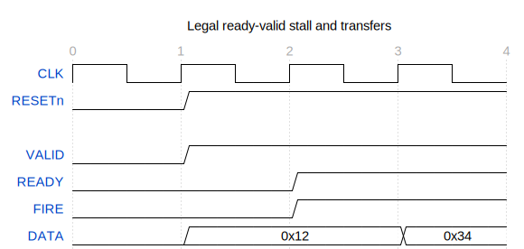

# Protocol Model

Protocol Model 是一个实验性的、可执行的通信协议语义模型。它把引脚或总线采样转换为
协议事件，再用状态、因果关系和事务义务检查一段有限 trace 是否违反协议规则。

它面向的不是 RTL 生成，也不是替代 UVM。它解决的是协议验证中经常反复出现的问题：
同一条规则既需要生成合法激励，也需要检查 DUT 观测；违规时还应指出哪条规则、哪几个
事件以及它们的依赖关系导致了失败。

当前实现支持 AXI4、APB3/APB4 和通用 ready-valid 机制，并提供可执行的 VirtualDut
验证 Project。

## 它能做什么

- 从已建模的规则构造有限、合法的协议 trace；
- 验证已有 trace，给出规则标识、违规位置和三值结论（通过、失败、证据不足）；
- 记录请求、响应、burst、join 等行为之间的因果边，而不只保留线性日志；
- 将 Protocol 与 VirtualDut 组合成小型验证 Project，输出波形、网络图、因果图和 HTML 报告；
- 对 AXI4 检查五通道握手、stall 稳定性、reset、burst、4KB、WSTRB、读写义务及部分 ID ordering；
- 对 APB3/APB4 检查 SETUP/ACCESS 两阶段、PREADY wait、PSLVERR 和 APB4 扩展字段。

## 核心思路

```text
pin sample / external trace
            │
            ▼
protocol monitor ──► canonical event ──► obligation + causal relation ──► verdict
            ▲                                                        │
            │                                                        ▼
       VirtualDut ◄──────── Project plan ◄──────── waveform / graph / report
```

- **采样（sample）**是某个周期观察到的引脚值，例如 `VALID`、`READY` 与 payload。
- **规范事件（canonical event）**是协议确认发生的一次传输，例如一次 `AR` 握手；它不是原始信号的逐位拷贝。
- **有限 trace**是一组已观察事件及其因果关系。它可被线性记录，但模型不会把日志顺序误当成唯一的协议顺序。
- **义务（obligation）**是事件创建的后续责任。例如 AXI `AR` 创建若干 `R` beat 的义务，最后一拍必须带 `RLAST`。
- **VirtualDut** 是功能性验证节点；它可以接收、响应或转换合法协议行为，但不是 RTL 生成器。
- **Project** 把协议链路、VirtualDut、激励和预期结果组织成一个可运行的验证实验。

详细定义、运行方法和边界见 [用户手册](docs/manual.md)。

## 实验一：ready-valid 到 Sink

这个最小 Project 由 `ScriptedSource → ready-valid Protocol → Sink` 组成。它说明：只有
`VALID && READY` 成功握手后产生的传输才会到达 Sink；在 stall 期间撤销 `VALID` 或改变
payload 会被标记为协议违规。

<table>
  <tr>
    <td width="50%" valign="top">
      <strong>网络拓扑</strong><br>
      
    </td>
    <td width="50%" valign="top">
      <strong>合法波形：stall 后保持 payload 并完成传输</strong><br>
      
    </td>
  </tr>
  <tr>
    <td width="50%" valign="top">
      <strong>合法执行的因果事件</strong><br>
      
    </td>
    <td width="50%" valign="top">
      <strong>违规波形：stall 期间 payload 改变</strong><br>
      
    </td>
  </tr>
  <tr>
    <td colspan="2" valign="top">
      <strong>违规因果图：失败被归因到 payload-stability 规则</strong><br>
      
    </td>
  </tr>
</table>

## 实验二：AXI4 read bridge

该 Project 用两条独立 AXI4 链路、一个读请求转发 bridge 和一个确定性 responder 组成
一个小型网络。它展示了：请求先在上游链路被接受，bridge 转发到下游链路，响应 beat 再按
因果关系返回上游。地址越过 4KB 的负例会在进入 bridge 前被拒绝。

<p align="center">
  <strong>端到端因果链</strong><br>
  
</p>

<table>
  <tr>
    <td width="50%" valign="top">
      <strong>上游 AXI-A 波形</strong><br>
      
    </td>
    <td width="50%" valign="top">
      <strong>下游 AXI-B 波形</strong><br>
      
    </td>
  </tr>
</table>

## 快速开始

Python 模型本身只使用标准库；WaveDrom 用于生成 SVG 波形，Graphviz 用于生成关系图。

```bash
python3 -m venv .venv
.venv/bin/python -m pip install --upgrade pip
npm ci

# 生成 ready-valid 项目报告
.venv/bin/python -m protocol_model ready-valid-sink

# 生成 AXI4 read bridge 项目报告
.venv/bin/python -m protocol_model axi-read-network
```

报告默认写入各 Project 的 `sims/01/index.html`，可在浏览器中打开。完整命令说明见
[用户手册：运行实验](docs/manual.md#运行实验)。

## 当前边界与下一步

这个版本是 `v0.1.0` 实验基础，接口和文件组织尚未承诺稳定兼容性。

- AXI4 尚未覆盖 exclusive、全部 USER/capability 语义和完整的跨 ID ordering；
- Project 还没有通用拓扑路由、仲裁、公平性、死锁搜索或可配置 latency/backpressure policy；
- VirtualDut responder 目前可产生确定性 payload，但还不是具有读写历史的 memory model；
- 尚未提供 VCD/FSDB/UVM adapter；因此不能直接检查真实 DUT 的波形文件；
- 下一阶段会先补强事件 JSON、外部 trace adapter、VirtualDut 的 memory/register state，
  再评估可复用的网络 elaboration 抽象。

## 文档与贡献

- [用户手册](docs/manual.md)：术语、架构、运行、读图方式、扩展方法和当前边界；
- [文档入口](docs/README.md)：当前文档与历史设计记录的索引；
- [CHANGELOG](CHANGELOG.md)：版本变更；
- [MIT License](LICENSE)：使用许可。

开发新规则时，建议提供一条明确的规则说明、一条合法 witness、一条只破坏该规则的
negative witness，以及能解释结论的波形或因果图。这样验证结果不会只停留在“测试通过”。
