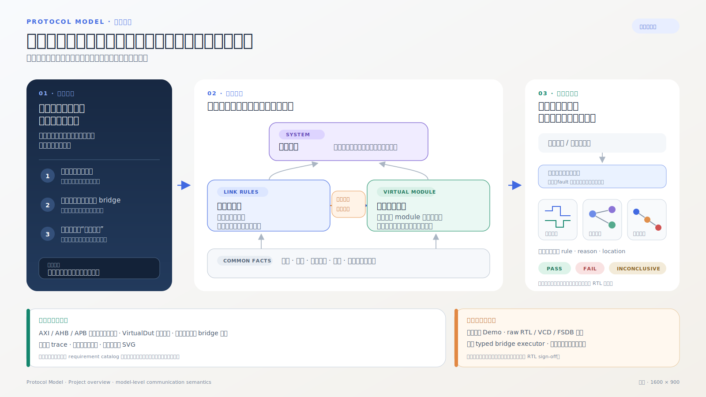

# Protocol Model 文档

文档提供两个入口：初次阅读可以沿技术路线获得完整直觉；设计或修改某个子系统时，应进入对应的
canonical 架构文档。当前实现状态和迁移计划单独列出，不与稳定概念混写。

[English overview](../showcase/materials/assets/overview/protocol-model-overview.en.svg) ·
[可导航的详细架构地图](architecture/technical-route/overview.svg)

- [技术路线导览](architecture/technical-route/README.md)：按一次通信经过的层级渐进阅读；
- [架构文档索引](architecture/README.md)：按概念所有权定位 canonical 文档；
- [术语表](architecture/technical-route/glossary.md)：先给白话解释，再给工程定义。

## 核心架构

### 单链路语言与观察

- [Observation 层与 AtomicFrame](architecture/observation-layer.md)：采样边界、ready-valid、reset epoch；
- [基础语义](architecture/technical-route/01-semantic-foundation.md)：event、constraint、resource、obligation；
- [Pattern 与 LinkProtocol](architecture/technical-route/02-patterns-and-link-protocol.md)：从关系积木构造单 link 协议。

### VirtualDut 与互连构造

- [VirtualDut 方法论](architecture/virtual-dut.md)：模块边界、行为构造、backend、ProtocolPort 和 attachment；
- [Bridge 与类型化事务转译](architecture/typed-transaction-translation.md)：operation form、stage、plan、executor、容量和 completion；
- [Bridge 构造的跨领域启示](architecture/bridge-construction-insights.md)：Chisel/Diplomacy、HLS/dataflow、TCP/IP 与 gateway 的设计映射；
- [事务转译 V1 实施计划](architecture/translation-v1-plan.md)：当前抽取顺序、源码边界与验收条件；
- [AddressFabric VirtualDut](architecture/address-fabric.md)：route、owner、decoder-mux、crossbar 与地址终点边界；
- [Integration 与 binding](architecture/technical-route/04-integration-and-binding.md)：协议 codec 如何装到具体端口。

### 组网、运行与证据

- [LinkProtocol、VirtualDut 与 SystemProtocol](architecture/system-protocol.md)：三个对象的作用域和递归组合；
- [SystemProtocol 组网构造](architecture/network-construction.md)：边界声明、construction lowering、elaboration、运行和分析；
- [观察、执行与证据](architecture/technical-route/06-observation-execution-evidence.md)：输入、session、verdict 和 artifact；
- [运行产物、可视化与发布](architecture/run-output-management.md)：可配置运行目录、manifest、renderer 和长期发布边界。

## 协议专题

这些页面说明通用架构在具体协议中的实现，不重新定义 VirtualDut、integration 或 SystemProtocol：

- [AXI4 LinkProtocol](architecture/axi4-link.md)；
- [AMBA LinkProtocol 家族组织](architecture/amba-link-families.md)；
- [AXI4-Lite 与 AXI4-Stream](architecture/amba-link-variants.md)；
- [AHB-Lite 与 APB phased links](architecture/amba-phased-links.md)；
- [ACE/CHI Link 边界](architecture/ace-chi-links.md)。

## 状态与路线

- [当前迁移状态](architecture/migration-status.md)：已经进入主线的能力和当前边界；
- [v0.1 方法迁移审计](architecture/migration-audit.md)：旧方法的吸收、重构和退休理由；
- [架构实施路线](architecture/technical-route/08-roadmap.md)：当前主线各层的依赖顺序；
- [项目 Roadmap](../ROADMAP.md)：更长期的协议、runtime、CDC 和研究方向。

普通运行写入调用方选择的工作目录，测试使用临时目录；它们不会隐式发布或改写本目录。具名文档或 showcase
生成脚本可以显式重建其拥有的发布子树。已退出的用户手册、Project gallery 和冻结包说明需要追溯时使用
版本控制记录。
