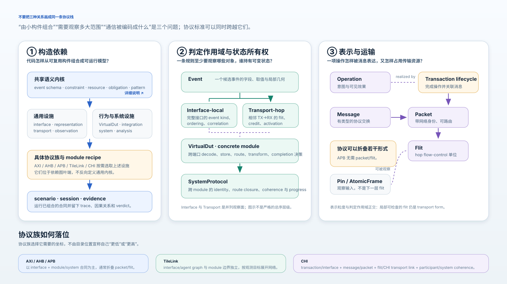

# Protocol Model 文档

这套文档同时服务三类需求：第一次认识工程、实现或审查某个架构对象、确认当前代码究竟覆盖了什么。
它们使用不同入口，避免让初次读者先面对完整源码目录和状态表。

这张图与当前架构文档同步；Showcase 中的发布图是演示快照，不作为架构定义来源。

## 第一次阅读

建议先看到一笔完整通信，再学习各对象的边界：

1. 从根目录的[快速体验](../README.md#快速体验-axi4-示例)运行或浏览一个 AXI4 场景；
2. 阅读[一次 APB 寄存器读取](architecture/technical-route/07-apb-read-walkthrough.md)，理解请求怎样经过接口、
   attachment、VirtualDut 和 SystemProtocol；
3. 回到[架构地图](architecture/technical-route/README.md)，用“五个问题”定位每个对象；
4. 按当前任务进入下面的专题，不需要顺序读完所有架构文档；
5. 最后查看[实现状态](architecture/implementation-status.md)，区分架构设计与当前可执行范围。

遇到不熟悉的词，使用[术语表](architecture/terminology.md)。工程讲义
[《从链路到互连：可组合通信协议建模》](../book/README.md)提供更连续的教学叙述，但 API 和实现状态仍以
本目录为准。

## 按任务选择阅读路径

| 目标 | 推荐顺序 |
|---|---|
| 新增或审查接口协议 | [基础语义](architecture/technical-route/01-semantic-foundation.md) → [Pattern 与 InterfaceProtocol](architecture/technical-route/02-patterns-and-interface-protocol.md) → [Observation](architecture/observation-layer.md) → 对应协议专题 |
| 构造 endpoint、bridge 或 crossbar | [VirtualDut](architecture/technical-route/03-virtual-dut.md) → [Integration 与 binding](architecture/technical-route/04-integration-and-binding.md) → [事务转译](architecture/typed-transaction-translation.md) → [AddressFabric](architecture/address-fabric.md) |
| 构造点到点系统或网络 | [SystemProtocol](architecture/technical-route/05-system-protocol.md) → [组网构造](architecture/network-construction.md) → [执行与证据](architecture/technical-route/06-observation-execution-evidence.md) |
| 研究 CHI、TileLink 或 NoC | [通信建模的三张视图](architecture/communication-scope-and-transport.md) → [ACE/CHI 边界](architecture/ace-chi-communication-scopes.md) → [CHI 源码地图](../protocol_model/protocols/amba/chi/README.md) |
| 接入 RTL/UVM/VCD | [Observation](architecture/observation-layer.md) → [执行与证据](architecture/technical-route/06-observation-execution-evidence.md) → [产物管理](architecture/run-output-management.md) |

## 架构参考

### 共同语义与接口合同

- [架构文档索引](architecture/README.md)：查询一个概念由哪篇 canonical 文档负责；
- [通信建模的三张视图](architecture/communication-scope-and-transport.md)：区分代码构造、规则作用域和表示/运输；
- [Observation 层与 AtomicFrame](architecture/observation-layer.md)：采样边界、ready-valid、reset epoch；
- [异步四相握手](architecture/asynchronous-handshake.md)：REQ/ACK RTZ observation 与 token 接口。

### VirtualDut、bridge 与 fabric

- [VirtualDut 方法论](architecture/virtual-dut.md)：模块边界、backend、attachment 与 realization；
- [Bridge 与类型化事务转译](architecture/typed-transaction-translation.md)：operation form、stage、executor 和 completion；
- [事务转译实施状态](architecture/translation-implementation.md)：当前 V1 profile 与剩余边界；
- [AddressFabric VirtualDut](architecture/address-fabric.md)：route、owner、decoder-mux 和 crossbar；
- [容量、接纳与背压](architecture/capacity-admission-and-backpressure.md)：有限资源、BLOCK、错误完成与 deadlock 输入事实。

### System、运行与证据

- [SystemProtocol 架构](architecture/system-protocol.md)：接口、模块和系统合同怎样组合；
- [SystemProtocol 组网构造](architecture/network-construction.md)：topology、construction、resolution、runtime 和 analysis；
- [可视化视图与 Artifact 管理](architecture/visualization-and-artifacts.md)：结构、时序、MSC、因果图和报告怎样分类并形成可追溯投影；
- [运行产物、可视化与发布](architecture/run-output-management.md)：运行目录、manifest、renderer 与发布边界；
- [事务时空图](visualization/transaction-time-space-view.md)：区分序列图、波形、因果图、拓扑和 CHI time-space view。

### 协议专题

- [AXI4 InterfaceProtocol](architecture/axi4-interface.md)；
- [AMBA interface 家族组织](architecture/amba-interface-families.md)；
- [AXI4-Lite 与 AXI4-Stream](architecture/amba-interface-variants.md)；
- [AHB-Lite 与 APB phased links](architecture/amba-phased-interfaces.md)；
- [ACE 接口与 CHI 多视图边界](architecture/ace-chi-communication-scopes.md)。

## 状态、计划与历史

- [当前实现状态](architecture/implementation-status.md)是“已经实现/尚未实现”的唯一汇总页；
- [近期实施顺序](architecture/technical-route/08-roadmap.md)只记录下一批能力的依赖关系；
- [项目 Roadmap](../ROADMAP.md)记录长期研究和工程方向；
- [社区传播与宣称治理](community/README.md)保存维护者使用的定位、推广计划和证据审计，不作为架构定义或直接发布稿；
- [Release archive](releases/README.md)保留已发布 tag 当时的术语和边界。

普通运行写入调用方选择的目录，测试使用临时目录。只有具名发布脚本可以重建其拥有的
`showcase/generated/` 子树；普通测试和文档阅读不会隐式改写发布材料。
