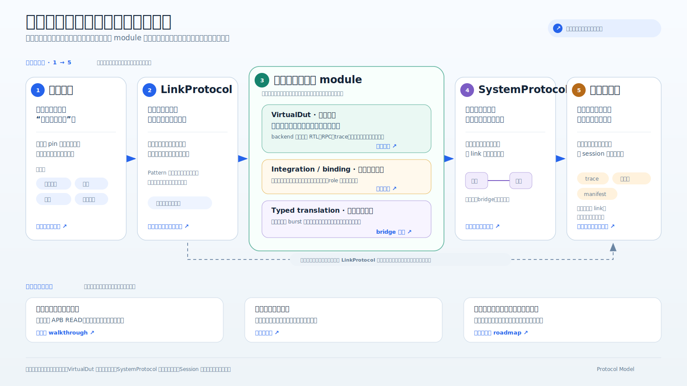

# Protocol Model 架构地图

这套阅读序列解释项目为什么这样分层、每一层解决什么问题，以及一次通信如何穿过这些层。它不是 Python
包名或工具清单，也不假设读者已经熟悉 AXI、形式语义、状态机或片上网络。概念所有权由
[架构文档索引](../README.md)统一声明；为避免复制定义，其中基础语义、Pattern/LinkProtocol 和 Integration
页面既位于渐进路线中，也直接承担对应概念的 canonical 说明，其余页面主要负责导读和实例。

## 从五个问题开始

协议建模容易把几类问题揉在一起。本项目先把它们拆成五个问题：

| 问题 | 对应对象 | 直观解释 |
|---|---|---|
| 一条连接上允许说什么？ | `LinkProtocol` | 类似一门只在两个端点之间使用的语言：有哪些消息、谁能发送、先后关系是什么 |
| 一个具体模块收到消息后做什么？ | `VirtualDut` + backend | 模块可能读寄存器、转发请求，也可能把内部行为完全交给 RTL、RPC 或参考模型 |
| 线上消息如何变成模块操作？ | attachment + binding | 把 APB `READ` 翻译成协议无关的 `AddressRead`，并绑定到某个具体端口 |
| 两侧模块操作粒度不同时怎样转换？ | `TranslationStage` + plan/executor | 把 AXI burst 拆成地址访问、调度 child，并把 completion 折回原事务 |
| 多个模块接起来后整体是否合法？ | `SystemProtocol` | 检查端口连接、路由、请求归属、返回路径，以及以后要加入的容量和等待关系 |

LinkProtocol 和 VirtualDut 行为分别 bottom-up 构造，在 attachment/binding 处汇合；typed translation 构造
跨端口语义变化；SystemProtocol 再扩大观察范围，但不会反向读取各 attachment 的私有状态。

## 先用一页建立全局认识

[](../../../showcase/materials/assets/overview/protocol-model-overview.zh.svg)

这张 16:9 图面向第一次接触项目的人，先说明常见困难、分层回答的问题、运行证据和当前边界；
[English version](../../../showcase/materials/assets/overview/protocol-model-overview.en.svg) 使用相同版式。下面的图承担详细导航，
因此保留更多工程对象和可点击链接。

## 可导航的详细架构地图

[](overview.svg)

建议先点击图片打开独立 SVG，再点击其中的色块。部分 Markdown 平台会把嵌入式 SVG 当作不可交互的
静态图片，因此下面同时保留普通链接。

## 分层说明

| 总览区域 | 先回答的白话问题 | 详细说明 |
|---|---|---|
| 基础语义 | 一条“消息”和一条“规则”在模型里长什么样？ | [基础语义：共同词汇与约束](01-semantic-foundation.md) |
| Pattern 与 LinkProtocol | 怎样从小规则组合出 AXI、AHB、APB 等链路协议？ | [通用模式与 LinkProtocol](02-patterns-and-link-protocol.md) |
| VirtualDut 行为路径 | 模块内部状态复杂甚至不可枚举时，如何只描述通信相关行为？ | [VirtualDut：行为、backend 与模块构造](03-virtual-dut.md) |
| Integration 与 binding | APB 代码究竟属于协议、设备还是两者之间？ | [协议集成与端口绑定](04-integration-and-binding.md) |
| 类型化事务转译 | 一笔 AXI burst 怎样拆成多笔 APB 访问，又怎样归还 completion？ | [Bridge 与类型化事务转译](../typed-transaction-translation.md) |
| SystemProtocol | 点到点连接、bridge 和微型网络怎样使用同一个组合模型？ | [SystemProtocol：从连接到组网](05-system-protocol.md) |
| 观察、执行与证据 | pin 波形如何变成协议事件，失败如何留下可解释证据？ | [观察、执行与产物](06-observation-execution-evidence.md) |
| 完整事务 | 一次 APB 寄存器读取具体经过哪些对象？ | [端到端示例：一次 APB 读取](07-apb-read-walkthrough.md) |
| 后续路线 | 为什么下一步不是继续堆协议，而是 capability、bridge 和 wait-for？ | [实施路线与阶段边界](08-roadmap.md) |

遇到不熟悉的词，可随时查看 [术语表](glossary.md)。

## 推荐阅读路径

第一次接触项目时采用示例优先路径：

1. 浏览[术语表](glossary.md)中的通信事实和 VirtualDut 小节；
2. 阅读[一次 APB 读取](07-apb-read-walkthrough.md)，先看到完整请求/完成路径；
3. 返回本页总览图，定位示例中出现的对象；
4. 再进入 LinkProtocol、VirtualDut、integration 或 SystemProtocol 的详细页。

需要系统理解架构时采用概念依赖路径：

```text
基础语义
  → Pattern / LinkProtocol
  → VirtualDut
  → Integration / binding
  → Bridge / typed translation
  → SystemProtocol
  → Observation / execution / evidence
```

准备新增协议时，重点阅读基础语义、Pattern/LinkProtocol、Observation。准备构造 bridge 或 crossbar 时，
重点阅读 VirtualDut、Integration/binding、typed translation 和 SystemProtocol。准备做真实 RTL/UVM 接入时，
重点阅读 Observation、执行与证据。

## 一句话架构

> `LinkProtocol` 规定线上语言，attachment 负责翻译，VirtualDut 决定模块行为，SystemProtocol 决定模块
> 如何连接；Session 运行这些规则，Artifact 保存可解释结果。
