# 可执行实验图册

本页把当前 Project 的可执行结果整理为可阅读的证据，而不是把 SVG 当作装饰。每组图都
对应一次 `out/<project>/<run-id>/manifest.json` 记录的运行；完整 JSON、约束表、HTML 报告和
源 WaveJSON/DOT 仍保留在 `out/`，但不进入 Git。本页的 SVG 是经过确认后复制的稳定快照。

阅读顺序建议是：先看网络图了解谁驱动或响应，再看波形了解各周期发生什么，最后看因果图
了解事务级依赖。`PASS` 表示该有限 trace 满足当前已经实现的规则；并不等于整个协议或真实
RTL 已被完全证明。

## 可视化事项表

| 章节 | Project / 场景 | 观察重点 | 快速运行 |
|---|---|---|---|
| 1 | ready-valid sink | handshake、stall payload stability | `python -m protocol_model ready-valid-sink` |
| 2 | APB3/APB4 compare | SETUP/ACCESS、wait-state request stability | `python -m protocol_model apb` |
| 3 | AXI4 read bridge | 双链路转发、ID correlation、4KB rejection | `python -m protocol_model axi-read-network` |
| 4 | AXI4 read interleave | per-ID ordering、跨 ID 交织 | `python -m protocol_model axi-read-interleave` |
| 5 | AXI4 scenario batch | read/write/ordering/concurrency/reset，共 37 cases | `python -m protocol_model axi-scenarios` |
| 6 | AXI4 long interleave | 两笔 16-beat read 的 obligation | `python -m protocol_model axi-read-interleave --beats 16` |

已准备本地依赖时，表中的命令应使用 `.venv/bin/python`。首次运行整个图册对应的实验集可用
`./scripts/quickstart.sh`，统一浏览入口生成在 `out/index.html`。

## 1. ready-valid：只有已握手的传输才会到达 Sink

运行：

```bash
.venv/bin/python -m protocol_model ready-valid-sink
```

这个最小 Project 连接 `ScriptedSource → DATA protocol instance → Sink`。正例包含一次
`VALID=1, READY=0` 的 stall；随后 payload 保持不变并完成握手。负例只改变 stall 中的
payload，因此应精确命中 `data.ready_valid.payload_stability`，并且 Sink 不接收该传输。

<p align="center">
  <strong>验证网络：协议 monitor 位于 Source 与 Sink 之间</strong><br>
  
</p>

<table>
  <tr>
    <td width="50%" valign="top">
      <strong>合法波形</strong><br>
      4 个 sample、2 次已接受 transfer、Sink 收到 2 项。<br>
      
    </td>
    <td width="50%" valign="top">
      <strong>单点变异波形</strong><br>
      仅在 READY 为低时改变 payload，因此应失败。<br>
      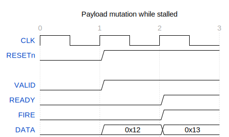
    </td>
  </tr>
  <tr>
    <td width="50%" valign="top">
      <strong>合法事件因果图</strong><br>
      
    </td>
    <td width="50%" valign="top">
      <strong>违规事件因果图</strong><br>
      
    </td>
  </tr>
</table>

## 2. APB3 与 APB4：两阶段传输与 wait state

运行：

```bash
.venv/bin/python -m protocol_model apb --transactions 4
```

此 Project 同时实例化 APB3 和 APB4。两者都要求每笔传输经过 SETUP 再进入 ACCESS；当
`PREADY=0` 时，ACCESS 延长但请求信号不得变化。APB4 额外检查 `PSTRB` 和 `PPROT`。
本次正例分别生成 4 笔 APB3 与 APB4 传输；负例在 APB4 ACCESS 阶段改变地址，命中
`apb4.two_phase.request_stability`。

<p align="center">
  <strong>一个 Project 中并列的 APB3/APB4 协议实例</strong><br>
  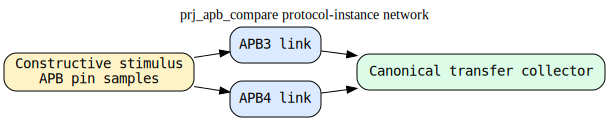
</p>

<table>
  <tr>
    <td width="50%" valign="top">
      <strong>APB3 波形</strong><br>
      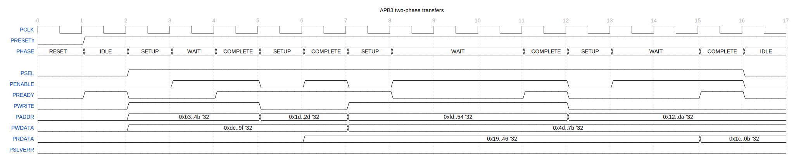
    </td>
    <td width="50%" valign="top">
      <strong>APB4 波形</strong><br>
      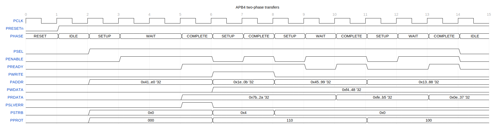
    </td>
  </tr>
</table>

<p align="center">
  <strong>两阶段状态关系：SETUP、等待中的 ACCESS 与完成条件</strong><br>
  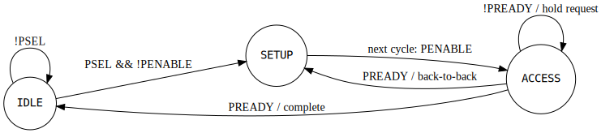
</p>

## 3. AXI4 read bridge：两条链路上的请求转发与响应返回

运行：

```bash
.venv/bin/python -m protocol_model axi-read-network
```

该 Project 使用两个命名 AXI4 实例：上游 AXI-A、下游 AXI-B。`AxiReadBridge` 是 Project
内的 VirtualDut：它接受上游 `AR`、转发下游 `AR`，再将下游 `R` beat 返回上游。另一个
responder 终止下游请求。正例为 4 beat read，共记录 10 个事件；负例构造跨越 4KB 边界的
burst，并在上游 `AR` 事件空间被拒绝，bridge 与下游链路不应开始事务。

<p align="center">
  <strong>双链路网络</strong><br>
  
</p>

<p align="center">
  <strong>请求、转发与 read-data 返回的因果链</strong><br>
  
</p>

<table>
  <tr>
    <td width="50%" valign="top">
      <strong>AXI-A：上游观察</strong><br>
      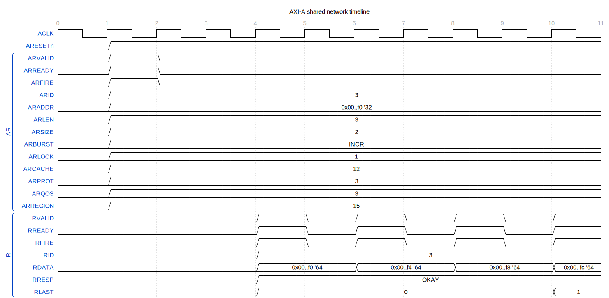
    </td>
    <td width="50%" valign="top">
      <strong>AXI-B：下游观察</strong><br>
      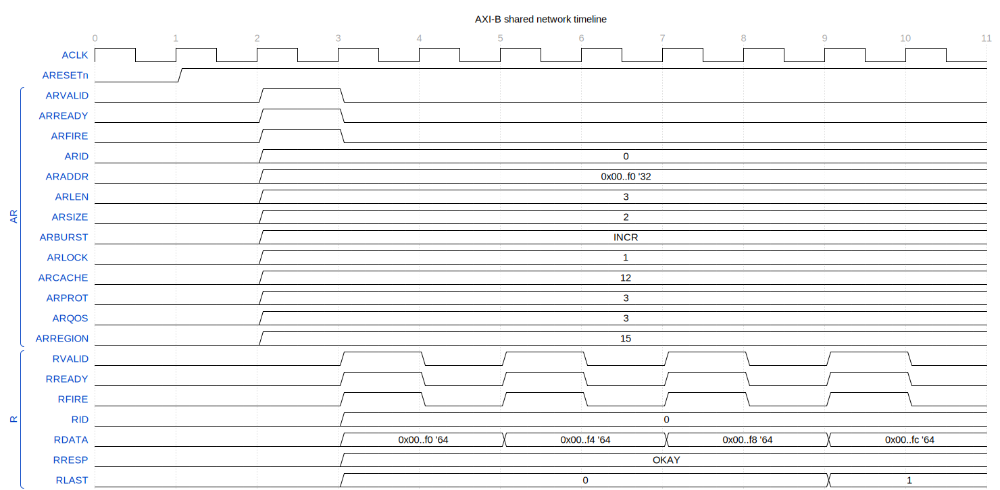
    </td>
  </tr>
</table>

## 4. AXI4 cross-ID read interleave：协议基础与 Project profile 分开

运行：

```bash
.venv/bin/python -m protocol_model axi-read-interleave
```

该 Project 从通用 AXI4 派生 read-only profile，并将 active read ID 限定为 1、2；未使用的
AR sideband 固定为零，AW/W/B 通道保持 quiet。输入 VirtualDut 依次发出 `AR(1)`、`AR(2)`；
输出 VirtualDut 交替发出 `R(2)`、`R(1)`，因此不同 ID 可以交织，且 ID2 可以先完成。

四个负例分别确认：同 ID 不得越序、RID 必须在 active set、ARCACHE 必须为零、AWVALID
必须保持低。这些是可追溯的 profile/协议规则，而不是隐藏在 stimulus 中的假设。

<p align="center">
  <strong>两个 VirtualDut 与派生 AXI4 profile</strong><br>
  
</p>

<table>
  <tr>
    <td width="52%" valign="top">
      <strong>短 trace 波形：2 个 AR 与 4 个交织 R beat</strong><br>
      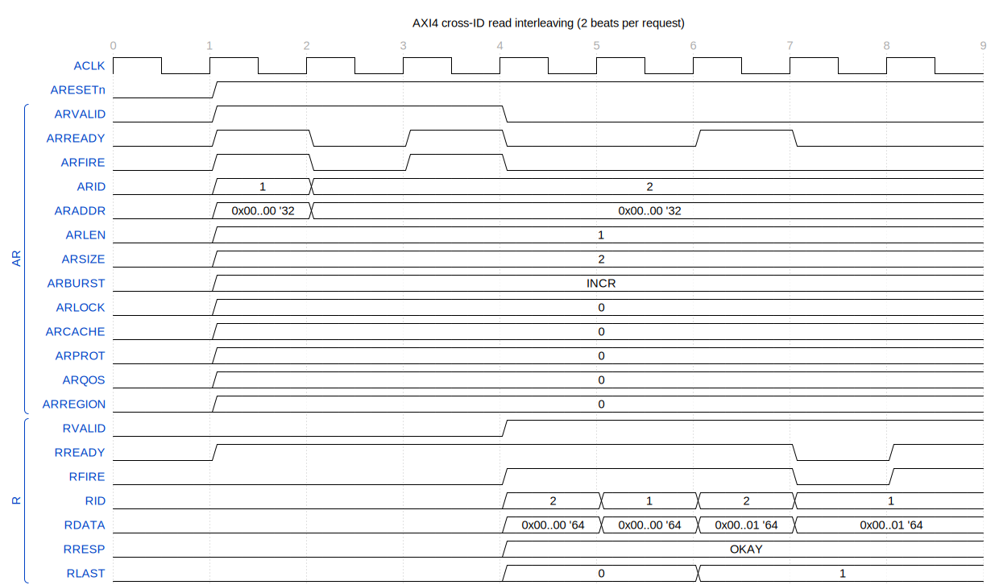
    </td>
    <td width="48%" valign="top">
      <strong>因果图</strong><br>
      每个 AR 仅约束自己的 R beat 序列；不同 ID 的 beat 没有额外先后边。<br>
      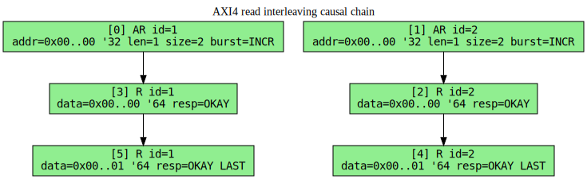
    </td>
  </tr>
</table>

## 5. AXI4 source/responder scenario batch：无 bridge 的协议场景集

快速运行：

```bash
.venv/bin/python -m protocol_model axi-scenarios
```

这个 Project 不经过 bridge，只连接 `AxiManagerSource → AXI4 ProtocolInstance ←
AxiSubordinateResponder`。它采用 full-width、aligned profile，将 `AxLOCK=0`、`AxCACHE=0`，
暂不覆盖 atomic/exclusive、cache 属性语义以及 narrow/unaligned 传输。37 个 case 分成：

| 类别 | 数量 | 代表性内容 |
|---|---:|---|
| Read | 15 | INCR/FIXED/WRAP、4KB、RLAST、RID、SLVERR/DECERR |
| Write | 10 | AW/W independence、WLAST、B obligation、BID、错误响应 |
| Ordering | 5 | 同 ID FIFO、跨 ID 完成与交织、W burst FIFO association |
| Concurrency | 4 | read/write parallel、五通道同周期、stall stability |
| Reset | 3 | outstanding epoch 清除、stalled VALID 清除、reset consistency |

每个 case 都保留原始 rule，并同时生成波形与因果图。立即型错误（如非法 burst geometry）
在请求节点后展示推导；事务型错误（如 RLAST/BID）则展示先前 request 建立的 obligation。

<p align="center">
  <strong>无 bridge 的两个 endpoint VirtualDut 与一个 AXI4 protocol instance</strong><br>
  
</p>

### 5.1 4KB boundary：从当前 AR 自身推导，而非比较前后事务

两个 case 都从 `ARADDR=0x0FF8` 开始，且 `ARSIZE=3`（8 bytes/beat）。合法 case 只有一拍，
覆盖到 `0x0FFF`；负例为两拍 INCR，第二拍地址为 `0x1000`，最终覆盖到 `0x1007`。WaveDrom
中 ARADDR 前面的 `0` 只是 `ARVALID=0` 时的 inactive bus，不是上一笔事务地址。

<table>
  <tr>
    <td width="50%" valign="top">
      <strong>合法：1 beat，结束于边界之前</strong><br>
      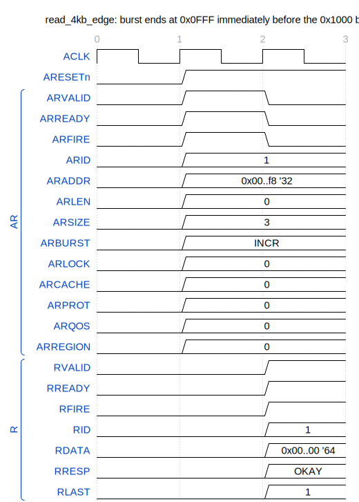
    </td>
    <td width="50%" valign="top">
      <strong>负例：2 beats，第二拍进入下一 4KB page</strong><br>
      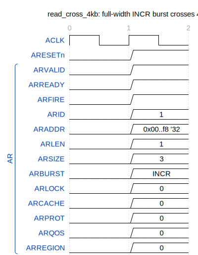
    </td>
  </tr>
  <tr>
    <td width="50%" valign="top">
      <strong>合法推导：page 0 == page 0</strong><br>
      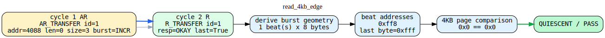
    </td>
    <td width="50%" valign="top">
      <strong>错误推导：page 0 != page 1</strong><br>
      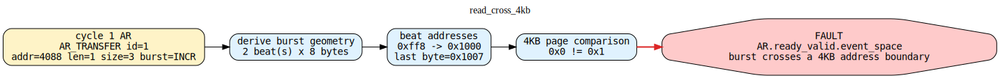
    </td>
  </tr>
</table>

### 5.2 通道独立与事务 ordering

AXI4 的 AW 和 W 是独立通道，因此完整 W burst 可以先于 AW 到达；关联仍按 AW/W 各自的
FIFO 顺序完成。读方向则允许不同 ID 的 R beat 交织，但每个 ID 内必须消费最老 obligation。

<table>
  <tr>
    <td width="50%" valign="top">
      <strong>W burst 先于 AW</strong><br>
      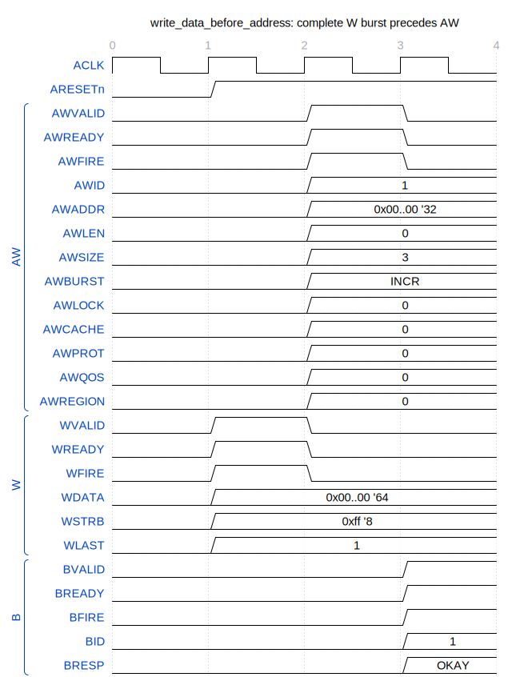
    </td>
    <td width="50%" valign="top">
      <strong>AW/W join 与 B obligation</strong><br>
      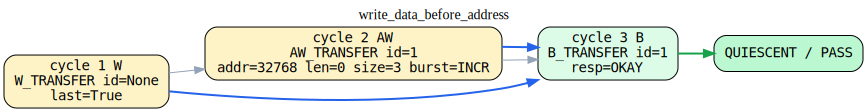
    </td>
  </tr>
  <tr>
    <td width="50%" valign="top">
      <strong>跨 ID read-data 交织</strong><br>
      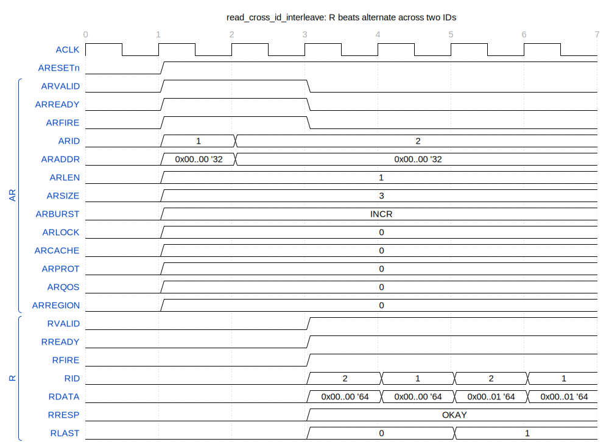
    </td>
    <td width="50%" valign="top">
      <strong>每个 AR 独立建立 R obligation</strong><br>
      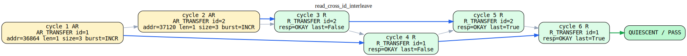
    </td>
  </tr>
</table>

### 5.3 五通道并发、stall 与 reset epoch

五通道并发 case 先建立旧的 R/B obligation，再让 AW/W/B/AR/R 在同一周期完成可交换的
transfer。两个负例分别展示：AW stall 期间 payload 改变，以及 reset 清除 pending read 后旧
R response 变成无来源响应。

<table>
  <tr>
    <td width="50%" valign="top">
      <strong>五通道同周期波形</strong><br>
      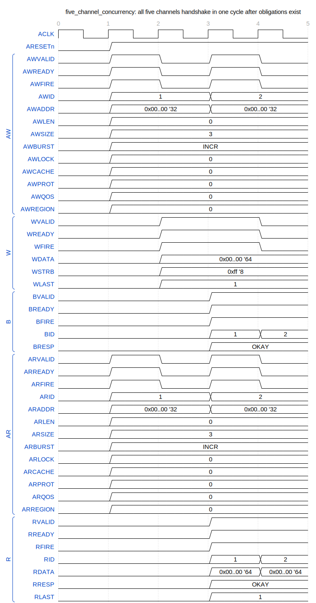
    </td>
    <td width="50%" valign="top">
      <strong>可交换 transfer 的事务关系</strong><br>
      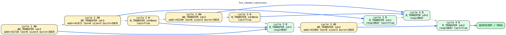
    </td>
  </tr>
  <tr>
    <td width="50%" valign="top">
      <strong>AW stall payload mutation</strong><br>
      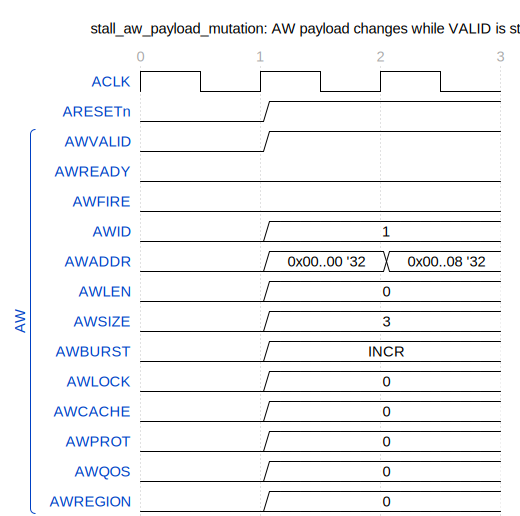<br>
      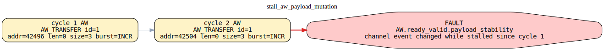
    </td>
    <td width="50%" valign="top">
      <strong>reset 后旧 R response 被拒绝</strong><br>
      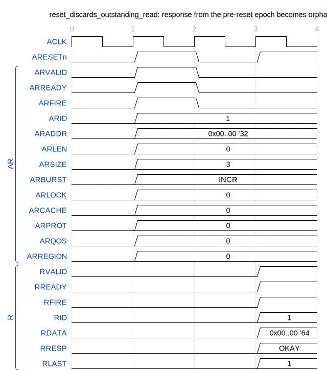<br>
      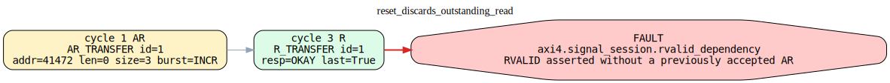
    </td>
  </tr>
</table>

完整 37-case 表、每个 case 的 trace、波形和因果图由同一次运行生成在
`out/prj_axi4_scenarios/01/report.html`；本节只提交便于审阅的稳定代表性快照。

## 6. 长 trace：两笔 16-beat 读取的交织

运行：

```bash
.venv/bin/python -m protocol_model axi-read-interleave --beats 16 \
  --sim-dir out/prj_axi4_read_interleave/long
```

这不是另一套协议：它复用上一节相同的 AXI4 profile 和 VirtualDut，只将每笔请求扩展为
16 个 R beat。该运行包含 2 个 `AR` 与 32 个 `R`，共 **34 个规范事件**，最终为 `PASS`。
波形中可观察到：每个 ID 内的 beat 次序保持，而 ID1/ID2 的 R beat 交替；ID2 的最后一拍
先出现，因此它先完成。这个例子用来展示模型对较长有限 trace 的 obligation 与因果处理，
不应被解读为吞吐率或时序性能测量。

<p align="center">
  <strong>34-event AXI4 cross-ID interleaving trace（每笔 16 beat）</strong><br>
  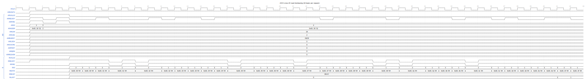
</p>
