# Protocol Model Project 功能导览

五个内建 Project 按简单到复杂排列。每个 case 的波形图与因果事件图均由同一次 `run-all` 生成。
负例的预期结果为 `FAIL`，表示对应约束被成功触发。

| Project | 测试内容 | Cases | 结果 |
|---|---|---:|---|
| `prj_ready_valid_sink` | 最小 ready-valid 链路：握手、stall 与 payload stability。 | 2 | PASS |
| `prj_apb_compare` | APB3/APB4 两阶段传输、wait state 与请求保持。 | 3 | PASS |
| `prj_axi4_read_bridge` | 两个 AXI4 实例之间的 read bridge、转发因果与 4KB 拒绝。 | 2 | PASS |
| `prj_axi4_read_interleave` | 跨 ID read-data 交织、同 ID 顺序与 Project profile。 | 5 | PASS |
| `prj_axi4_scenarios` | 无 bridge 的 AXI4 source/responder 批量场景，覆盖五通道事务、并发、ordering 与 reset。 | 37 | PASS |
## `prj_ready_valid_sink`

最小 ready-valid 链路：握手、stall 与 payload stability。

结果：**PASS**；2 个 case。

### Project 图

#### Project 组网 · network.svg

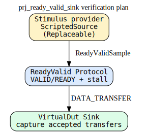

### `legal_stall`

legal_stall

预期：`PASS`；观察到：`PASS`。

#### 波形图 · waveform.svg

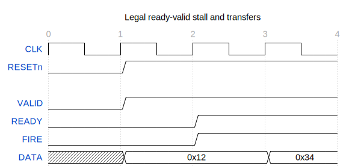

#### 因果事件图 · causality.svg

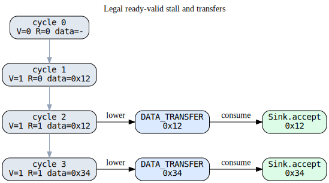

### `changed_while_stalled`

changed_while_stalled

预期：`FAIL`；观察到：`FAIL`。

#### 波形图 · waveform.svg

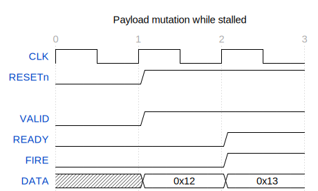

#### 因果事件图 · causality.svg

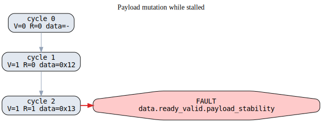

## `prj_apb_compare`

APB3/APB4 两阶段传输、wait state 与请求保持。

结果：**PASS**；3 个 case。

### Project 图

#### 协议状态图 · state.svg

#### Project 组网 · network.svg

### `legal_apb3`

legal_apb3

预期：`PASS`；观察到：`PASS`。

#### 波形图 · waveform.svg

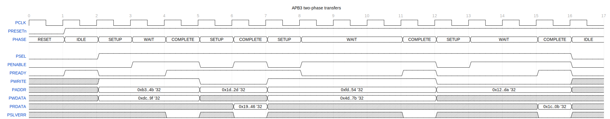

#### 因果事件图 · causality.svg

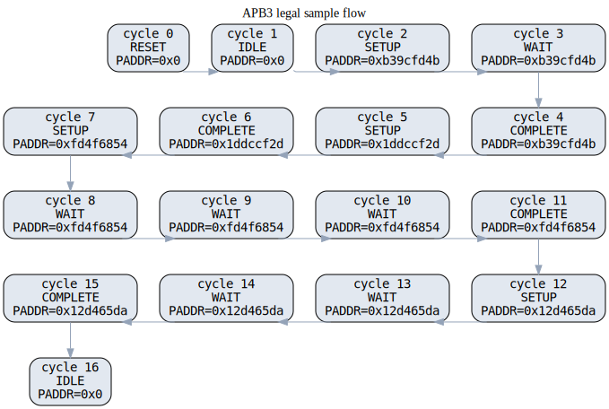

### `legal_apb4`

legal_apb4

预期：`PASS`；观察到：`PASS`。

#### 波形图 · waveform.svg

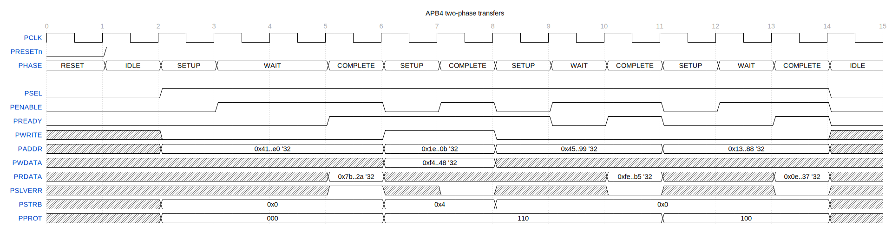

#### 因果事件图 · causality.svg

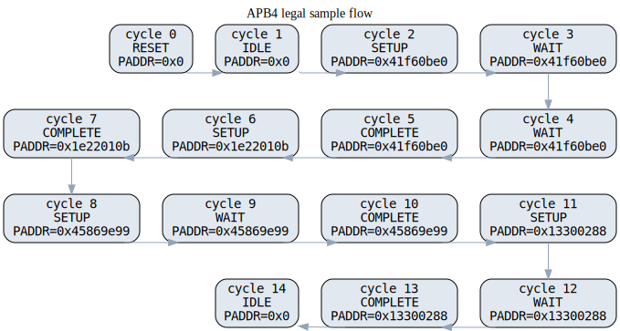

### `request_stability_mutation`

request_stability_mutation

预期：`FAIL`；观察到：`FAIL`。

#### 波形图 · waveform.svg

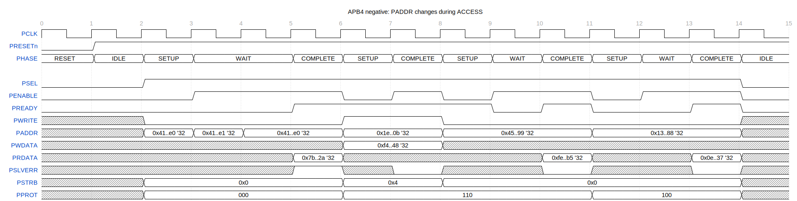

#### 因果事件图 · causality.svg

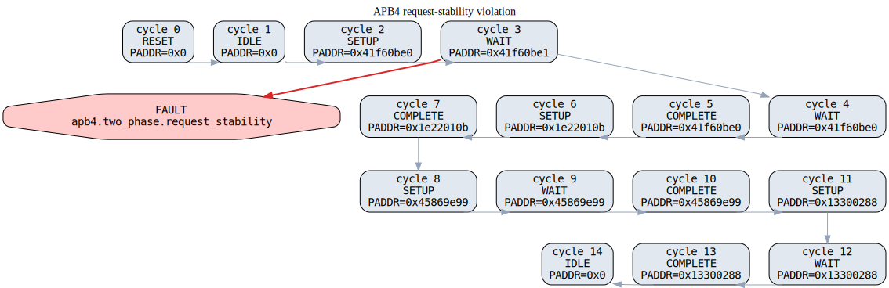

## `prj_axi4_read_bridge`

两个 AXI4 实例之间的 read bridge、转发因果与 4KB 拒绝。

结果：**PASS**；2 个 case。

### Project 图

#### Project 组网 · network.svg

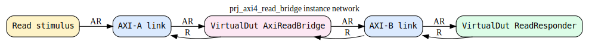

### `legal_4kb_edge`

legal_4kb_edge

预期：`PASS`；观察到：`PASS`。

#### 因果事件图 · causality.svg

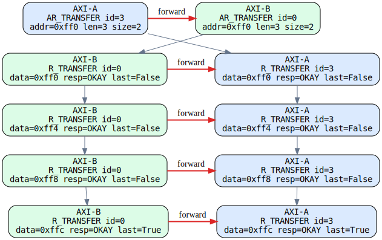

#### AXI-A 波形图 · waveform.axi-a.svg

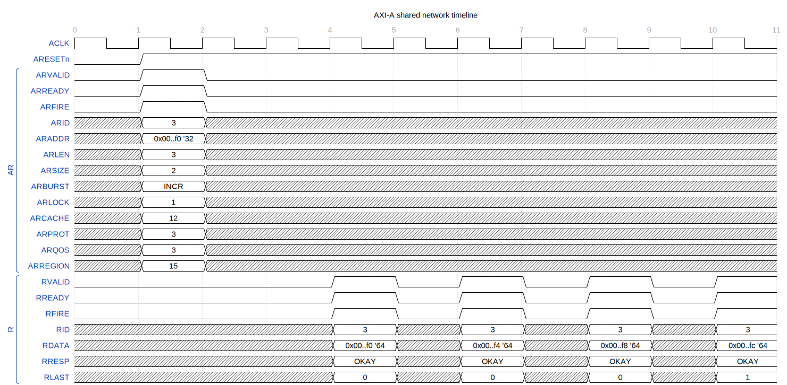

#### AXI-B 波形图 · waveform.axi-b.svg

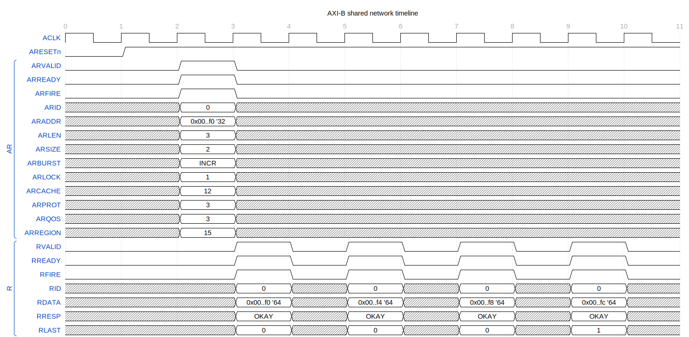

### `crossing_4kb`

crossing_4kb

预期：`FAIL`；观察到：`FAIL`。

#### 波形图 · waveform.svg

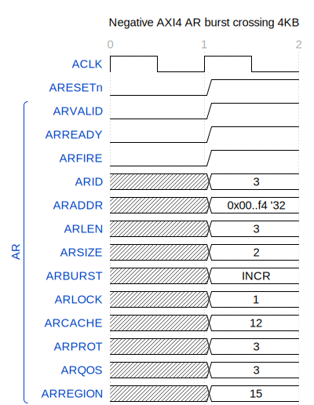

#### 因果事件图 · causality.svg

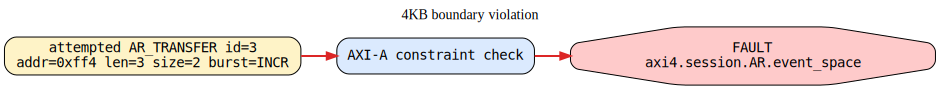

## `prj_axi4_read_interleave`

跨 ID read-data 交织、同 ID 顺序与 Project profile。

结果：**PASS**；5 个 case。

### Project 图

#### Project 组网 · network.svg

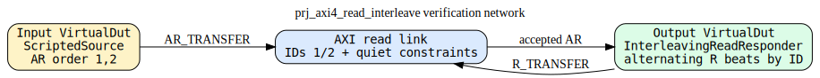

### `cross_id_out_of_order`

cross_id_out_of_order

预期：`PASS`；观察到：`PASS`。

#### 波形图 · waveform.svg

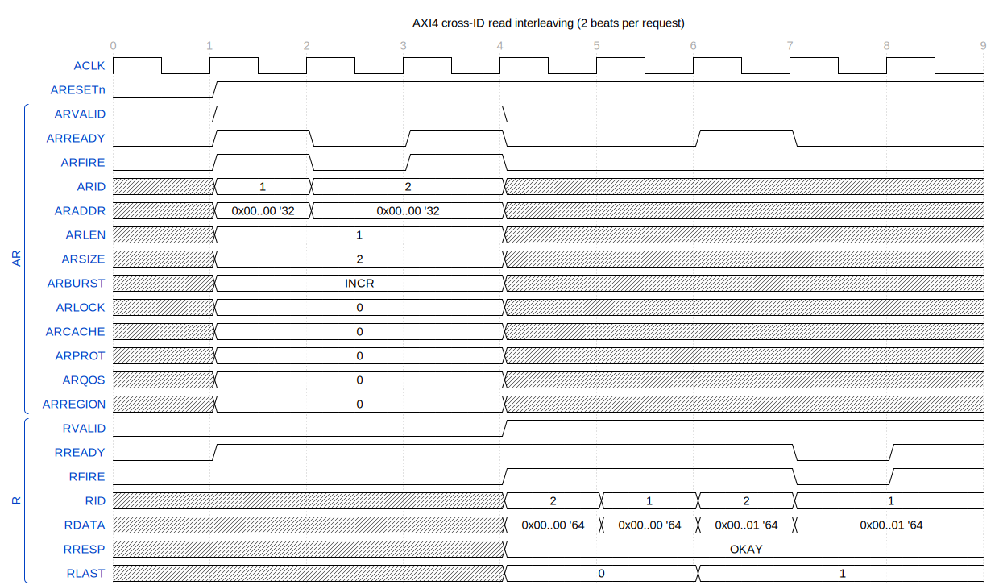

#### 因果事件图 · causality.svg

### `same_id_cannot_overtake`

same_id_cannot_overtake

预期：`FAIL`；观察到：`FAIL`。

#### 波形图 · waveform.svg

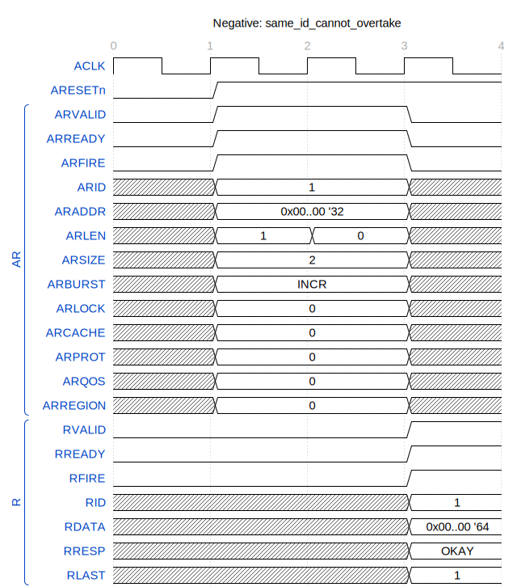

#### 因果事件图 · causality.svg

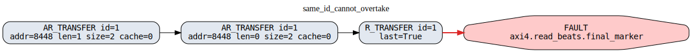

### `rid_must_be_active`

rid_must_be_active

预期：`FAIL`；观察到：`FAIL`。

#### 波形图 · waveform.svg

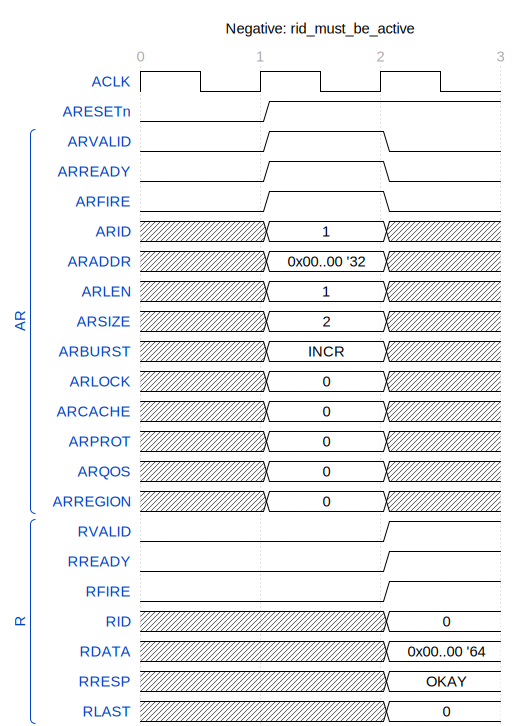

#### 因果事件图 · causality.svg

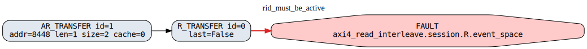

### `arcache_tied_zero`

arcache_tied_zero

预期：`FAIL`；观察到：`FAIL`。

#### 波形图 · waveform.svg

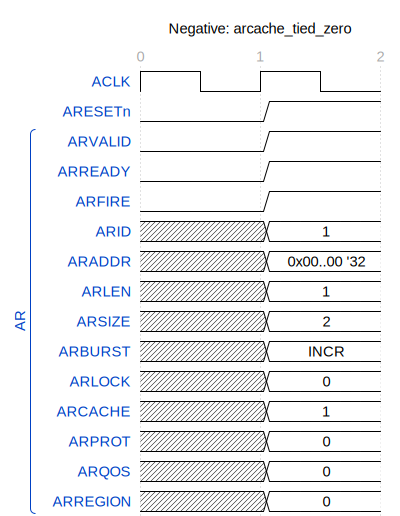

#### 因果事件图 · causality.svg

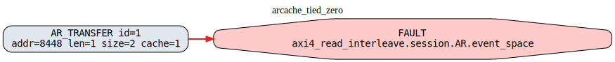

### `write_valid_tied_low`

write_valid_tied_low

预期：`FAIL`；观察到：`FAIL`。

#### 波形图 · waveform.svg

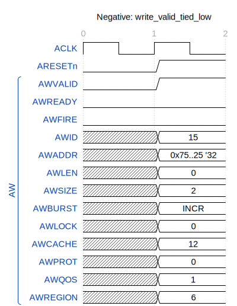

#### 因果事件图 · causality.svg

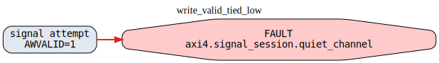

## `prj_axi4_scenarios`

无 bridge 的 AXI4 source/responder 批量场景，覆盖五通道事务、并发、ordering 与 reset。

结果：**PASS**；37 个 case。

### Project 图

#### Project 组网 · network.svg

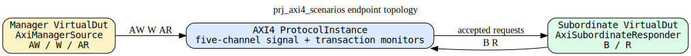

### `read_single_incr`

legal 1-beat INCR read

预期：`PASS`；观察到：`PASS`。

#### 波形图 · waveform.svg

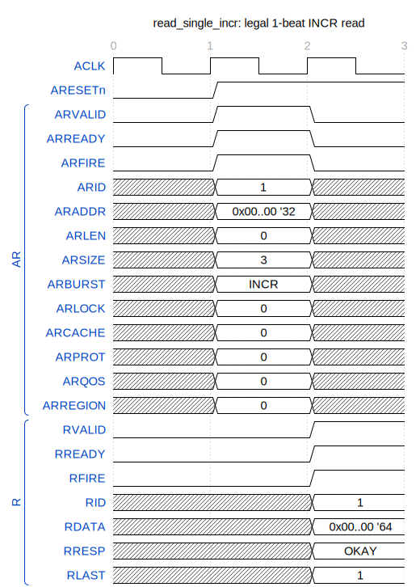

#### 因果事件图 · causality.svg

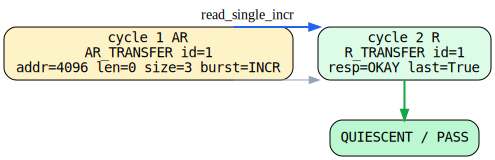

### `read_16_incr`

legal 16-beat INCR read

预期：`PASS`；观察到：`PASS`。

#### 波形图 · waveform.svg

#### 因果事件图 · causality.svg

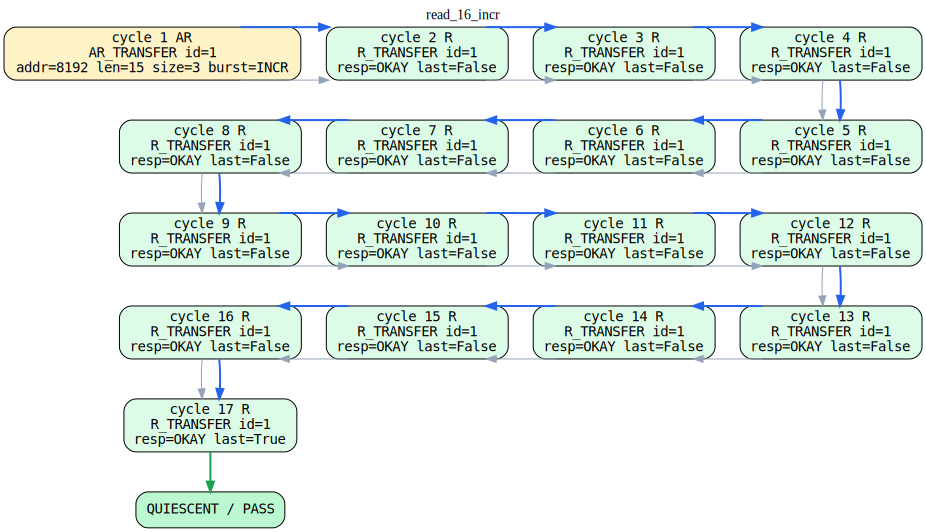

### `read_fixed_16`

legal 16-beat FIXED read

预期：`PASS`；观察到：`PASS`。

#### 波形图 · waveform.svg

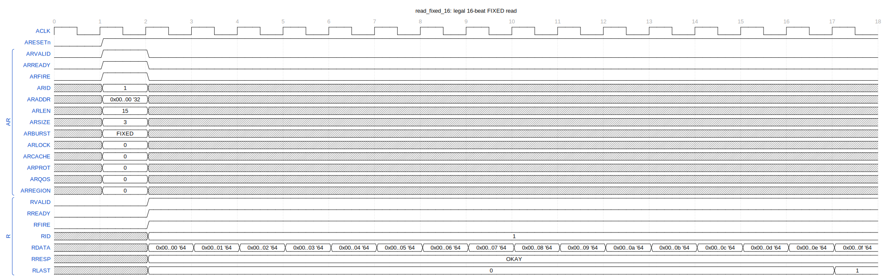

#### 因果事件图 · causality.svg

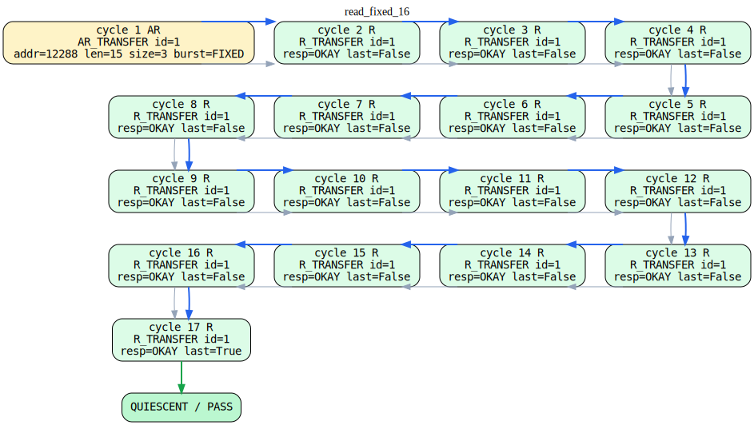

### `read_wrap_4`

legal 4-beat WRAP read

预期：`PASS`；观察到：`PASS`。

#### 波形图 · waveform.svg

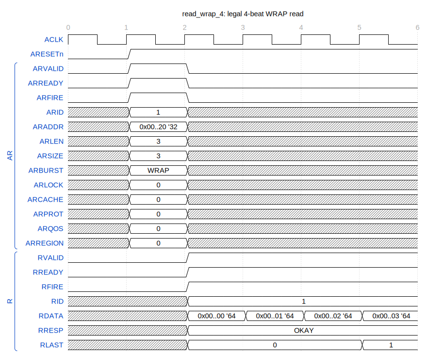

#### 因果事件图 · causality.svg

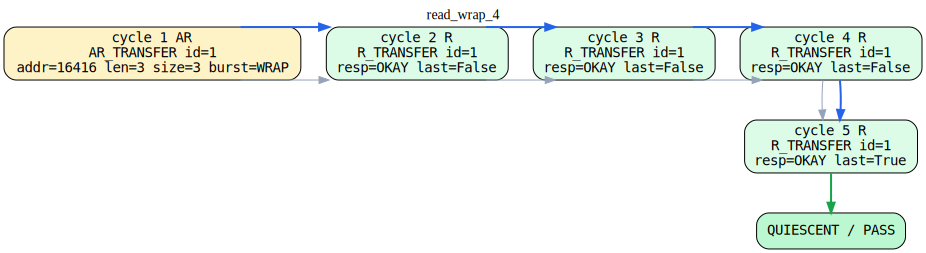

### `read_fixed_17_rejected`

FIXED exceeds 16 beats

预期：`FAIL`；观察到：`FAIL`。

#### 波形图 · waveform.svg

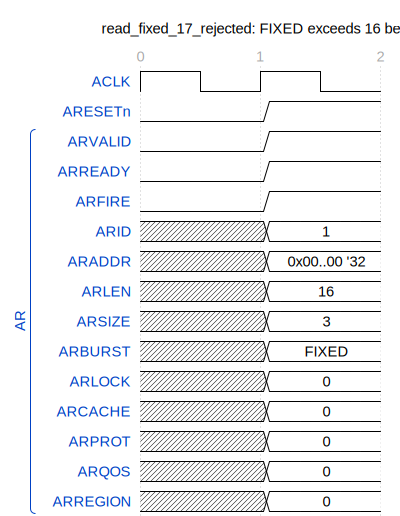

#### 因果事件图 · causality.svg

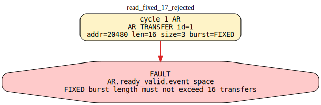

### `read_wrap_3_rejected`

WRAP uses an illegal three-beat length

预期：`FAIL`；观察到：`FAIL`。

#### 波形图 · waveform.svg

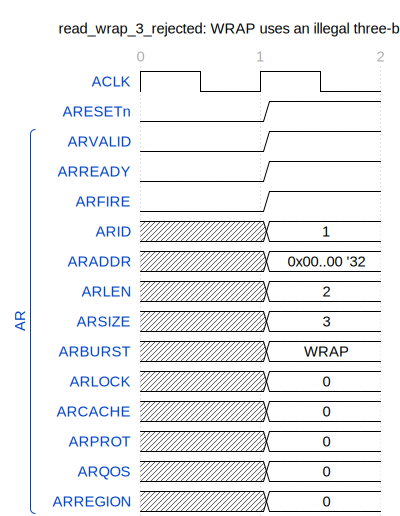

#### 因果事件图 · causality.svg

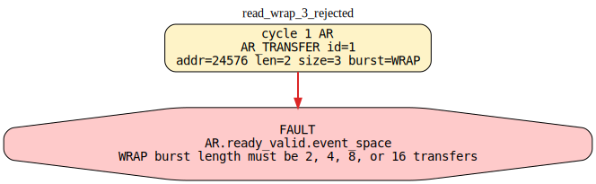

### `read_4kb_edge`

burst ends at 0x0FFF immediately before the 0x1000 boundary

预期：`PASS`；观察到：`PASS`。

#### 波形图 · waveform.svg

#### 因果事件图 · causality.svg

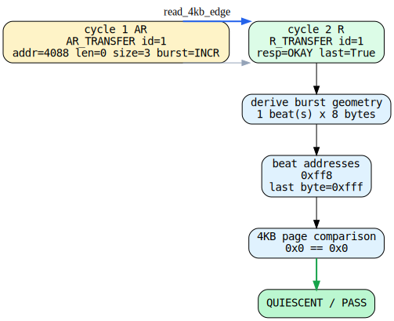

### `read_cross_4kb`

full-width INCR burst crosses 4KB

预期：`FAIL`；观察到：`FAIL`。

#### 波形图 · waveform.svg

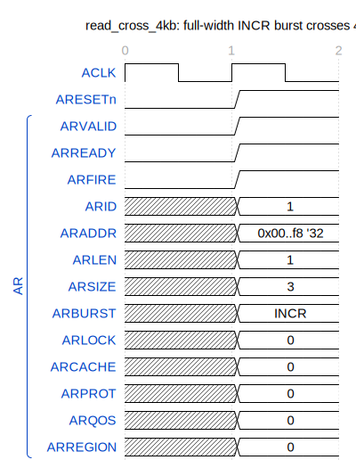

#### 因果事件图 · causality.svg

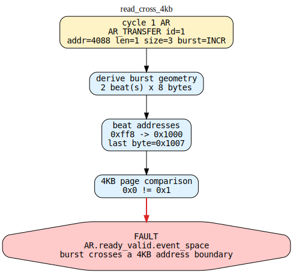

### `read_early_rlast`

RLAST asserted on the first of two beats

预期：`FAIL`；观察到：`FAIL`。

#### 波形图 · waveform.svg

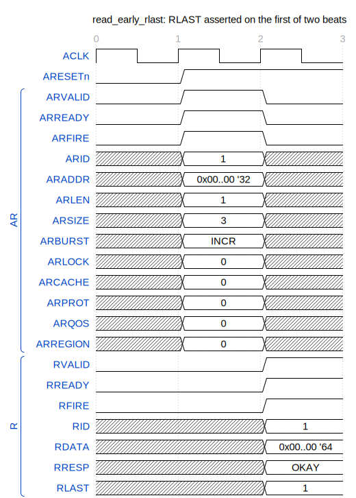

#### 因果事件图 · causality.svg

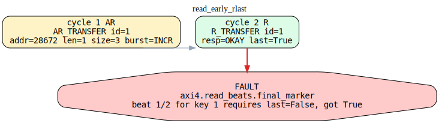

### `read_missing_rlast`

final beat omits RLAST

预期：`FAIL`；观察到：`FAIL`。

#### 波形图 · waveform.svg

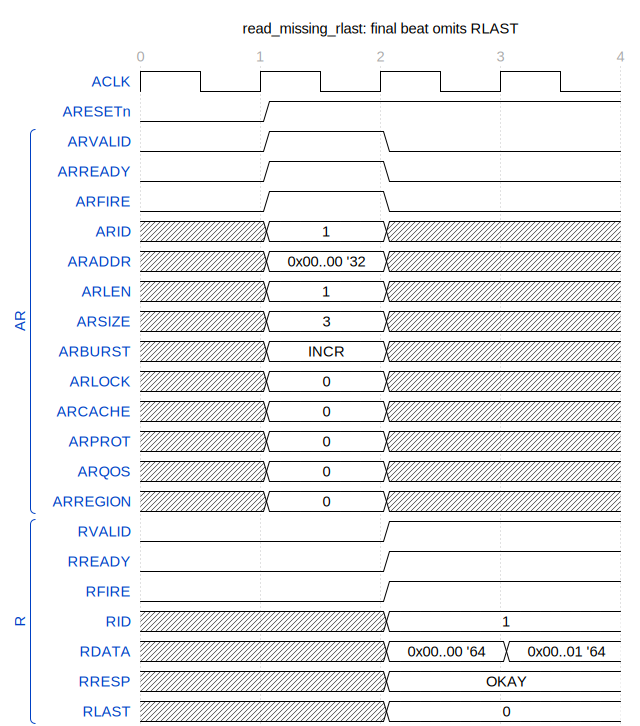

#### 因果事件图 · causality.svg

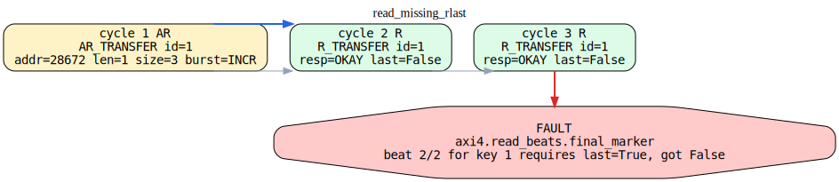

### `read_extra_beat`

R beat follows a completed burst

预期：`FAIL`；观察到：`FAIL`。

#### 波形图 · waveform.svg

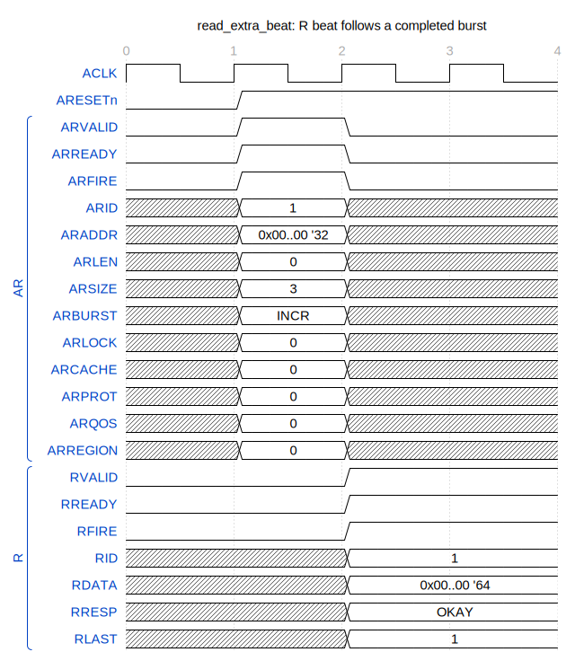

#### 因果事件图 · causality.svg

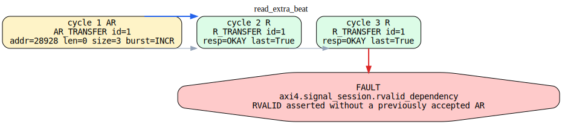

### `read_orphan_r`

R arrives without an AR obligation

预期：`FAIL`；观察到：`FAIL`。

#### 波形图 · waveform.svg

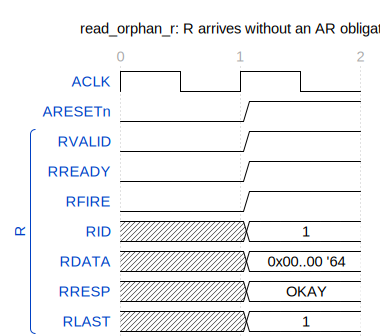

#### 因果事件图 · causality.svg

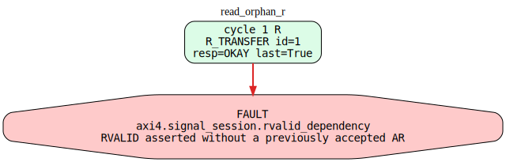

### `read_unknown_rid`

R uses a different ID from the pending AR

预期：`FAIL`；观察到：`FAIL`。

#### 波形图 · waveform.svg


#### 因果事件图 · causality.svg


### `read_slverr`

SLVERR completes an ordinary read

预期：`PASS`；观察到：`PASS`。

#### 波形图 · waveform.svg

#### 因果事件图 · causality.svg


### `read_decerr`

DECERR completes an ordinary read

预期：`PASS`；观察到：`PASS`。

#### 波形图 · waveform.svg

#### 因果事件图 · causality.svg


### `write_single`

ordinary single-beat write

预期：`PASS`；观察到：`PASS`。

#### 波形图 · waveform.svg


#### 因果事件图 · causality.svg

### `write_data_before_address`

complete W burst precedes AW

预期：`PASS`；观察到：`PASS`。

#### 波形图 · waveform.svg


#### 因果事件图 · causality.svg


### `write_aw_w_same_cycle`

AW and W handshake together

预期：`PASS`；观察到：`PASS`。

#### 波形图 · waveform.svg


#### 因果事件图 · causality.svg

### `write_two_outstanding`

two AW descriptors join two FIFO W bursts

预期：`PASS`；观察到：`PASS`。

#### 波形图 · waveform.svg


#### 因果事件图 · causality.svg


### `write_early_wlast`

WLAST asserted before AWLEN beats

预期：`FAIL`；观察到：`FAIL`。

#### 波形图 · waveform.svg


#### 因果事件图 · causality.svg


### `write_missing_wlast`

final W beat omits WLAST

预期：`FAIL`；观察到：`FAIL`。

#### 波形图 · waveform.svg


#### 因果事件图 · causality.svg


### `write_wrong_bid`

BID does not name a completed write

预期：`FAIL`；观察到：`FAIL`。

#### 波形图 · waveform.svg


#### 因果事件图 · causality.svg


### `write_b_before_join`

B arrives before AW/W join

预期：`FAIL`；观察到：`FAIL`。

#### 波形图 · waveform.svg


#### 因果事件图 · causality.svg


### `write_slverr`

SLVERR completes an ordinary write

预期：`PASS`；观察到：`PASS`。

#### 波形图 · waveform.svg

#### 因果事件图 · causality.svg

### `write_decerr`

DECERR completes an ordinary write

预期：`PASS`；观察到：`PASS`。

#### 波形图 · waveform.svg

#### 因果事件图 · causality.svg


### `read_cross_id_later_first`

later ID2 request completes before ID1

预期：`PASS`；观察到：`PASS`。

#### 波形图 · waveform.svg


#### 因果事件图 · causality.svg


### `read_cross_id_interleave`

R beats alternate across two IDs

预期：`PASS`；观察到：`PASS`。

#### 波形图 · waveform.svg


#### 因果事件图 · causality.svg


### `read_same_id_overtake`

second same-ID burst attempts to complete first

预期：`FAIL`；观察到：`FAIL`。

#### 波形图 · waveform.svg


#### 因果事件图 · causality.svg


### `write_cross_id_b_reverse`

different BID responses complete in reverse request order

预期：`PASS`；观察到：`PASS`。

#### 波形图 · waveform.svg


#### 因果事件图 · causality.svg


### `write_burst_fifo_mismatch`

short W burst cannot skip the oldest longer AW

预期：`FAIL`；观察到：`FAIL`。

#### 波形图 · waveform.svg


#### 因果事件图 · causality.svg


### `read_write_parallel`

read and write requests overlap and R/B complete together

预期：`PASS`；观察到：`PASS`。

#### 波形图 · waveform.svg


#### 因果事件图 · causality.svg


### `five_channel_concurrency`

all five channels handshake in one cycle after obligations exist

预期：`PASS`；观察到：`PASS`。

#### 波形图 · waveform.svg


#### 因果事件图 · causality.svg


### `stall_aw_payload_mutation`

AW payload changes while VALID is stalled

预期：`FAIL`；观察到：`FAIL`。

#### 波形图 · waveform.svg


#### 因果事件图 · causality.svg


### `stall_r_valid_drop`

RVALID drops before a stalled transfer is accepted

预期：`FAIL`；观察到：`FAIL`。

#### 波形图 · waveform.svg


#### 因果事件图 · causality.svg


### `reset_discards_outstanding_read`

response from the pre-reset epoch becomes orphaned

预期：`FAIL`；观察到：`FAIL`。

#### 波形图 · waveform.svg


#### 因果事件图 · causality.svg


### `reset_clears_stalled_valid`

reset cancels a stalled AW and a new write completes afterward

预期：`PASS`；观察到：`PASS`。

#### 波形图 · waveform.svg


#### 因果事件图 · causality.svg


### `inconsistent_channel_reset`

one AXI channel observes a different reset level

预期：`FAIL`；观察到：`FAIL`。

#### 波形图 · waveform.svg


#### 因果事件图 · causality.svg


