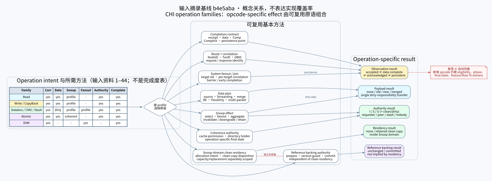
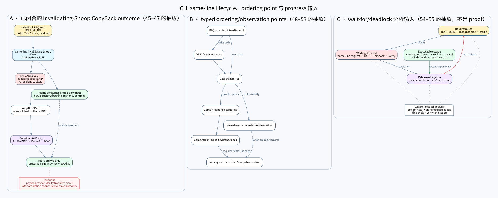
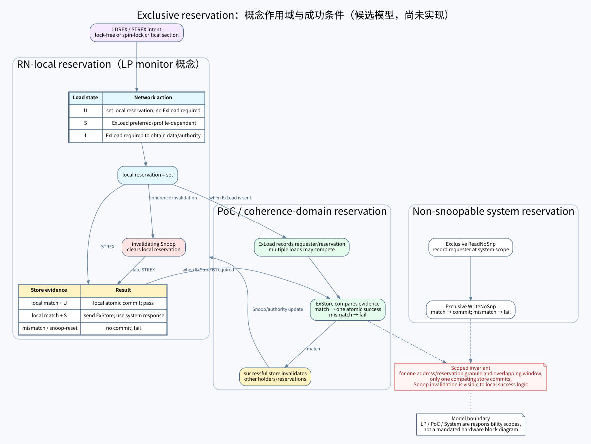

# CHI 注入流程资料摘录与建模映射

本文记录 2026-07-28 用户注入的一组 CHI 流程图与中文速记经过治理后留下的**概念摘录**。它用于发现候选
功能、比较可复用建模方法和 opcode-specific lifecycle，不是 CHI 规范、架构权威入口或实现状态汇总。
文中“当前工程判断”以提交 `b4e5aba` 为评审基线；后续实时状态仍只查实现状态与 roadmap。

- 稳定架构边界仍由
  [`chi-coherence-network-session.md`](../architecture/chi-coherence-network-session.md) 定义；
- 已实现/未实现结论仍只查
  [`implementation-status.md`](../architecture/implementation-status.md)；
- 当前实施顺序仍只查
  [`08-roadmap.md`](../architecture/technical-route/08-roadmap.md)；
- Issue H 包的可执行切片见
  [`protocol_model/.../issue_h/README.md`](../../protocol_model/protocols/amba/chi/issue_h/README.md)。

## 来源、处理方式与可信度

输入共 66 个文件：62 张 JPG、4 个 TXT，文件内容合计 2,262,645 bytes。在仓库根目录以 C locale 执行
`LC_ALL=C find figs -maxdepth 1 -type f -print0 | LC_ALL=C sort -z | xargs -0 sha256sum | sha256sum`，
得到集合摘要 `ce44a66a1dfc1f05cbc5232a831531e7484b3de9c7025c6cde3ec828dcc3c91d`。该摘要包含
`figs/` 路径前缀。图中可见第三方知乎水印，但原作者、原始 URL、版本和许可均未知。

因此治理只保留独立表述的关系和问题线索：

- 不保存、拼接、裁剪或嵌入原像素，也不复刻其版式、配色和逐箭头 MSC；
- 文件名与摘要的映射保留在本文，便于审计本次提炼是否漏项；
- 与协议一致性有关的 claim 必须重新核对 Arm CHI Issue H；有歧义的图只记录风险，不成为规范依据；
- 三张阅读图由本目录中的 DOT 源生成，执行
  `sh assets/chi-injected-flow-digest/render.sh` 可重建 SVG。当前阅读件使用 Graphviz 2.43.0 和
  `Noto Sans CJK SC` 生成；图的语义由 DOT 决定，跨 Graphviz/字体版本不承诺 SVG 字节完全相同。

三张图的输入摘录基线是 `b4e5aba`，不随每个 opcode slice 滚动改写。它们只表达从输入提炼出的语义维度
和候选方法，不表达 done/todo 或实时实现覆盖率；实现汇总应从已验证的 canonical status/model 另生成
architecture/showcase 资产。后续规范裁决保留在本文文字中；只有裁决暴露新的通用建模轴时，才把该轴
补入摘要图。只有发现提炼错误、重新审计一批有 provenance 的输入，或这类解释结构本身改变时，才同时
修改 DOT 并用上述脚本重建 SVG。

完成逐项覆盖、视觉和重建检查后，未受 Git 跟踪的原始 `figs/` 已删除；仓库长期保留的是本文、DOT 源和
SVG 阅读件，而不是第三方像素副本。

## 三张摘要图

三图分别观察单 operation 组合、跨 transaction 并发以及 reservation 作用域；这是问题维度划分，不是开发
完成度划分，任一张图都不是实时能力表。

### 1. Operation family 与可复用原语

这张图不把每个 opcode 当成孤立实现。Read、Write/CopyBack、dataless/CMO、Atomic 和 DVM 会按各自语义
选取 route/correlation、data plan、Snoop、fanout/join、authority commit、completion 等方法，不要求每个
family 经过全部原语；不同 opcode 仍需声明自己的 eligibility、dirty-data disposition、最终权限和完成条件。

后续对 `WriteEvictFull` 的规范裁决暴露了一个原图没有清楚分开的建模轴：Snoop-domain 内是否保留 clean
resident copy，与 reference backing 是否发生 prepare/commit 不是同一件事。因此图中只保留
clean-residency 与 reference-backing 两条通用方法轴，不放置该 opcode 的具体流程或完成状态；
`CAH=0` 生命周期及其当前实现边界仍查 canonical status 和 Issue H package 文档。

### 2. 同址并发、ordering point 与 progress

同址 hazard 需要同时表示 transaction phase 与 line authority/payload。receipt、DBID、data、completion
和 acknowledgment 也是不同观察点。held/wait/release/escape 可以形成 wait-for 分析输入，但当前投影不等于
一般 deadlock proof。

### 3. Exclusive reservation 的概念作用域

输入材料把 exclusive access 分为 RN-local reservation、PoC/coherence-domain reservation 和 non-snoopable
system reservation。图中 monitor 只表达候选概念职责和成功条件，不宣称 CHI 强制一种硬件结构；是否已有
executable lifecycle 仍查 canonical status。

## 基本方法与组合功能

| 建模层 | 可复用基本方法 | 由它组合出的功能 | `b4e5aba` 当时评审记录（历史，不维护） |
|---|---|---|---|
| 表示与关联 | typed REQ/RSP/SNP/DAT、NodeID route、TxnID/DBID、request/response identity | Read、Write、CopyBack、CMO、Atomic、DVM 的完整 transaction | Issue H 只登记了当前窄版所需 form；完整 catalog 尚缺 |
| 数据传递与 dirty responsibility | payload owner、byte enable、full/partial merge、PassDirty | DMT/DCT、dirty transfer、WriteBack、WriteClean、partial write、Atomic RMW | 若干 full-line dirty path 已有；partial/multi-packet/physical SN commit 尚缺 |
| Snoop-domain clean residency | Allocate intent、clean copy retain/discard、coherence-domain boundary | WriteEvict、stash 或下游 clean allocation | 输入 #26 提示 clean CopyBack；容量、victim 和 replacement policy 不能从该图推导 |
| reference backing authority | backing prepare/commit、line-local version 与 conflict guard | reference payload 更新及 dirty responsibility retirement | full-line reference backing 已有；它不是 Snoop-domain residency 或独立 Memory/SN physical commit |
| coherence authority | cache permission、directory holder、Snoop fanout/aggregate、operation-specific final state | ReadUnique、CleanUnique、MakeUnique、Clean/MakeInvalid、Evict、Stash | Read/CleanUnique/受限 WriteBack 已闭合；Evict/MakeUnique/Stash 尚缺 |
| completion 与 ordering | receipt、DBID lease、Comp/CompAck、同址 reservation、causal edge | same-line transient、OWO、跨 Home stream ordering | 当前只闭合少量同址路径；一般 observation/ordering property 尚缺 |
| progress | held resource、waiting demand、release event、Retry/P-Credit escape | block/replay、Retry/Snoop 组合、wait-for/deadlock witness | 已有只读 held/wait 投影；尚无一般 cycle proof、选择/公平性或多 waiter |
| operation effect | opcode eligibility、dirty disposition、permission transition、completion rule | 每个新增 opcode slice | 不是“只加 enum”；每个 slice 都必须连 participant、Home、feature/flow 和 witness |
| Atomic/Exclusive | 原子 memory transform、reservation scope、Snoop invalidation、唯一成功提交 | AtomicStore/Load/Swap/Compare、LDREX/STREX | 仅作为未来候选，当前没有 executable lifecycle |

所以“功能由基本方法组合”只意味着大部分结构可复用，不意味着新 opcode 不需要实现。以 clean `Evict` 为例，
它可复用 TxnID、route、directory transition 和 completion retirement，但仍需要新增 REQ form、RN
eligibility/final-state、Home holder removal、feature/flow closure 以及负向/拓扑见证。

## 输入分组与提炼结果

| 输入组 | 提炼出的稳定关系 | 对 `b4e5aba` 当时路线的影响（历史） |
|---|---|---|
| 1–14 · Read | 数据可来自 SN/Home/peer；common、DMT、DCT 改变 transport path，不改变 transaction 必须闭合的 correlation；最终 I/SC/UC/UD 与 dirty responsibility 单独判定 | 可作为未来 DMT/DCT、MakeReadUnique 和 partial merge 的候选目录，不扩大当前 Read slice |
| 15–27 · Write/CopyBack | full/partial/zero、是否 Snoop、是否 merge、requester 保留/丢弃 line 是独立轴；DBID grant 不等于 memory observation；clean residency 也不等于 backing commit | 23 只展示正常 WriteBack，不包含已实现的 same-line cancel；26/27 是 WriteEvict family，不并入首个 clean Evict |
| 28–38 · Dataless/CMO/Stash/Evict | operation 由“peer dirty 数据写回或丢弃、谁获得 authority、是否等待 persistence”区分 | 29 与 dirty-peer CleanUnique 相符但画了尚未实现的 HN→SN physical write；38 是 clean Evict 的候选最小流 |
| 39–44 · Atomic/DVM | AtomicStore 不返回旧值，Load/Swap/Compare 返回旧值；DVM 是 fanout/join，sync 需要 barrier | 需要独立 operation algebra 与 system fanout，不应顺手塞进 coherence opcode 切片 |
| 45–47 · same-line hazard | pending phase 与 line authority/payload 是两条状态轴；Snoop 后晚到 completion 不得复活旧 authority；dirty payload 只转移一次 | 支持当前 `LIVE_UD→CANCELED_I→CopyBackWrData_I` 的方法选择，但 46 的具体完成流版本不明 |
| 48–53 · ordering/OWO | receipt、response、data、completion、ack、downstream observation 是不同 causal point；允许 overlap 不等于允许乱序观察 | 后续应建 typed observation edge，不用单一 `completed` 布尔值 |
| 54–55 · deadlock avoidance | DBID、line、response slot、Retry/credit 与 CompAck obligation 都可能进入 wait-for；每个环需要可执行 release/escape | 只能作为 wait-for 数据模型线索，原图本身不足以证明或排除 deadlock |
| 56–65 · Exclusive | local/PoC/system reservation 作用域不同；invalidating Snoop 清本地 reservation；load/store 是否上网由 state 与 reservation evidence 决定 | 后续独立功能族；不能把 LP/PoC/System monitor 误建成一个全局 mutable object |

## 需要特别防止的误读

- 输入 #23 是正常 `WriteBackFull → CompDBIDResp → CopyBack data`，没有 post-Snoop cancel；
  本工程的 cancel 结论来自 Issue H 独立核对，不来自该图。
- 输入 #26 只提供 data-bearing clean eviction 的发现线索；`CAH=0` 字段合同、精确
  `REQ → CompDBIDResp → CopyBackWrData_UC` 序列、RN `UC→I` 和 backing unchanged 都来自后续 Issue H
  裁决，不能反向归因给原图。该裁决也不证明自动 replacement、`CAH=1` 或 same-line Snoop 已实现。
- 输入 #29 把 dirty data 进一步写到 SN；当前工程只承诺协议无关 reference backing commit，
  不宣称已有 topology-visible HN→SN physical write。
- 输入 #30 的无数据 permission upgrade 与标注的 `I→UD` 不自洽；只保留
  `MakeUnique/SnpMakeInvalid/Comp/CompAck` 作为待核对线索。
- 输入 #38 清楚表达“clean copy 退出、可选 directory/filter update、无 DAT”，但没有完整表达
  `UC/UCE/SC→I-before-REQ`、固定字段、Retry rule、`ExpCompAck=0`、DBID 无 lease、stale hint、
  same-line Snoop 与 error 边界；这些合同必须独立核对 Issue H。
- 输入 #46 使用的 WriteBack completion 形态与当前 Issue H slice 不同；不用于 normative claim。
- 输入 #54–55 和第二份 #65 只有箭头图且存在解释歧义；这里只抽取 invariant，不固化具体序列。
- 这批材料没有 Retry/Snoop/error 组合、DERR 来源或 `UCE`，不能为这些能力增加实现 claim。

## 后续规范裁决（不更新本评审实现快照）

1. 在本评审基线中，roadmap 的 Retry/Snoop/error 窄组合仍必须直接核对 Issue H；本批材料只补充
   wait-for 与 phase 表达方法，没有提供该组合的协议证据。该切片后续是否闭合仍查实时实现状态。
2. clean `Evict` 的核准边界是：RN 从 `UC/UCE/SC` 先转 `I` 再发 REQ；Home 可条件删除匹配 clean holder，
   也必须容忍 stale/non-holder 或仍标记 shared-dirty responsibility 的 hint，并 no-op 返回 `Comp_I`；
   无 DAT、CompAck、DBID lease 或 backing
   write。本次核准的 clean profile 对 RN 从 `I/UD/SD` 主动发起是负例，但 Issue H 另有 deliberate dirty
   invalidate 后用 Evict 通知的旁支，所以该旁支是非目标，不是“协议永远禁止 dirty→Evict”。迟到或
   TxnID 不匹配的 completion 仍是 RN correlation 负例。
3. 本次对 `WriteEvictFull` 采用的首个规范映射是 `CAH=0` data-bearing 分支：
   `WriteEvictFull REQ → CompDBIDResp → CopyBackWrData_UC`。调用方显式选择 resident `UC` line；RN 接收
   DBID 并发出完整 clean data 时进入 `I`。Home 侧将数据保留为 Snoop-domain clean residency，同时保持
   reference backing payload/version 不变，不执行 backing commit。该映射没有 SNP traffic，但
   Snoop-domain residency 仍要求 system authority 显式选择 coherence domain。clean residency 与
   reference backing 因而是两个独立状态轴。RN 发出 DAT 后 original TxnID 可复用，旧 data phase 改由
   Home DBID 关联；该裁决只定义建模边界，能力是否闭合仍查实时实现状态。
4. 自动 victim/replacement policy、`CAH=1`、`WriteEvictOrEvict` 与 same-line Snoop 组合不由上述窄映射覆盖；
   三张摘要图也不表达这些 modifier 的实现状态。
5. same-line、OWO 与 deadlock 继续采用“phase + authority/payload + held/wait/release”三类事实，避免把一张
   具体 MSC 硬编码成通用 scheduler。

## 逐项语义索引（压缩）

| 编号 | 从输入中提取的主题；不确定处不作为规范 claim |
|---|---|
| 1–14 | #1 普通 ReadNoSnp；#2 DMT ReadNoSnp；#3 DMT separate response；#4 普通 ReadOnce；#5 DCT ReadOnce；#6 ReadOnceCleanInvalid；#7 ReadOnceMakeInvalid；#8 UDP merge/no-DCT ReadUnique；#9 UDP/DCT ReadUnique；#10 无 exclusive sequence 的 ReadPreferUnique；#11 带 exclusive sequence 的 ReadPreferUnique；#12 MakeReadUnique upgrade；#13 MakeReadUnique 与 ReadUnique 同址串行；#14 ReadShared/ReadNotSharedDirty/ReadClean 的 dirty-owner downgrade/transfer。 |
| 15–27 | #15 WriteNoSnp full/def；#16 WriteNoSnp partial 的旧数据 merge；#17 WriteNoSnp zero；#18 WriteUniqueFull；#19 WriteUniquePtl merge；#20 WriteUniqueZero；#21/22 full/partial WriteUnique stash；#23 正常 WriteBackFull；#24 partial CopyBack merge；#25 WriteCleanFull 后 requester 保留 clean copy；#26 WriteEvictFull 携带 clean CopyBack data；#27 WriteEvictOrEvict 的无数据选择流。 |
| 28–38 | #28 dataless/CMO 速记；#29 dirty-peer CleanUnique；#30 MakeUnique（状态标注有疑点）；#31 CleanInvalid；#32 MakeInvalid；#33 CleanShared；#34 CleanSharedPersist；#35 completion 与 Persist 分离；#36 StashOnceUnique；#37 StashOnceShared 的实际结果仍由 profile 决定；#38 clean Evict。 |
| 39–44 | #39 AtomicStore/Load/Swap/Compare 分类；#40 collective operation 用例；#41 AtomicSwap lock 用例；#42 AtomicStore Home RMW；#43 AtomicLoad/Swap/Compare 返回旧值；#44 DVM non-sync early completion 与 sync fanout barrier。 |
| 45–55 | #45 pending WriteBack 遇 shared/forward Snoop，最终 DAT 服从 post-Snoop state；#46 pending WriteBack 遇 ReadUnique/invalidating Snoop（completion 形态版本不明）；#47 pending ReadUnique/CleanUnique 展示 phase 与 authority 分离；#48 combined Read ordering points；#49 separate response/data ordering；#50 coherent same-line CompAck edge；#51 单 Home Ordered Write Observation；#52 跨 Home 保守 stream ordering；#53 跨 Home 更细粒度 overlap；#54 单 RN/Home resource dependency；#55 两 RN/两 Home wait-for cycle。 |
| 56–65 | #56 exclusive/LDREX-STREX 背景；#57 四线程 spin-lock 用例；#58 LP/PoC/System reservation scope；#59 三类 reservation 行为速记；#60 U 命中时 load/store 可本地完成；#61 competing requester 的 Snoop 清 reservation；#62 ExLoad=yes/ExStore=no；#63 多方 load reservation、唯一 store success；#64 ExLoad=no/ExStore=yes 且缺少 PoC evidence 时失败；第一份 #65 失败后重新 load/retry；第二份 #65 双方都发 ExLoad/ExStore 的竞争，底部结果有视觉歧义。 |

## 完整覆盖清单

下面每个输入 basename 恰好出现一次；编号 65 有两个不同文件。

- **Read（1–14）**：
  `1common_readnosnp.jpg`, `2dmt_readnosnp.jpg`,
  `3dmt_separateresp_readnosnp.jpg`, `4common_readonce.jpg`,
  `5dct_readonce.jpg`, `6readoncecleanvalid.jpg`,
  `7readoncemakeinvalid.jpg`, `8udp_mergedata_nodct_readunique.jpg`,
  `9udp_dct_readunique.jpg`, `10noexclusiveseq_readpreferunique.jpg`,
  `11includingexclusiveseq_readpreferunique.jpg`,
  `12noexclusive_makereadunique.jpg`, `13.jpg`,
  `14readshared_readnotshareddirty_readclean.jpg`.
- **Write/CopyBack（15–27）**：
  `15writenosnp.jpg`, `16writenosnpptl.jpg`, `17writenosnpzero.jpg`,
  `18writeuniquefull.jpg`, `19writeuniqueptl.jpg`,
  `20writeuniquezero.jpg`, `21writeuniquefullstash.jpg`,
  `22wrtieuniqueptlstash.jpg`, `23writebackfull.jpg`,
  `24writebackptl.jpg`, `25writecleanfull.jpg`,
  `26writeevictfull.jpg`, `27writeevictorevict.jpg`.
- **Dataless/CMO/Stash/Evict（28–38）**：
  `28dataless.txt`, `29cleanunique.jpg`, `30makeunique.jpg`,
  `31cleaninvalid.jpg`, `32makeinvalid.jpg`, `33cleanshared.jpg`,
  `34cleansharedpersist.jpg`, `35cleansharedpersistsep.jpg`,
  `36stashonceunique.jpg`, `37stashonceshared.jpg`, `38evict.jpg`.
- **Atomic/DVM（39–44）**：
  `39atomic.txt`, `40.jpg`, `41.jpg`, `42atomicstore.jpg`,
  `43AtomicLoadAtomicSwapAtomicCompare.jpg`, `44DVM.jpg`.
- **Hazard/ordering/deadlock（45–55）**：
  `45hazardhandel.jpg`, `46hazardhandel.jpg`, `47hazardhandel.jpg`,
  `48ordering.jpg`, `49ordering.jpg`, `50ordering.jpg`, `51owo.jpg`,
  `52streamowo.jpg`, `53streamowo.jpg`, `54avoiddeadlock.jpg`,
  `55avoiddeadlock.jpg`.
- **Exclusive（56–65）**：
  `56.txt`, `57.jpg`, `58.jpg`, `59.txt`, `60exclusive.jpg`,
  `61exclusive.jpg`, `62includingexloadtrans_noexstoretrans.jpg`,
  `63.jpg`, `64noexloadtrans_includingexstoretrans.jpg`, `65.jpg`,
  `65includingexloadtrans_includingexstoretrans.jpg`.
