# AXI4 可执行示例导航

这是一套统一的 AXI4 介绍例：同一个具名 runner 执行 `24` 个场景，并为每个场景发布 `result.json`、波形和因果图。其中 `10` 个展示合法路径，`14` 个展示预期拒绝；表中的 `FAIL` 是协议语义判定，不表示发布失败。

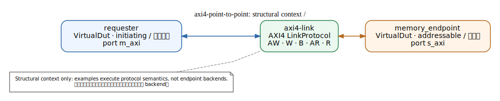

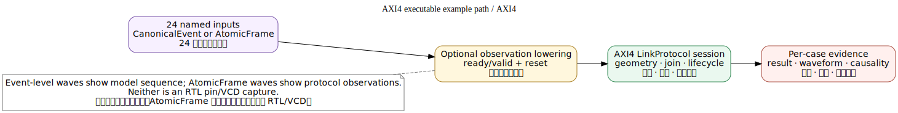

场景有两种诚实的观察口径：`link-events` 的每一列是一笔依次送入模型的 `CanonicalEvent`，不表示 AXI pin、周期或 VALID/READY；`atomic-frames` 才展示一个采样沿内的 ready/valid lane，并把内部 reset 取反为 AXI 的 `ARESETn`。

## 事务生命周期

| Case | Input view | Expected → observed | Rule | Evidence |
| --- | --- | --- | --- | --- |
| `read-single-lifecycle` 单拍读事务打开并解除一个义务 AR 建立一个待读资源，匹配的末拍 R 将其释放。 | `link-events` | `PASS` → `PASS` | `—` | [wave](cases/read-single-lifecycle/waveform.svg) · [cause](cases/read-single-lifecycle/causality.svg) · [JSON](cases/read-single-lifecycle/result.json) |
| `read-orphan-response` R 响应必须对应已接受的 AR 没有待读请求的响应会在单链路范围内被拒绝。 | `link-events` | `FAIL` → `FAIL` | `axi4.read.orphan_beat` | [wave](cases/read-orphan-response/waveform.svg) · [cause](cases/read-orphan-response/causality.svg) · [JSON](cases/read-orphan-response/result.json) |
| `write-single-lifecycle` AW 与 W 关联后再由 B 完成 关联后的写事务占用一个 completion 资源，直到 B 到达。 | `link-events` | `PASS` → `PASS` | `—` | [wave](cases/write-single-lifecycle/waveform.svg) · [cause](cases/write-single-lifecycle/causality.svg) · [JSON](cases/write-single-lifecycle/result.json) |
| `write-data-before-address` 完整 W burst 可以先于 AW 描述符到达 无 ID 的 W burst 按 FIFO 顺序等待并关联后续 AW。 | `link-events` | `PASS` → `PASS` | `—` | [wave](cases/write-data-before-address/waveform.svg) · [cause](cases/write-data-before-address/causality.svg) · [JSON](cases/write-data-before-address/result.json) |
| `write-early-wlast` **精讲** WLAST 必须符合最早 AW 声明的拍数 AWLEN=3 表示四拍，因此首拍置 WLAST 属于过早结束。 | `atomic-frames` | `FAIL` → `FAIL` | `axi4.write.final_marker` | [wave](cases/write-early-wlast/waveform.svg) · [cause](cases/write-early-wlast/causality.svg) · [JSON](cases/write-early-wlast/result.json) |
| `write-missing-wlast` 最后一拍必需的 W 传输必须置 WLAST 单拍 AW 要求唯一的 W 传输同时也是末拍。 | `link-events` | `FAIL` → `FAIL` | `axi4.write.final_marker` | [wave](cases/write-missing-wlast/waveform.svg) · [cause](cases/write-missing-wlast/causality.svg) · [JSON](cases/write-missing-wlast/result.json) |
| `write-wrong-bid` BID 必须标识一笔待完成写事务 ID 13 的 B 响应不能完成 ID 12 的已关联写事务。 | `link-events` | `FAIL` → `FAIL` | `axi4.exclusive.orphan_write_response` | [wave](cases/write-wrong-bid/waveform.svg) · [cause](cases/write-wrong-bid/causality.svg) · [JSON](cases/write-wrong-bid/result.json) |

查看 `read-single-lifecycle` 的波形与因果图

**单拍读事务打开并解除一个义务.** AR 建立一个待读资源，匹配的末拍 R 将其释放。

事件级波形的一列是一笔 CanonicalEvent，不表示 pin/cycle。

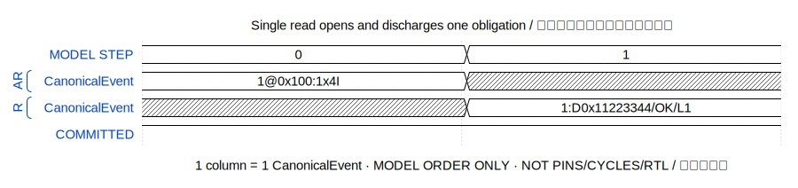

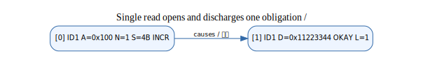

[result.json](cases/read-single-lifecycle/result.json) · [WaveJSON](sources/cases/read-single-lifecycle/waveform.json) · [DOT](sources/cases/read-single-lifecycle/causality.dot)

查看 `read-orphan-response` 的波形与因果图

**R 响应必须对应已接受的 AR.** 没有待读请求的响应会在单链路范围内被拒绝。

事件级波形的一列是一笔 CanonicalEvent，不表示 pin/cycle。

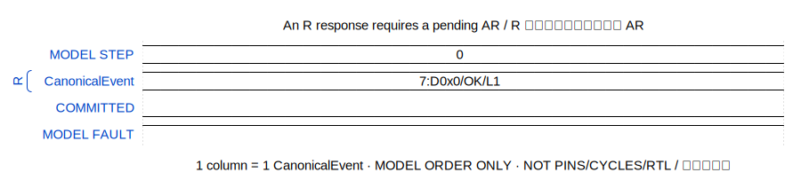

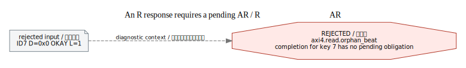

[result.json](cases/read-orphan-response/result.json) · [WaveJSON](sources/cases/read-orphan-response/waveform.json) · [DOT](sources/cases/read-orphan-response/causality.dot)

查看 `write-single-lifecycle` 的波形与因果图

**AW 与 W 关联后再由 B 完成.** 关联后的写事务占用一个 completion 资源，直到 B 到达。

事件级波形的一列是一笔 CanonicalEvent，不表示 pin/cycle。

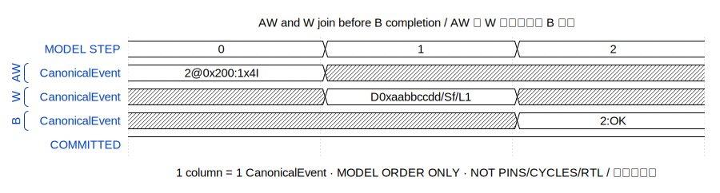

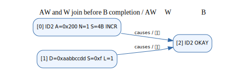

[result.json](cases/write-single-lifecycle/result.json) · [WaveJSON](sources/cases/write-single-lifecycle/waveform.json) · [DOT](sources/cases/write-single-lifecycle/causality.dot)

查看 `write-data-before-address` 的波形与因果图

**完整 W burst 可以先于 AW 描述符到达.** 无 ID 的 W burst 按 FIFO 顺序等待并关联后续 AW。

事件级波形的一列是一笔 CanonicalEvent，不表示 pin/cycle。

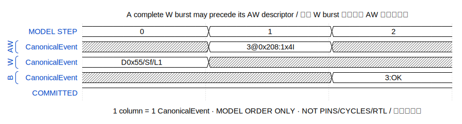

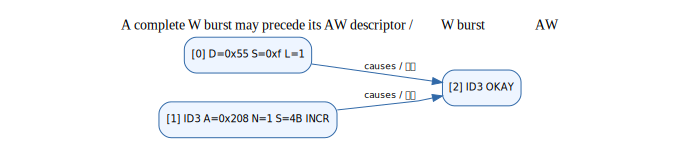

[result.json](cases/write-data-before-address/result.json) · [WaveJSON](sources/cases/write-data-before-address/waveform.json) · [DOT](sources/cases/write-data-before-address/causality.dot)

查看 `write-missing-wlast` 的波形与因果图

**最后一拍必需的 W 传输必须置 WLAST.** 单拍 AW 要求唯一的 W 传输同时也是末拍。

事件级波形的一列是一笔 CanonicalEvent，不表示 pin/cycle。

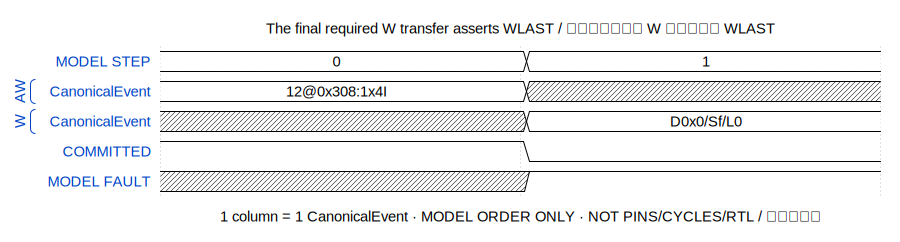

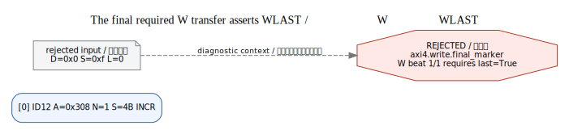

[result.json](cases/write-missing-wlast/result.json) · [WaveJSON](sources/cases/write-missing-wlast/waveform.json) · [DOT](sources/cases/write-missing-wlast/causality.dot)

查看 `write-wrong-bid` 的波形与因果图

**BID 必须标识一笔待完成写事务.** ID 13 的 B 响应不能完成 ID 12 的已关联写事务。

事件级波形的一列是一笔 CanonicalEvent，不表示 pin/cycle。

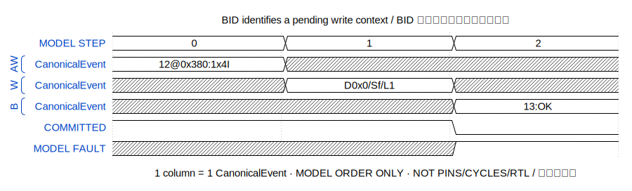

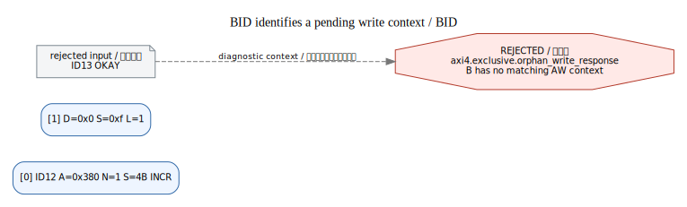

[result.json](cases/write-wrong-bid/result.json) · [WaveJSON](sources/cases/write-wrong-bid/waveform.json) · [DOT](sources/cases/write-wrong-bid/causality.dot)

## burst 与字节几何

| Case | Input view | Expected → observed | Rule | Evidence |
| --- | --- | --- | --- | --- |
| `read-crosses-4kb-boundary` INCR burst 必须位于同一个 4KB 区域 从 0xFFC 开始的两个四字节传输会跨越该边界。 | `link-events` | `FAIL` → `FAIL` | `axi4.link_session.AR.event_schema` | [wave](cases/read-crosses-4kb-boundary/waveform.svg) · [cause](cases/read-crosses-4kb-boundary/causality.svg) · [JSON](cases/read-crosses-4kb-boundary/result.json) |
| `write-narrow-unaligned-incr` **精讲** 窄位宽非对齐传输轮换合法字节通道 四拍合法 WSTRB 由 AW 几何信息派生。 | `atomic-frames` | `PASS` → `PASS` | `—` | [wave](cases/write-narrow-unaligned-incr/waveform.svg) · [cause](cases/write-narrow-unaligned-incr/causality.svg) · [JSON](cases/write-narrow-unaligned-incr/result.json) |
| `write-strobe-outside-lanes` WSTRB 不得选择传输容器之外的字节 该首拍位于地址 0x3，只有字节通道 3 合法。 | `link-events` | `FAIL` → `FAIL` | `axi4.write.byte_lanes` | [wave](cases/write-strobe-outside-lanes/waveform.svg) · [cause](cases/write-strobe-outside-lanes/causality.svg) · [JSON](cases/write-strobe-outside-lanes/result.json) |
| `read-wrap-four-legal` 四拍 WRAP burst 在自身窗口内回绕 从 0x2C 开始的四拍传输会在 0x20–0x2F 窗口内合法回绕。 | `link-events` | `PASS` → `PASS` | `—` | [wave](cases/read-wrap-four-legal/waveform.svg) · [cause](cases/read-wrap-four-legal/causality.svg) · [JSON](cases/read-wrap-four-legal/result.json) |
| `read-wrap-three-illegal` WRAP 必须使用协议允许的传输拍数 三拍不是 AXI4 允许的 WRAP 长度。 | `link-events` | `FAIL` → `FAIL` | `axi4.link_session.AR.event_schema` | [wave](cases/read-wrap-three-illegal/waveform.svg) · [cause](cases/read-wrap-three-illegal/causality.svg) · [JSON](cases/read-wrap-three-illegal/result.json) |
| `read-fixed-sixteen-legal` FIXED 允许在同一地址容器上传输十六拍 即使位于 0xFFF，每一拍仍复用同一个页内传输容器。 | `link-events` | `PASS` → `PASS` | `—` | [wave](cases/read-fixed-sixteen-legal/waveform.svg) · [cause](cases/read-fixed-sixteen-legal/causality.svg) · [JSON](cases/read-fixed-sixteen-legal/result.json) |
| `read-fixed-seventeen-illegal` FIXED 长度不超过十六拍 AxLEN=16 表示十七拍，因此不适用于 FIXED。 | `link-events` | `FAIL` → `FAIL` | `axi4.link_session.AR.event_schema` | [wave](cases/read-fixed-seventeen-illegal/waveform.svg) · [cause](cases/read-fixed-seventeen-illegal/causality.svg) · [JSON](cases/read-fixed-seventeen-illegal/result.json) |

查看 `read-crosses-4kb-boundary` 的波形与因果图

**INCR burst 必须位于同一个 4KB 区域.** 从 0xFFC 开始的两个四字节传输会跨越该边界。

事件级波形的一列是一笔 CanonicalEvent，不表示 pin/cycle。

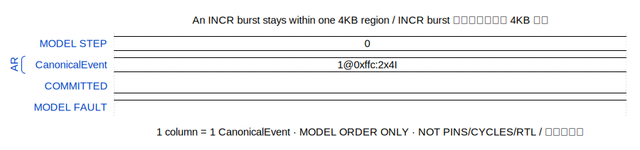

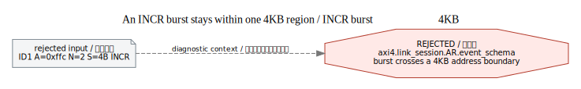

[result.json](cases/read-crosses-4kb-boundary/result.json) · [WaveJSON](sources/cases/read-crosses-4kb-boundary/waveform.json) · [DOT](sources/cases/read-crosses-4kb-boundary/causality.dot)

查看 `write-strobe-outside-lanes` 的波形与因果图

**WSTRB 不得选择传输容器之外的字节.** 该首拍位于地址 0x3，只有字节通道 3 合法。

事件级波形的一列是一笔 CanonicalEvent，不表示 pin/cycle。

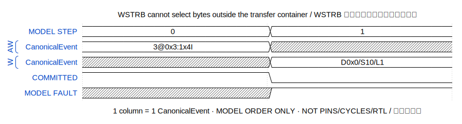

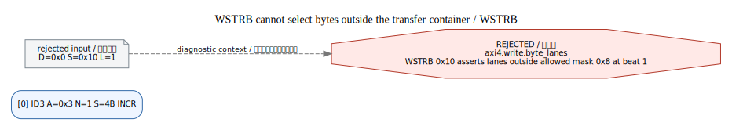

[result.json](cases/write-strobe-outside-lanes/result.json) · [WaveJSON](sources/cases/write-strobe-outside-lanes/waveform.json) · [DOT](sources/cases/write-strobe-outside-lanes/causality.dot)

查看 `read-wrap-four-legal` 的波形与因果图

**四拍 WRAP burst 在自身窗口内回绕.** 从 0x2C 开始的四拍传输会在 0x20–0x2F 窗口内合法回绕。

事件级波形的一列是一笔 CanonicalEvent，不表示 pin/cycle。

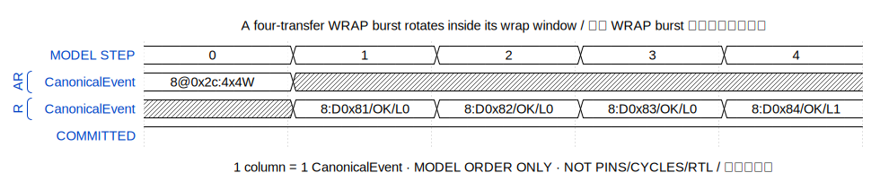

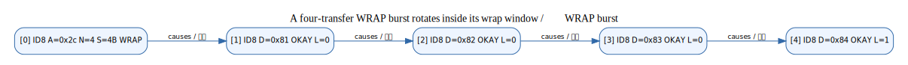

[result.json](cases/read-wrap-four-legal/result.json) · [WaveJSON](sources/cases/read-wrap-four-legal/waveform.json) · [DOT](sources/cases/read-wrap-four-legal/causality.dot)

查看 `read-wrap-three-illegal` 的波形与因果图

**WRAP 必须使用协议允许的传输拍数.** 三拍不是 AXI4 允许的 WRAP 长度。

事件级波形的一列是一笔 CanonicalEvent，不表示 pin/cycle。

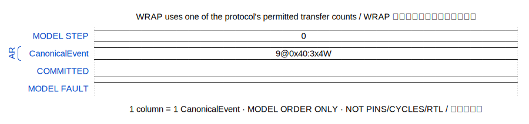

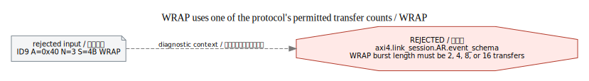

[result.json](cases/read-wrap-three-illegal/result.json) · [WaveJSON](sources/cases/read-wrap-three-illegal/waveform.json) · [DOT](sources/cases/read-wrap-three-illegal/causality.dot)

查看 `read-fixed-sixteen-legal` 的波形与因果图

**FIXED 允许在同一地址容器上传输十六拍.** 即使位于 0xFFF，每一拍仍复用同一个页内传输容器。

事件级波形的一列是一笔 CanonicalEvent，不表示 pin/cycle。

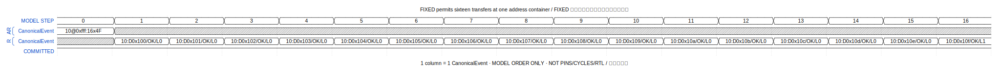

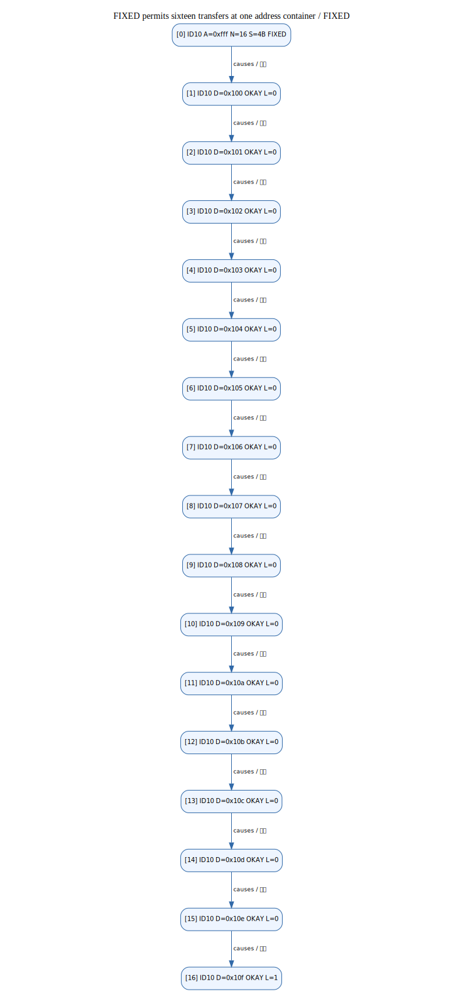

[result.json](cases/read-fixed-sixteen-legal/result.json) · [WaveJSON](sources/cases/read-fixed-sixteen-legal/waveform.json) · [DOT](sources/cases/read-fixed-sixteen-legal/causality.dot)

查看 `read-fixed-seventeen-illegal` 的波形与因果图

**FIXED 长度不超过十六拍.** AxLEN=16 表示十七拍，因此不适用于 FIXED。

事件级波形的一列是一笔 CanonicalEvent，不表示 pin/cycle。

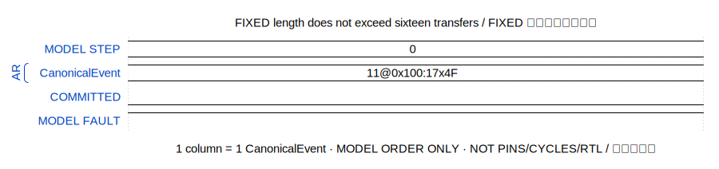

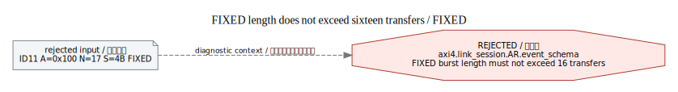

[result.json](cases/read-fixed-seventeen-illegal/result.json) · [WaveJSON](sources/cases/read-fixed-seventeen-illegal/waveform.json) · [DOT](sources/cases/read-fixed-seventeen-illegal/causality.dot)

## 顺序与交织

| Case | Input view | Expected → observed | Rule | Evidence |
| --- | --- | --- | --- | --- |
| `read-cross-id-interleave` 不同 ID 的读响应可以交织 链路交替返回不同 ID，同时分别维护各自的拍数。 | `link-events` | `PASS` → `PASS` | `—` | [wave](cases/read-cross-id-interleave/waveform.svg) · [cause](cases/read-cross-id-interleave/causality.svg) · [JSON](cases/read-cross-id-interleave/result.json) |
| `read-same-id-later-cannot-overtake` 同 ID 的最早读请求优先消费响应 面向后一笔单拍读的末拍，对最早的两拍读而言属于过早结束。 | `link-events` | `FAIL` → `FAIL` | `axi4.read.final_marker` | [wave](cases/read-same-id-later-cannot-overtake/waveform.svg) · [cause](cases/read-same-id-later-cannot-overtake/causality.svg) · [JSON](cases/read-same-id-later-cannot-overtake/result.json) |
| `write-multiple-outstanding-reverse-b` 不同写 ID 可以按请求的逆序完成 W 仍按 FIFO 与 AW 关联，而 B 可以按 ID 选择待完成写事务。 | `link-events` | `PASS` → `PASS` | `—` | [wave](cases/write-multiple-outstanding-reverse-b/waveform.svg) · [cause](cases/write-multiple-outstanding-reverse-b/causality.svg) · [JSON](cases/write-multiple-outstanding-reverse-b/result.json) |

查看 `read-cross-id-interleave` 的波形与因果图

**不同 ID 的读响应可以交织.** 链路交替返回不同 ID，同时分别维护各自的拍数。

事件级波形的一列是一笔 CanonicalEvent，不表示 pin/cycle。

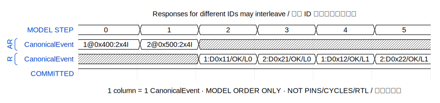

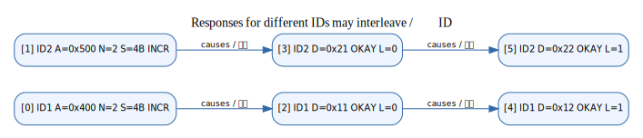

[result.json](cases/read-cross-id-interleave/result.json) · [WaveJSON](sources/cases/read-cross-id-interleave/waveform.json) · [DOT](sources/cases/read-cross-id-interleave/causality.dot)

查看 `read-same-id-later-cannot-overtake` 的波形与因果图

**同 ID 的最早读请求优先消费响应.** 面向后一笔单拍读的末拍，对最早的两拍读而言属于过早结束。

事件级波形的一列是一笔 CanonicalEvent，不表示 pin/cycle。

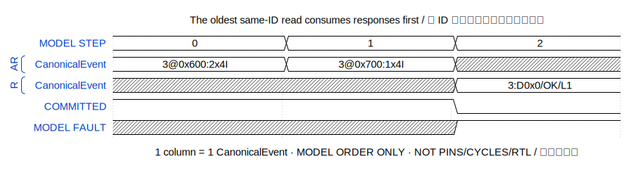

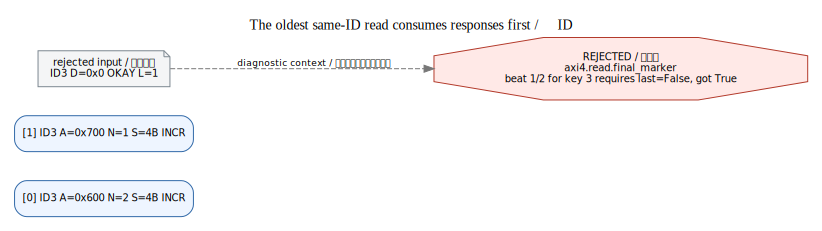

[result.json](cases/read-same-id-later-cannot-overtake/result.json) · [WaveJSON](sources/cases/read-same-id-later-cannot-overtake/waveform.json) · [DOT](sources/cases/read-same-id-later-cannot-overtake/causality.dot)

查看 `write-multiple-outstanding-reverse-b` 的波形与因果图

**不同写 ID 可以按请求的逆序完成.** W 仍按 FIFO 与 AW 关联，而 B 可以按 ID 选择待完成写事务。

事件级波形的一列是一笔 CanonicalEvent，不表示 pin/cycle。

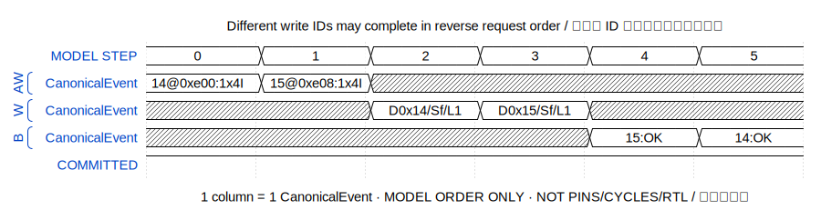

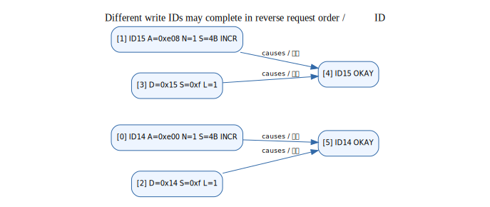

[result.json](cases/write-multiple-outstanding-reverse-b/result.json) · [WaveJSON](sources/cases/write-multiple-outstanding-reverse-b/waveform.json) · [DOT](sources/cases/write-multiple-outstanding-reverse-b/causality.dot)

## 采样与复位

| Case | Input view | Expected → observed | Rule | Evidence |
| --- | --- | --- | --- | --- |
| `observation-same-frame-aw-w` 同一采样沿的 AW 与 W 作为一个帧提交 观察层在后续 B 之前关联同一帧中的两个传输。 | `atomic-frames` | `PASS` → `PASS` | `—` | [wave](cases/observation-same-frame-aw-w/waveform.svg) · [cause](cases/observation-same-frame-aw-w/causality.svg) · [JSON](cases/observation-same-frame-aw-w/result.json) |
| `observation-same-frame-ar-r` 响应不能消费同一采样沿刚建立的义务 R 依据当前 AR 提交之前可见的状态进行检查。 | `atomic-frames` | `FAIL` → `FAIL` | `axi4.read.orphan_beat` | [wave](cases/observation-same-frame-ar-r/waveform.svg) · [cause](cases/observation-same-frame-ar-r/causality.svg) · [JSON](cases/observation-same-frame-ar-r/result.json) |
| `observation-stalled-payload-mutation` VALID 阻塞期间 payload 保持稳定 AR 接受前改变 ARADDR 会违反 ready/valid 稳定性。 | `atomic-frames` | `FAIL` → `FAIL` | `axi4.observation.AR.ready_valid.payload_stability` | [wave](cases/observation-stalled-payload-mutation/waveform.svg) · [cause](cases/observation-stalled-payload-mutation/causality.svg) · [JSON](cases/observation-stalled-payload-mutation/result.json) |
| `observation-reset-clears-pending-read` 复位开启新的观察与链路 epoch 复位后的 R 不能完成复位前的 AR。 | `atomic-frames` | `FAIL` → `FAIL` | `axi4.read.orphan_beat` | [wave](cases/observation-reset-clears-pending-read/waveform.svg) · [cause](cases/observation-reset-clears-pending-read/causality.svg) · [JSON](cases/observation-reset-clears-pending-read/result.json) |

查看 `observation-same-frame-aw-w` 的波形与因果图

**同一采样沿的 AW 与 W 作为一个帧提交.** 观察层在后续 B 之前关联同一帧中的两个传输。

该波形投影 AtomicFrame 中的 ready/valid 采样。

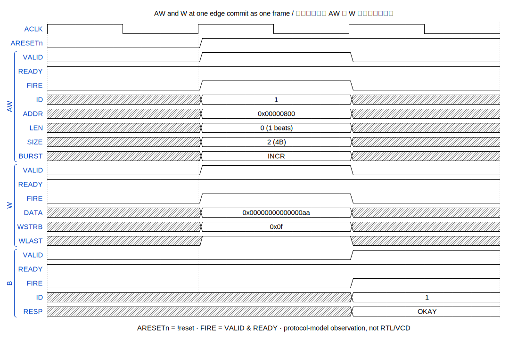

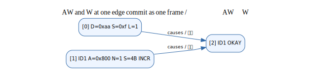

[result.json](cases/observation-same-frame-aw-w/result.json) · [WaveJSON](sources/cases/observation-same-frame-aw-w/waveform.json) · [DOT](sources/cases/observation-same-frame-aw-w/causality.dot)

查看 `observation-same-frame-ar-r` 的波形与因果图

**响应不能消费同一采样沿刚建立的义务.** R 依据当前 AR 提交之前可见的状态进行检查。

该波形投影 AtomicFrame 中的 ready/valid 采样。

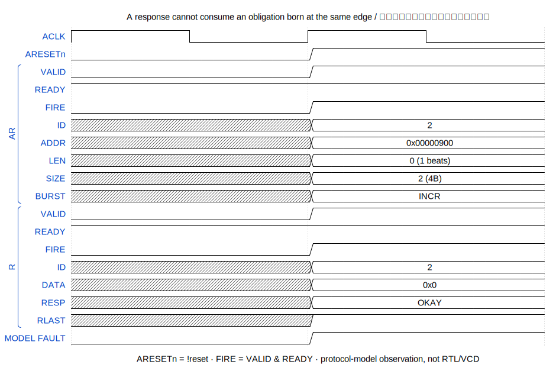

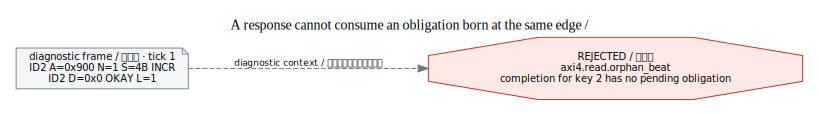

[result.json](cases/observation-same-frame-ar-r/result.json) · [WaveJSON](sources/cases/observation-same-frame-ar-r/waveform.json) · [DOT](sources/cases/observation-same-frame-ar-r/causality.dot)

查看 `observation-stalled-payload-mutation` 的波形与因果图

**VALID 阻塞期间 payload 保持稳定.** AR 接受前改变 ARADDR 会违反 ready/valid 稳定性。

该波形投影 AtomicFrame 中的 ready/valid 采样。

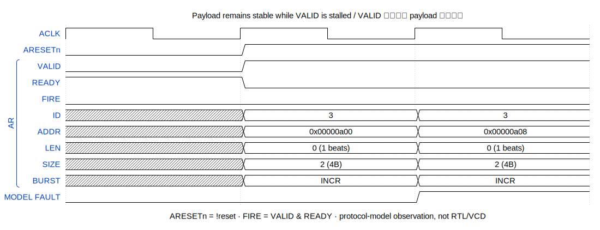

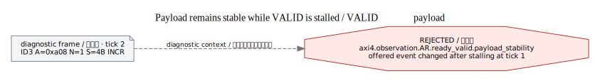

[result.json](cases/observation-stalled-payload-mutation/result.json) · [WaveJSON](sources/cases/observation-stalled-payload-mutation/waveform.json) · [DOT](sources/cases/observation-stalled-payload-mutation/causality.dot)

查看 `observation-reset-clears-pending-read` 的波形与因果图

**复位开启新的观察与链路 epoch.** 复位后的 R 不能完成复位前的 AR。

该波形投影 AtomicFrame 中的 ready/valid 采样。

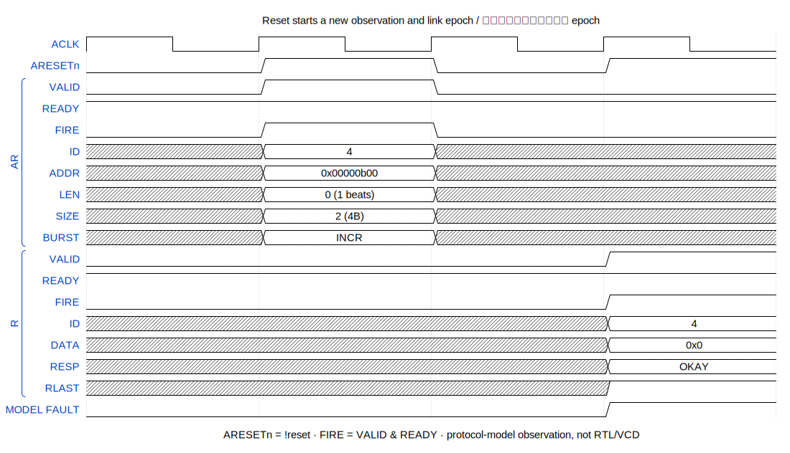

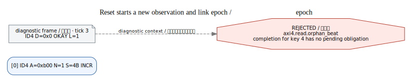

[result.json](cases/observation-reset-clears-pending-read/result.json) · [WaveJSON](sources/cases/observation-reset-clears-pending-read/waveform.json) · [DOT](sources/cases/observation-reset-clears-pending-read/causality.dot)

## 独占访问与 profile

| Case | Input view | Expected → observed | Rule | Evidence |
| --- | --- | --- | --- | --- |
| `exclusive-matching-exokay` 匹配的链路内独占序列可以成功 已完成的独占读使一笔匹配写事务具备返回 EXOKAY 的资格。 | `link-events` | `PASS` → `PASS` | `—` | [wave](cases/exclusive-matching-exokay/waveform.svg) · [cause](cases/exclusive-matching-exokay/causality.svg) · [JSON](cases/exclusive-matching-exokay/result.json) |
| `profile-bounded-read-capacity` 细化 profile 可以限制 outstanding read 在容量配置为一时，第二个 AR 超限并被回滚。 | `link-events` | `FAIL` → `FAIL` | `axi4_one_read.axi4.read.pending_transactions.capacity` | [wave](cases/profile-bounded-read-capacity/waveform.svg) · [cause](cases/profile-bounded-read-capacity/causality.svg) · [JSON](cases/profile-bounded-read-capacity/result.json) |
| `exclusive-unmatched-success` EXOKAY 要求存在匹配且已完成的独占读 没有 reservation 的独占写可以完成，但不能返回 EXOKAY。 | `link-events` | `FAIL` → `FAIL` | `axi4.exclusive.unmatched_success` | [wave](cases/exclusive-unmatched-success/waveform.svg) · [cause](cases/exclusive-unmatched-success/causality.svg) · [JSON](cases/exclusive-unmatched-success/result.json) |

查看 `exclusive-matching-exokay` 的波形与因果图

**匹配的链路内独占序列可以成功.** 已完成的独占读使一笔匹配写事务具备返回 EXOKAY 的资格。

事件级波形的一列是一笔 CanonicalEvent，不表示 pin/cycle。

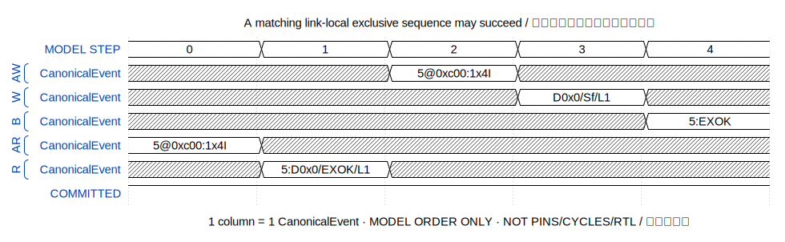

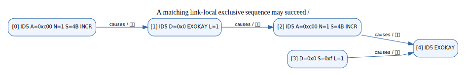

[result.json](cases/exclusive-matching-exokay/result.json) · [WaveJSON](sources/cases/exclusive-matching-exokay/waveform.json) · [DOT](sources/cases/exclusive-matching-exokay/causality.dot)

查看 `profile-bounded-read-capacity` 的波形与因果图

**细化 profile 可以限制 outstanding read.** 在容量配置为一时，第二个 AR 超限并被回滚。

事件级波形的一列是一笔 CanonicalEvent，不表示 pin/cycle。

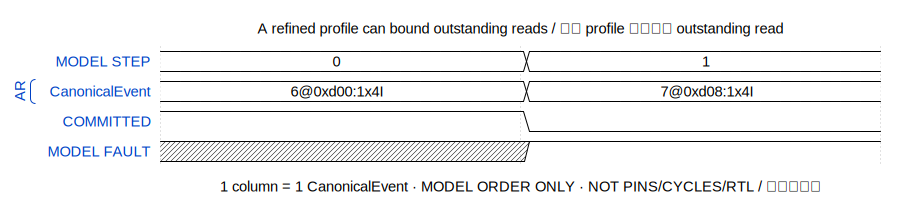

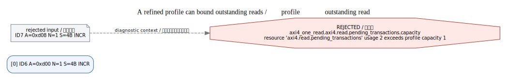

[result.json](cases/profile-bounded-read-capacity/result.json) · [WaveJSON](sources/cases/profile-bounded-read-capacity/waveform.json) · [DOT](sources/cases/profile-bounded-read-capacity/causality.dot)

查看 `exclusive-unmatched-success` 的波形与因果图

**EXOKAY 要求存在匹配且已完成的独占读.** 没有 reservation 的独占写可以完成，但不能返回 EXOKAY。

事件级波形的一列是一笔 CanonicalEvent，不表示 pin/cycle。

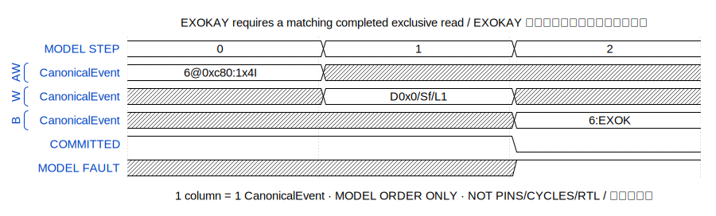

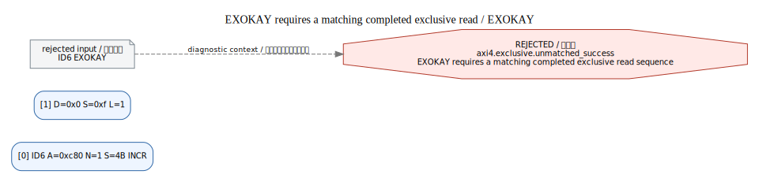

[result.json](cases/exclusive-unmatched-success/result.json) · [WaveJSON](sources/cases/exclusive-unmatched-success/waveform.json) · [DOT](sources/cases/exclusive-unmatched-success/causality.dot)

## 两个精讲场景

这两项仍是上表中的同一 case、同一次执行，不另计场景，也没有第二套 checker。它们只是使用更丰富的 `AtomicFrame` 输入和展开说明。

### `write-early-wlast` — WLAST 必须符合最早 AW 声明的拍数

这条轨迹保留同一 AW 描述符，只把第一拍 WLAST 置为 1。模型由 AWLEN=3 推导此处仍需后续三拍，因此以 `axi4.write.final_marker` 拒绝本次原子提交。

波形中的 `ARESETn` 是模型内部 active-high `reset` 的取反展示；`FIRE` 由 `VALID && READY` 派生，不是额外 RTL 采样。

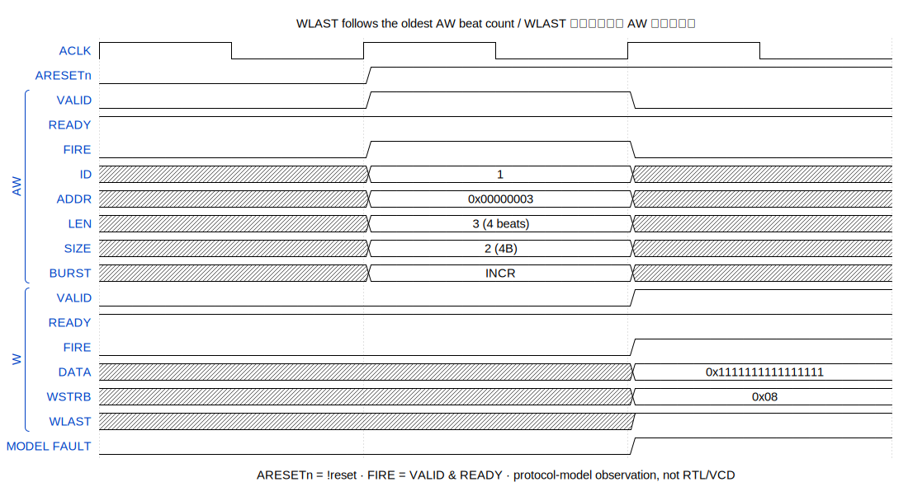

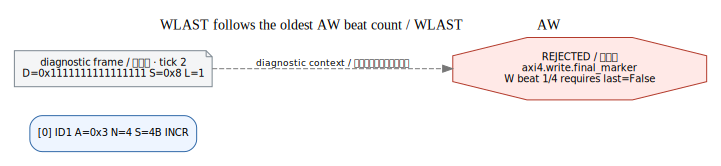

[result.json](cases/write-early-wlast/result.json) · [WaveJSON](sources/cases/write-early-wlast/waveform.json) · [DOT](sources/cases/write-early-wlast/causality.dot)

### `write-narrow-unaligned-incr` — 窄位宽非对齐传输轮换合法字节通道

这条轨迹从复位开始，AWLEN=3 声明四拍写传输。四个 W beat 逐拍展示非对齐窄传输的 WSTRB 轮换，末拍 WLAST=1，随后 B 完成事务并释放相关资源。

波形中的 `ARESETn` 是模型内部 active-high `reset` 的取反展示；`FIRE` 由 `VALID && READY` 派生，不是额外 RTL 采样。

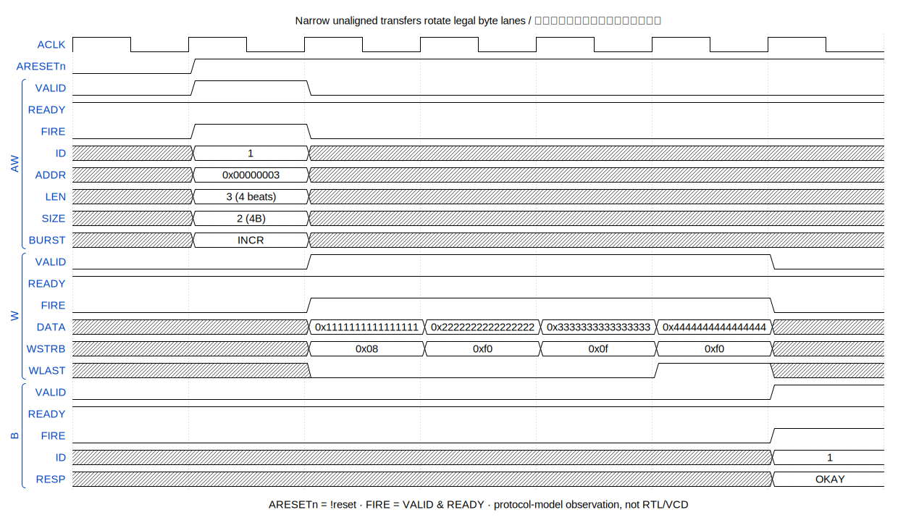

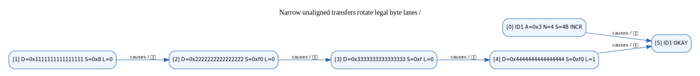

[result.json](cases/write-narrow-unaligned-incr/result.json) · [WaveJSON](sources/cases/write-narrow-unaligned-incr/waveform.json) · [DOT](sources/cases/write-narrow-unaligned-incr/causality.dot)

## 证据边界与追溯

本次 `24/24` 个场景满足各自声明的期望。场景数量表示已经执行的代表性样本，不等价于 AXI4 规范条款覆盖率，也不是 RTL compliance 结论。聚合数据见 [examples.json](examples.json)，生成来源见 [provenance.json](provenance.json)，文件清单见 [manifest.json](manifest.json)。
