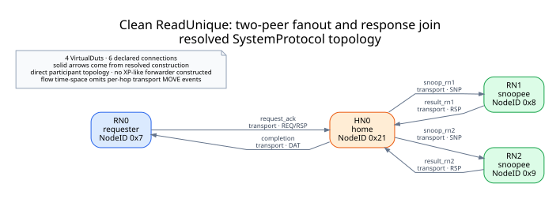
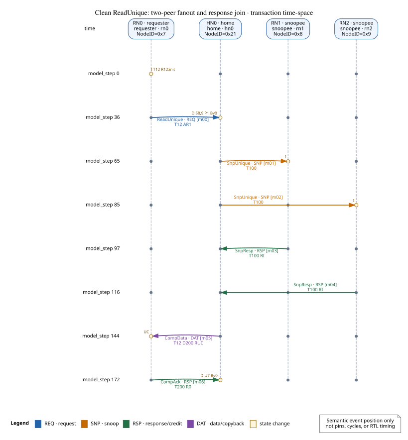
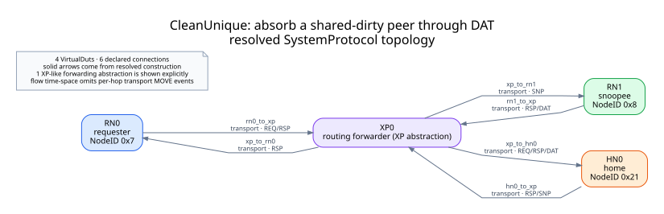
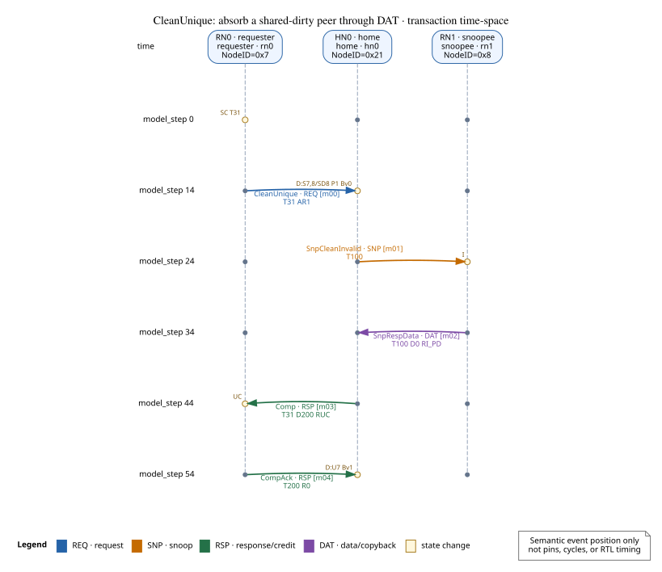
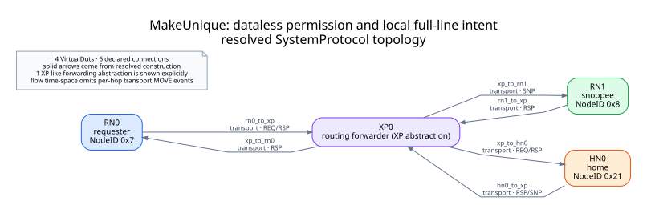
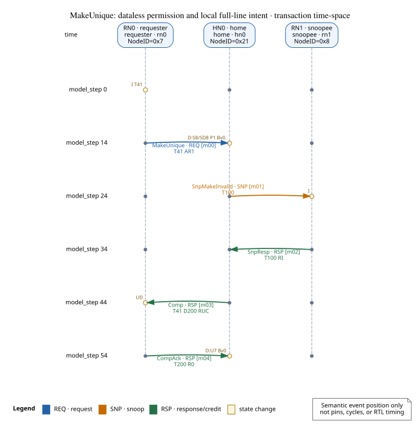
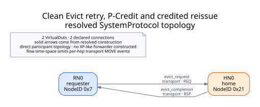
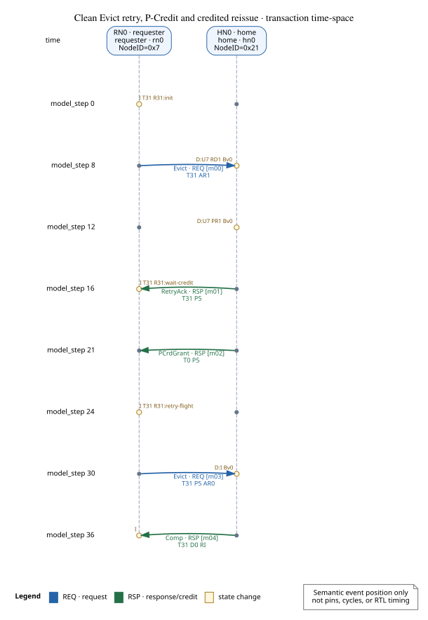
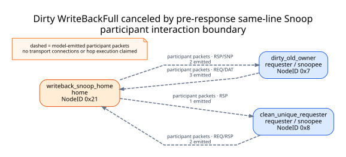
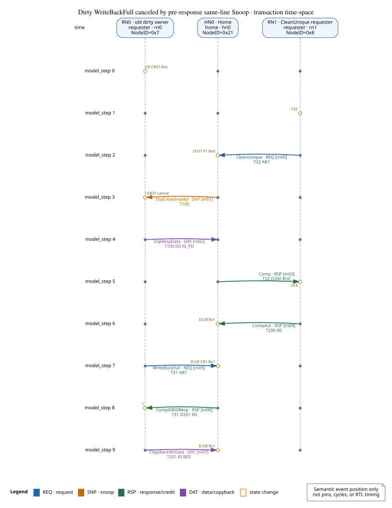

# CHI Issue H executable flow gallery

每个具名案例分别执行一次模型；该案例的四种互相链接视图均由这次案例执行投影：

1. **topology / participant boundary**：前四案画 resolved SystemProtocol 的真实连接，WriteBackFull 案只画实际 packet 交互边界；
2. **transaction time-space**：参与者、已接收消息和可见状态变化；
3. **explicit causality**：只画模型产出、correlation、fan-out/join、Retry 或同址干涉所提供的因果边；
4. **semantic event timeline**：按 `model_step` 排列相同事件引用，用于快速对照，不是 pin/cycle/RTL 波形。

本次执行结论：**PASS**；5 个具名场景。

## 场景导航

| 场景 | 主要问题 | 四视图 |
|---|---|---|
| `clean-read-unique-fanout` | Fan one ReadUnique out to two clean peers, join both Snoop responses, then commit Unique authority. | [拓扑/边界](cases/clean-read-unique-fanout/topology.svg) · [时空](cases/clean-read-unique-fanout/transaction-time-space.svg) · [因果](cases/clean-read-unique-fanout/causal.svg) · [语义时间线](cases/clean-read-unique-fanout/semantic-event-timeline.svg) |
| `dirty-peer-clean-unique` | Return shared-dirty peer data on DAT, update Home backing once, and complete CleanUnique with Comp/CompAck. | [拓扑/边界](cases/dirty-peer-clean-unique/topology.svg) · [时空](cases/dirty-peer-clean-unique/transaction-time-space.svg) · [因果](cases/dirty-peer-clean-unique/causal.svg) · [语义时间线](cases/dirty-peer-clean-unique/semantic-event-timeline.svg) |
| `make-unique-local-intent` | Obtain Unique permission with a dataless network lifecycle and install the requester's local full-line write intent. | [拓扑/边界](cases/make-unique-local-intent/topology.svg) · [时空](cases/make-unique-local-intent/transaction-time-space.svg) · [因果](cases/make-unique-local-intent/causal.svg) · [语义时间线](cases/make-unique-local-intent/semantic-event-timeline.svg) |
| `clean-evict-retry` | Observe RetryAck, Home P-Credit debt/grant, credited reissue, and the terminal clean Evict completion. | [拓扑/边界](cases/clean-evict-retry/topology.svg) · [时空](cases/clean-evict-retry/transaction-time-space.svg) · [因果](cases/clean-evict-retry/causal.svg) · [语义时间线](cases/clean-evict-retry/semantic-event-timeline.svg) |
| `writeback-snoop-cancel` | Delay an emitted dirty WriteBackFull while a same-line invalidating Snoop transfers ownership, then close the late request with zero-byte cancellation data. | [拓扑/边界](cases/writeback-snoop-cancel/topology.svg) · [时空](cases/writeback-snoop-cancel/transaction-time-space.svg) · [因果](cases/writeback-snoop-cancel/causal.svg) · [语义时间线](cases/writeback-snoop-cancel/semantic-event-timeline.svg) |

## 怎样核对

每个消息和状态变化都有稳定 `event_ref`；三个事件视图 SVG 以及 `sources/cases/<case>/transaction-time-space-view.json` 使用同一组引用。DOT 与 WaveJSON 也保留在 `sources/`，因此可以区分模型事实、协议专用投影和最终排版。

### Clean ReadUnique: two-peer fanout and response join

- 执行 verdict：`PASS`；7 个已接收消息，6 个可见状态变化，8 条显式因果边。
- 学习目标：Fan one ReadUnique out to two clean peers, join both Snoop responses, then commit Unique authority.
- 边界：Clean MESI authority transfer over a resolved direct topology; no dirty-owner forwarding or performance claim.

### CleanUnique: absorb a shared-dirty peer through DAT

- 执行 verdict：`PASS`；5 个已接收消息，5 个可见状态变化，5 条显式因果边。
- 学习目标：Return shared-dirty peer data on DAT, update Home backing once, and complete CleanUnique with Comp/CompAck.
- 边界：Restricted shared-dirty CleanUnique path; not general Owned/SD or DCT behavior.

### MakeUnique: dataless permission and local full-line intent

- 执行 verdict：`PASS`；5 个已接收消息，5 个可见状态变化，5 条显式因果边。
- 学习目标：Obtain Unique permission with a dataless network lifecycle and install the requester's local full-line write intent.
- 边界：MakeUnique plus one modeled local store intent; not partial write or arbitrary cache-pipeline behavior.

### Clean Evict retry, P-Credit and credited reissue

- 执行 verdict：`PASS`；5 个已接收消息，7 个可见状态变化，8 条显式因果边。
- 学习目标：Observe RetryAck, Home P-Credit debt/grant, credited reissue, and the terminal clean Evict completion.
- 边界：One deterministic successful retry cycle; not general Retry/error composition, fairness, or liveness proof.

### Dirty WriteBackFull canceled by pre-response same-line Snoop

- 执行 verdict：`PASS`；8 个已接收消息，9 个可见状态变化，9 条显式因果边。
- 学习目标：Delay an emitted dirty WriteBackFull while a same-line invalidating Snoop transfers ownership, then close the late request with zero-byte cancellation data.
- 边界：Scenario-controlled participant interleaving. Every packet and state transition is model-produced, but transport hop timing is not simulated for this case.

## 能说明与不能说明的内容

- 这些 case 证明相应 CHI lifecycle、participant state、correlation 和选定组合在当前模型中可执行；
- 它们不把参考资料中的每个 flow 都冒充成已实现功能，也不由示例数量推断规范覆盖率；
- `model_step` 是离散语义提交顺序。图中没有 packed pin/phit、物理时延、CDC 或 RTL sampling；
- 当前四个 resolved flow 都是 direct topology，没有构造 XP/router。若案例实际提供 forwarding binding，拓扑会将其显示为 `routing forwarder (XP abstraction)`；
- 时空图过滤逐 hop transport `MOVE`；原 `model_step` 标签的间隔只保留模型提交次序线索，不是 XP 周期延迟；
- WriteBackFull 案的包交付顺序与延后交付由 scenario 显式编排；它没有建模网络时延或 transport hop。包和状态转移仍来自生产 participant runtime；
- 其余四案通过 resolved direct topology 与 coherence-network scheduler；
- 因而最后一案的虚线图只证明 participant 间实际 packet 交互，不把它提升为已构造、已执行的 transport hop。

机器结果见 [result.json](result.json)，生成边界见 [provenance.json](provenance.json)，全部资产清单见 [manifest.json](manifest.json)。
