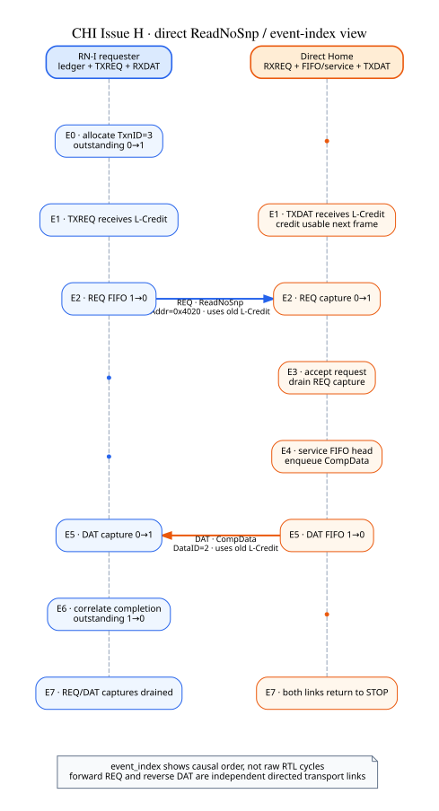

# CHI Issue H：最小 direct-Home read

本例执行了一次 `ReadNoSnp`：RN-I 先分配 `(SrcID=0x07, TxnID=3)` outstanding；请求经
RN→Home 的 REQ link 到达 direct Home；Home 显式 service 后生成 `CompData`；响应经 Home→RN 的
DAT link 返回，并以 `(TgtID=0x07, TxnID=3)` 关闭原事务。地址 `0x4020` 在 128-bit DAT 配置下对应
`DataID=2`。

图的纵轴是 `event_index`，用于表达因果顺序。它不是 raw pin waveform，也不规定 RTL 必须在相同周期
插入或省略空拍。REQ 与 DAT 是方向相反、分别激活和持有 L-Credit 的两条 link。

## 本次实际检查

- L-Credit 在收到后的下一帧才可使用；
- 有限 TX FIFO、receiver reservation 与 capture 容量保持一致；
- Home 接收成功后才 drain REQ capture；
- RN correlation 成功后才 drain DAT capture；
- completion 释放 outstanding，两个 link 最终回到 STOP。

## 当前边界

这是 direct Home、单 DAT flit、common-clock reference transport 的受限 happy path。它不包含 bit codec、
Retry/P-Credit、RSP/SNP、完整 RN-I/HN、router、缓存一致性或 raw RTL timing。participant 与 capture 间的
交接由场景显式编排；多事务组合仍需要统一 admission/rollback。

机器结果见 [result.json](result.json)，图源见 [sources](sources/)，生成边界见
[provenance.json](provenance.json)。
