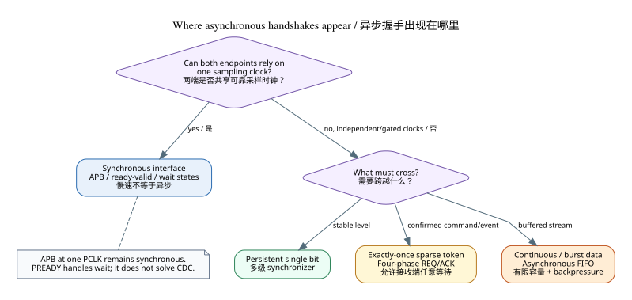
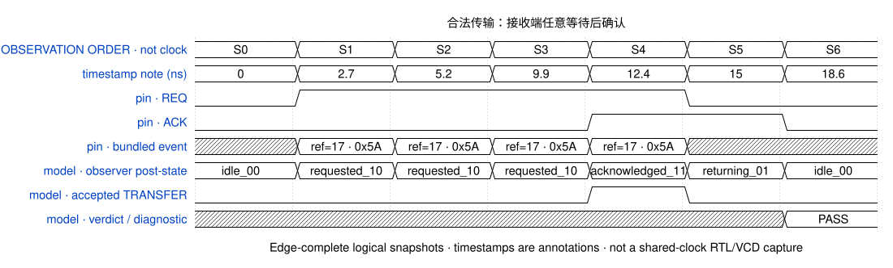
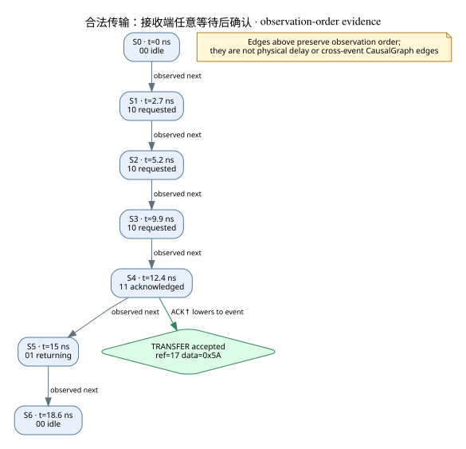
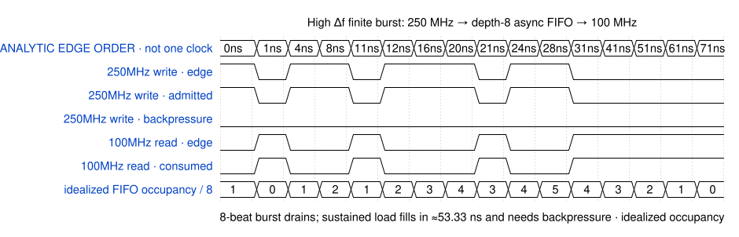
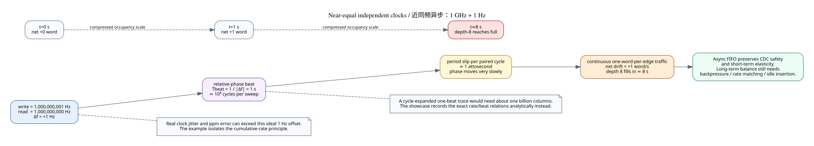

# Four-phase handshake 与异步频差 Showcase

本例回答两个问题：四相 REQ/ACK 在什么边界出现，以及异步 FIFO 面对不同频差时究竟解决什么。

## 什么时候需要

判断依据是两端能否依赖共同采样时刻，而不是接口绝对速度。一个很慢的 APB endpoint 只要与 manager
共用 PCLK，仍通过 PREADY 插入同步 wait state；它不需要为“慢”改成异步握手。典型异步边界包括：

- 独立 PLL、可停钟或可掉电 domain 之间的 command/completion；
- 总线 wrapper 与内部异步外设、DMA source、mailbox 或混合信号控制；
- 必须逐笔确认且允许接收方任意等待的稀疏 token；
- 连续数据或 burst，此时通常采用有限 async FIFO，而不是逐 word 四相往返。

## 四相 observation 的可执行证据

横轴是 edge-complete observation order；timestamp 只是本例提供的 ns 注记。三个场景都由当前
`FourPhaseObserver` 执行，每项都有波形、诊断关系图和机器结果。

| case | 目标 | expected → observed | rule | evidence |
|---|---|---|---|---|
| `legal-delayed-ack` | 合法传输：接收端任意等待后确认 | `PASS` → `PASS` | — | [wave](cases/legal-delayed-ack/waveform.svg) · [cause](cases/legal-delayed-ack/causality.svg) · [JSON](cases/legal-delayed-ack/result.json) |
| `ack-before-request` | 非法传输：ACK 在 REQ 前出现 | `FAIL` → `FAIL` | `showcase.ack-before-request.phase_order` | [wave](cases/ack-before-request/waveform.svg) · [cause](cases/ack-before-request/causality.svg) · [JSON](cases/ack-before-request/result.json) |
| `payload-overwrite-before-ack` | 非法传输：等待 ACK 时 payload 被覆盖 | `FAIL` → `FAIL` | `showcase.payload-overwrite-before-ack.event_stability` | [wave](cases/payload-overwrite-before-ack/waveform.svg) · [cause](cases/payload-overwrite-before-ack/causality.svg) · [JSON](cases/payload-overwrite-before-ack/result.json) |

### 合法路径精讲

REQ 在 `S1` 上升，接收端可以停留在 `10`；`S4` 的 ACK 上升产生唯一 `TRANSFER`。REQ、ACK
随后依次归零，wire slot 才重新可用。

## 高差频：FIFO 吸收弹性，满后实施背压

本投影使用 250 MHz producer、100 MHz consumer、depth-8 FIFO。一次 8-beat burst 的峰值占用为
`5/8`，没有触发 backpressure，并在读侧继续运行后排空——这是高差频 FIFO 很擅长的
有限 burst elasticity。若 producer 持续满速，150 Mword/s 的长期带宽缺口会在理想流体近似下约
`53.33 ns` 填满 FIFO，之后仍必须背压。图中没有展开 Gray
pointer 同步延迟，因此它说明容量/admission，不作为具体 async FIFO RTL 证明。

## 低差频：1 GHz 与 1 GHz + 1 Hz 的慢速 beat

两时钟独立时，频率看起来几乎相同也不能按同步处理。这里 `Δf=1 Hz`：

- 完整相对相位 sweep 需要 `1 s`，约十亿个 cycle；
- 对应周期差约 `0.999999999 as`；
- 连续 one-word-per-edge 流量仍净积累 `1 word/s`；
- depth-8 FIFO 在没有背压/速率匹配时约 `8 s` 填满。

因此 async FIFO 很适合隔离相位不确定性、同步指针并提供有限 elasticity；它不会凭空修正长期平均
速率。近同频场景还说明为什么项目以后需要 symbolic phase/time-window 分析，而不应为一次 beat 展开
十亿列波形。

现实 1 GHz clock 的 jitter 或 ppm 误差可能远大于这个理想化 `1 Hz` offset；这个刻意极端的例子用于分离
“CDC 相位安全”与“长期累计速率差”两个问题。

## 证据边界

- `waveform.svg` 是模型生成的 normalized signal/analytic edge projection，不是 RTL/VCD；
- 四相 observer 检查相位与 EARLY data window，不证明 synchronizer、MTBF 或 STA；
- 高频 FIFO 图是容量与 admission 演示，尚未声称仓库已经实现 Gray-pointer async FIFO VirtualDut；
- 近同频结论来自文件中保存的精确频率关系，完整数字见 [result.json](result.json)；
- 生成参数、命令与 renderer 见 [provenance.json](provenance.json)，文件清单见 [manifest.json](manifest.json)。
