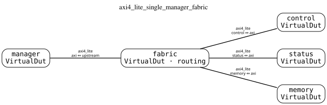
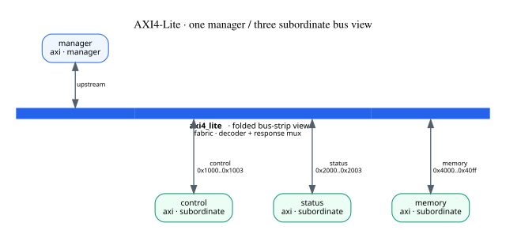
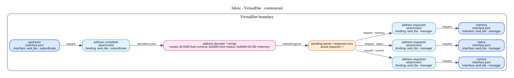
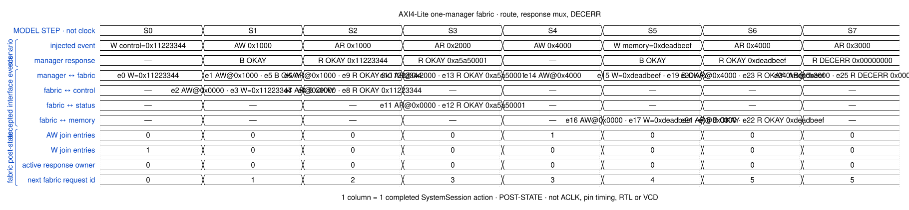
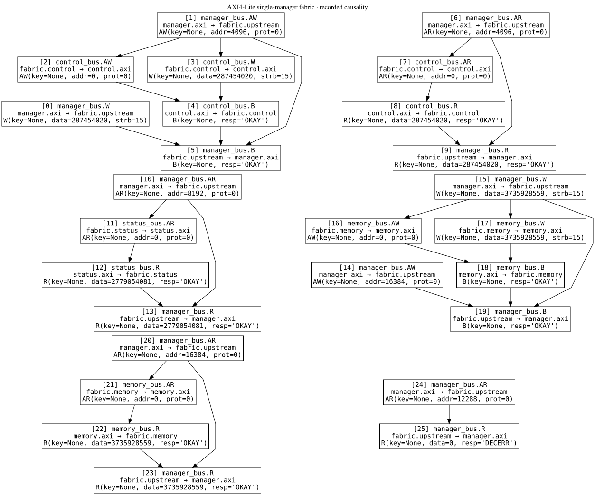

# AXI4-Lite single-manager, three-subordinate address fabric

This publication was built and executed by the named demo script.

## Canonical topology

The canonical view keeps `fabric` as an explicit routing `VirtualDut`.  Four
binary `InterfaceConnection` instances connect concrete module ports; the
star shape alone does not supply decode or response-return behavior.

## Folded bus-strip view

This is a presentation projection of the same topology.  The long strip folds
the single-ingress fabric and labels its route windows; it is not a second
topology and does not turn AXI4-Lite into one implicit multi-drop connection.

## Fabric realization

The shared VirtualDut projector exposes the upstream subordinate attachment,
three downstream manager attachments, address decoder/remap, pending owner,
and response mux.  These are constructed module-local components.

## Executed model steps

The first column holds `W` until the following `AW` arrives; the fifth column
holds `AW` until the following `W` arrives.  Completed writes and reads then
traverse the selected egress and return through the response mux.  The final
unmapped read returns `R/DECERR` locally and does not visit an endpoint.
Columns are completed semantic actions, not AXI clock cycles or a pin-level
golden trace.

## Recorded causality

The graph contains the accepted events and causal edges recorded by the
current system runtime.  It demonstrates this execution witness; it does not
claim exhaustive AXI4-Lite compliance or physical-timing equivalence.

Machine-readable execution is in [result.json](result.json), source IR is in
[sources](sources/), the generation boundary is in
[provenance.json](provenance.json), and [manifest.json](manifest.json) indexes
the complete publication.
