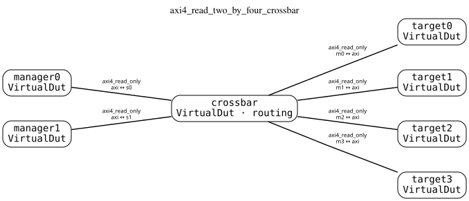
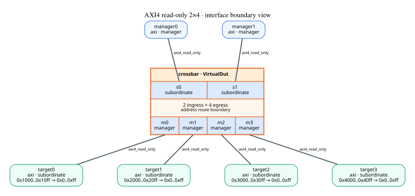
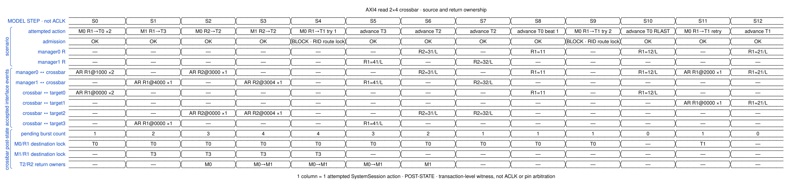
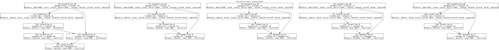

# AXI4 read 2×4 crossbar · executable witness

This publication was built and executed by the named demo script.

## Canonical topology

Two manager boundaries and four memory targets are connected through one
explicit crossbar `VirtualDut`.  The same parameterized builder accepts any
non-empty ingress and egress tuples; 2×4 is an instance chosen to make the
independence of N and M visible.  System address resolution closes two
ingresses across four route windows, producing eight resolved paths.

## Interconnect interface map

The typed map expands only the crossbar boundary.  It shows the two ingress
and four egress ports, each port's AXI4 read-only role, and the four resolved
system-to-local address remaps.  The central rectangle does not assert an
internal lane count or physical crosspoint implementation.

## Executed model steps

The crossbar owns one sparse pending-read ledger.  Two views are derived from
the same entries:

- `(ingress, RID) → egress` prevents one manager's active RID from changing
  target before its previous `RLAST`;
- `(egress, downstream RID) → FIFO[ingress]` returns colliding raw IDs to the
  manager whose AR entered that downstream ID stream first.

S2 and S3 place manager0/RID2 followed by manager1/RID2 at target2.  S6 and S7
return them in that owner order.  Manager1/RID1 independently completes from
target3 at S5.  Manager0/RID1 remains locked to target0 after its first beat,
so both S4 and S9 are blocked; S11 succeeds after the target0 `RLAST` at S10.

Canonical events already represent accepted transfers.  Their submission
order is this witness's grant order; the model does not prescribe an RTL
arbiter or simultaneous-pin timing.

## Recorded causality

Blocked attempts leave no accepted interface event and are retained in
`result.json`.  Accepted AR/R events and the causal edges currently recorded
by `SystemSession` appear here.

## Current profile boundary

The `raw-ID-serialized` profile preserves ARID downstream.  Different managers
using the same RID at one target therefore share one legal downstream ordering
stream.  This may serialize otherwise independent work, but it does not lose
ordinary read ownership.  Multi-ingress exclusive reads are rejected because
exclusive identity must be source-qualified.  A later prefix/remap policy can
populate the ledger's separate `downstream_id` field without changing the
upstream ordering key or return-owner mechanism.

Machine-readable execution is in [result.json](result.json), source IR is in
[sources](sources/), generation boundaries are in
[provenance.json](provenance.json), and [manifest.json](manifest.json) indexes
the complete publication.
