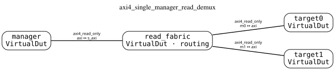
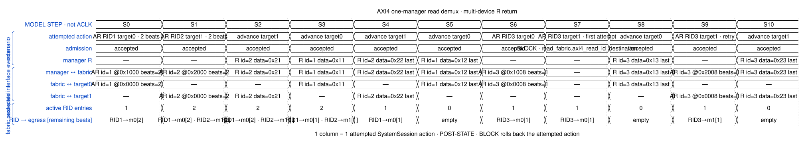
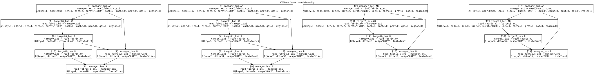

# AXI4 single-manager, two-subordinate read fabric

This publication was built and executed by the named demo script.

## Canonical topology

The topology contains one manager boundary, one explicit read-fabric
`VirtualDut`, two memory endpoints, and three binary AXI4
`InterfaceConnection` instances.  The star shape is a consequence of the
connections; decode and response-return behavior comes from the fabric backend.

## Executed model steps

RID 1 and RID 2 are simultaneously owned by different output ports.  The
targets are advanced in alternating order, producing the legal return sequence
`RID2, RID1, RID2/RLAST, RID1/RLAST`.  Later, RID 3 is locked to target 0; an
attempt to send that RID to target 1 is blocked and leaves the state unchanged.
The retry succeeds after target 0 returns `RLAST`.

The columns are semantic actions, not ACLK cycles or a pin-level golden trace.
The table is a sparse model data structure; its RTL mapping is deliberately not
fixed by this example.

## Recorded causality

Only accepted interface events enter the causal graph.  The blocked first
attempt for RID 3 is retained in `result.json` as an admission result but has no
committed interface event.

Machine-readable execution is in [result.json](result.json), source IR is in
[sources](sources/), the generation boundary is in
[provenance.json](provenance.json), and [manifest.json](manifest.json) indexes
the complete publication.
