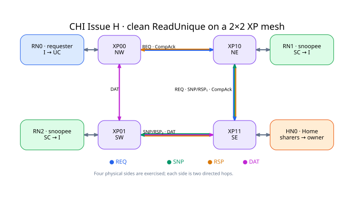
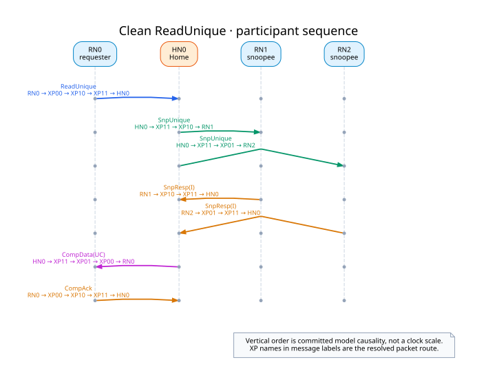
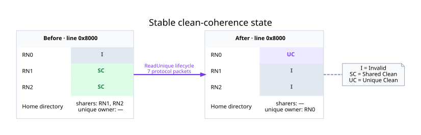

# CHI Issue H：2×2 XP mesh 上的 Clean ReadUnique

四个 XP 组成 2×2 方形 mesh；在这个最小尺寸上，mesh 的四条边也构成一个环。RN0、RN1、HN0、RN2
分别挂在四角。图中的节点和连接来自本次实际 `SystemProtocol`，固定坐标只是这张讲解图的排版选择。

本次运行使用了 14/16 条有向
connection，并覆盖全部四条物理边。未使用的两个反向 hop 是
`xp00_to_xp01, xp10_to_xp00`；拓扑允许双向通信，并不要求一笔事务遍历每个方向。

一笔 `ReadUnique` 产生：

- 1 个 REQ；
- 2 个 `SnpUnique` packet；
- 2 个 `SnpResp`；
- 1 个 `CompData`；
- 1 个 `CompAck`。

消息下方的 XP 序列来自 resolved route。纵向仅表示模型提交的因果次序，不表示时钟周期距离。

初始 RN1/RN2 为 `SC`，Home directory 记录两个 sharer；完成后 RN0 为 `UC`，RN1/RN2 为 `I`，
Home 将 RN0 记作 unique owner。Home 同时发出的两份 snoop 经过容量为一的 egress 分批进入网络，
运行中待发送 batch 的最大深度为 2，没有丢失 fan-out packet。

## 这个见证实际说明了什么

- caller 可以自由组装含环的 transport topology，CHI package 不固化 mesh；
- exact `TgtID + channel` 路由把每个 packet 解析到一条有限、无环的实际路径；
- 四个 XP 均执行有限队列的 store-and-forward；
- REQ、SNP、RSP、DAT 与 clean coherence participant state 在同一 session 中闭合；
- 482 个 reference microstep 后网络、participant transaction 和 pending
  egress 均静默。

## 当前范围

这是 clean-only `I/SC/UC` 的 `ReadUnique` 场景。它还不包含 dirty owner、完整 MESI/MOESI、
adaptive routing、Retry、router QoS/fairness 或网络 deadlock proof。物理拓扑存在环，只说明以后可以在
真实循环结构上建立 wait-for 分析，不等于本例已经证明无死锁。

三张图是 topology、packet route 和 stable state 的模型级投影，**不是 raw pin waveform**，也不规定
RTL 的流水级、空拍位置或周期距离。机器结果见 [result.json](result.json)，DOT 源见
[sources](sources/)，生成边界见 [provenance.json](provenance.json)。
