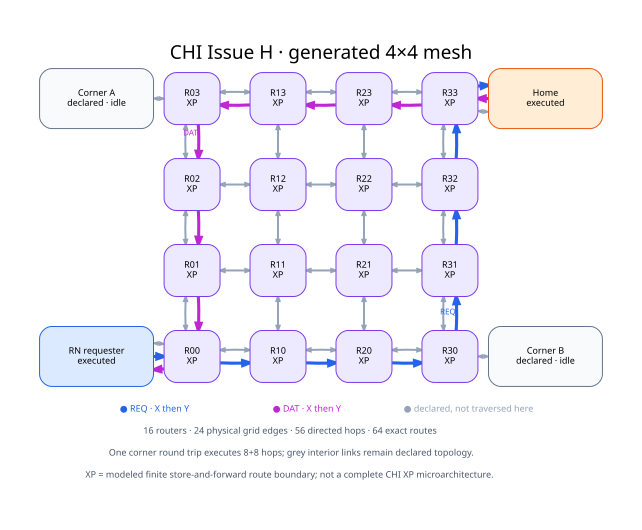

# CHI Issue H：4×4 bidirectional mesh

本页执行一条受限 `ReadNoSnp → CompData` 生命周期。Topology 由调用方明确构造为
`SystemProtocol`；CHI participant、有限 store-and-forward router、exact NodeID route 和逐跳
transport 来自 `protocol_model`。

这里把每个 `ChiStoreForwardRouterNode` 简写为 **XP abstraction**：它显式拥有
ingress queue、exact NodeID route、egress 与 Link Credit，但不宣称覆盖完整 CHI XP
微架构、内部 pipeline 或周期延迟。

本 case 生成 16 个 XP abstraction/router、24
条物理 grid edge、48 条有向 backbone hop，再加四个角点
endpoint 的双向 attachment。每个 router 为四个 endpoint 建立 exact NodeID route，因此共有
64 条 route entry。

REQ 与 DAT 各执行 8 条有向 hop，采用确定性的 X-then-Y
选择并在角到角往返后静默。灰色 interior edge 是已 elaborated、route table 已覆盖但这一次事务没有穿过的
topology；图没有暗示一笔 read 已经动态扫遍所有 mesh link。

## 执行证据与边界

本 case 实际检查 completion、返回值、每个已执行 hop 的 lineage、router accept/forward 计数和最终
quiescence。reference microstep 数只记录确定性模型执行，不是吞吐或物理延迟测量。

当前流程集中在 REQ/DAT direct read。它不建立 shared-bus/broadcast 语义，不包含 RSP/SNP coherence、
Retry/error 组合或 adaptive routing，也不构成完整 CHI compliance、QoS/fairness 结论或 deadlock proof。
clean coherence 的状态闭合需要另外的 ReadUnique/Snoop witness。

机器结果见 [result.json](result.json)，图的可检查 DOT 源见 [sources](sources/)，构造与宣称边界见
[provenance.json](provenance.json)，发布文件清单见 [manifest.json](manifest.json)。
