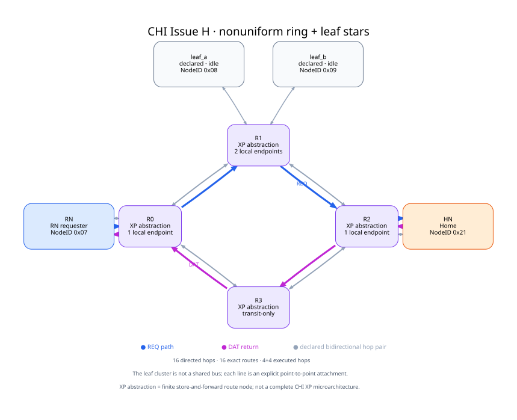

# CHI Issue H：异构 ring backbone + leaf stars

本页执行一条受限 `ReadNoSnp → CompData` 生命周期。Topology 由调用方明确构造为
`SystemProtocol`；CHI participant、有限 store-and-forward router、exact NodeID route 和逐跳
transport 来自 `protocol_model`。

这里把每个 `ChiStoreForwardRouterNode` 简写为 **XP abstraction**：它显式拥有
ingress queue、exact NodeID route、egress 与 Link Credit，但不宣称覆盖完整 CHI XP
微架构、内部 pipeline 或周期延迟。

四个 XP abstraction/router 构成双向 ring backbone。R0 挂 requester，R2 挂 Home，R1 同时挂两个声明但本次空闲的
leaf endpoint，R3 则是 transit-only。这个不均匀 attachment 使 topology 不再只是对称方框：
本次 REQ 使用 `RN → R0 → R1 → R2 → HN`，DAT 走
`HN → R2 → R3 → R0 → RN`，合起来覆盖 ring 的四条物理边。

这里的“star”只描述 R1 周围的点到点叶节点簇。它不是 multi-drop shared bus，也没有从图形推断
broadcast 或共享介质仲裁。有向 hop 数为 16，router
exact-route entry 数为 16。

## 执行证据与边界

本 case 实际检查 completion、返回值、每个已执行 hop 的 lineage、router accept/forward 计数和最终
quiescence。reference microstep 数只记录确定性模型执行，不是吞吐或物理延迟测量。

当前流程集中在 REQ/DAT direct read。它不建立 shared-bus/broadcast 语义，不包含 RSP/SNP coherence、
Retry/error 组合或 adaptive routing，也不构成完整 CHI compliance、QoS/fairness 结论或 deadlock proof。
clean coherence 的状态闭合需要另外的 ReadUnique/Snoop witness。

机器结果见 [result.json](result.json)，图的可检查 DOT 源见 [sources](sources/)，构造与宣称边界见
[provenance.json](provenance.json)，发布文件清单见 [manifest.json](manifest.json)。
