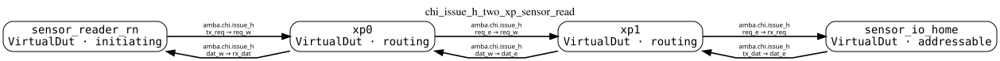
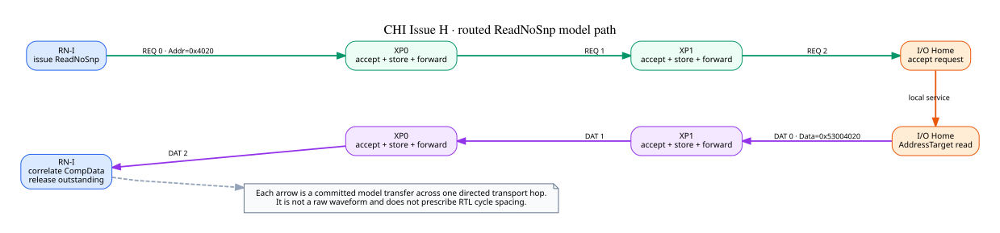
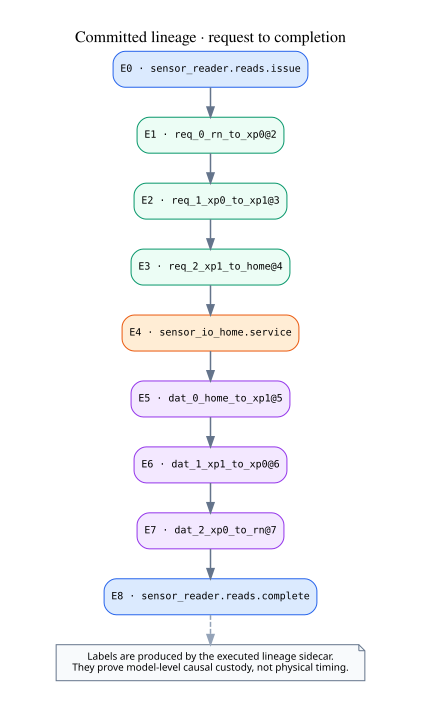

# CHI Issue H：两级 XP 路由读取

这个示例由 `SystemProtocolBuilder` 声明四个 VirtualDut 和六条有向 transport connection：
`sensor_reader_rn → xp0 → xp1 → sensor_io_home` 承载 REQ，DAT 沿独立的反向连接返回。
拓扑图直接从实际 `SystemProtocol` 生成，不另存一份手写网络事实。

RN-I 以 `NodeID=0x7` 发出 `ReadNoSnp`，目标 Home 为
`NodeID=0x21`。请求地址 `0x4020` 经过两个有限
store-and-forward XP；I/O Home 通过通用 `AddressSpace/MemoryRegion` 读取并返回
`0x53004020`，随后 RN-I 以 TxnID 关联 `CompData` 并释放 outstanding。

lineage 图来自本次执行实际保留的 custody 标签。它把 requester issue、每条 REQ/DAT hop、Home
service 和 completion 连成一条因果证据链；它不把 reference scheduler 的空步或 link tick 写成 RTL
必须遵守的周期位置。

## 本次实际检查

- REQ 与 DAT 分别解析为三条有向 connection；
- 两个 XP 都执行了 accept、有限队列暂存和 downstream forward；
- 每跳 activation、L-Credit、TX/RX 容量和背压仍由现有 CHI transport session 执行；
- typed payload 在普通路由中保持不变；
- completion lineage 覆盖全部六条 hop；
- 返回值、DataID、transaction correlation 和最终静默状态均通过检查；
- reference scheduler 共提交 `71` 个 microstep。

## 外设表示边界

`sensor_io_home` 使用 `ChiAddressHomeNode` 把 CHI `ReadNoSnp` 降为协议无关的 `AddressRead`，并由
`AddressSpace/MemoryRegion` 持有唯一的本地数据状态。当前绑定属于 CHI family participant composition；
全局 address→Home authority 仍是后续 SystemProtocol 合同。

## 当前范围

这是 direct-Home、aligned full-DAT-width、single-DAT-flit、REQ/DAT-only 的 CHI Issue H 参考见证。
完整 CHI Port、raw pin waveform、bit codec、narrow DAT placement、CHI error-response mapping、
SNP/coherence、multi-flit response、router QoS/fairness 和网络死锁证明仍在本例范围之外。
图中的箭头表达模型级传输与因果次序，不约束真实 RTL 在相邻传输之间插入多少空拍。

机器结果见 [result.json](result.json)，可检查的 DOT 源见 [sources](sources/)，生成方式和边界见
[provenance.json](provenance.json)。
