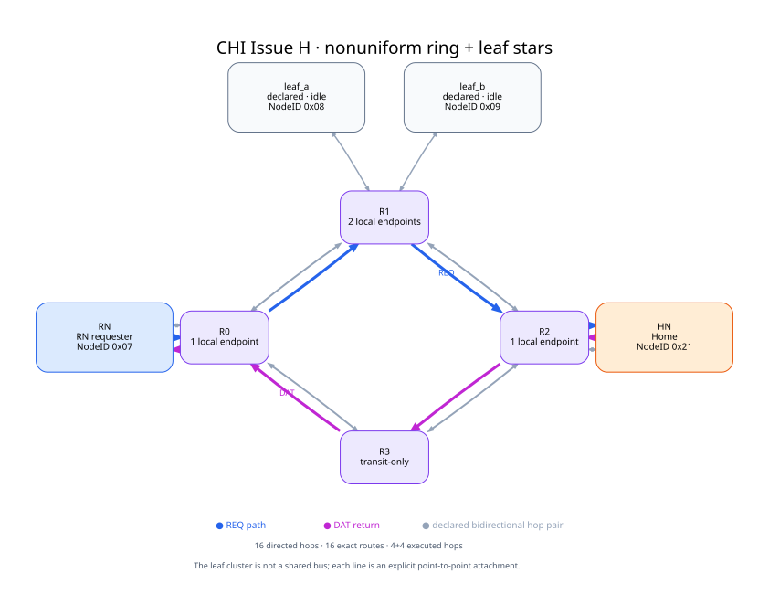
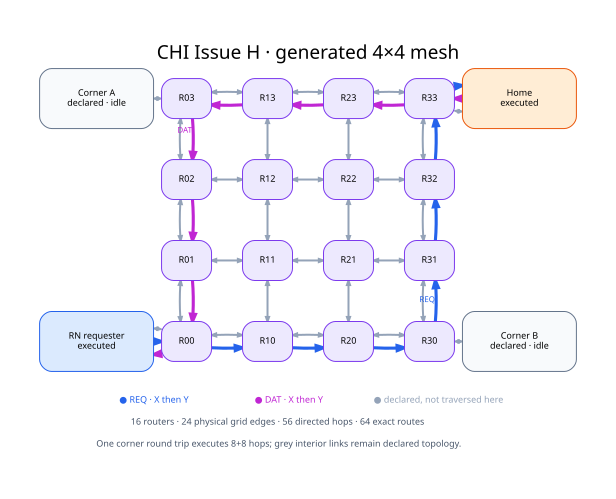
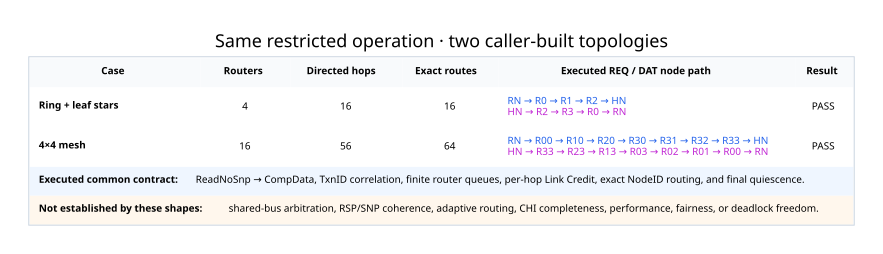

# CHI Issue H：同一事务经过两种调用方拓扑

本页执行同一条受限 `ReadNoSnp → CompData` 生命周期，但让调用方提供两种不同
`SystemProtocol` topology。目的不是用网络外观代替协议覆盖，而是展示现有 CHI participant、
有限 store-and-forward router、exact NodeID route 和逐跳 transport 能在不同固定拓扑上组合。

## 非均匀 ring backbone + leaf stars

四个 router 构成双向 ring backbone。R0 挂 requester，R2 挂 Home，R1 同时挂两个声明但本次空闲的
leaf endpoint，R3 则是 transit-only。这个不均匀 attachment 使 topology 不再只是对称方框：
本次 REQ 使用 `RN → R0 → R1 → R2 → HN`，DAT 走
`HN → R2 → R3 → R0 → RN`，合起来覆盖 ring 的四条物理边。

这里的“star”只描述 R1 周围的点到点叶节点簇。它不是 multi-drop shared bus，也没有从图形推断
broadcast 或共享介质仲裁。实际系统包含 16 条有向 hop 和
16 条 router exact-route entry。

## 4×4 bidirectional mesh

第二个 case 生成 16 个 router、24 条物理 grid edge、
48 条有向 backbone hop，再加四个角点 endpoint 的
双向 attachment。每个 router 为四个 endpoint 建立 exact NodeID route，因此共有
64 条 route entry。

REQ 与 DAT 各执行 8 条有向 hop，采用确定性的 X-then-Y
选择并在角到角往返后静默。灰色 interior edge 是已 elaborated、route table 已覆盖但这一次事务没有穿过的
topology；图没有暗示一笔 read 已经动态扫遍所有 mesh link。

## 对照与边界

两案都实际检查了 completion、返回值、每个已执行 hop 的 lineage、router accept/forward 计数和最终
quiescence。reference microstep 数只记录确定性模型执行，不是吞吐或物理延迟测量。

这两个 case 当前集中在 REQ/DAT direct read。它们不建立 shared-bus/broadcast 语义，不包含
RSP/SNP coherence、Retry/error 组合或 adaptive routing，也不构成完整 CHI compliance、QoS/fairness
结论或 deadlock proof。clean coherence 的状态闭合需要另外的 ReadUnique/Snoop witness。

机器结果见 [result.json](result.json)，三张图的可检查 DOT 源见 [sources](sources/)，构造与宣称边界见
[provenance.json](provenance.json)，发布文件清单见 [manifest.json](manifest.json)。
