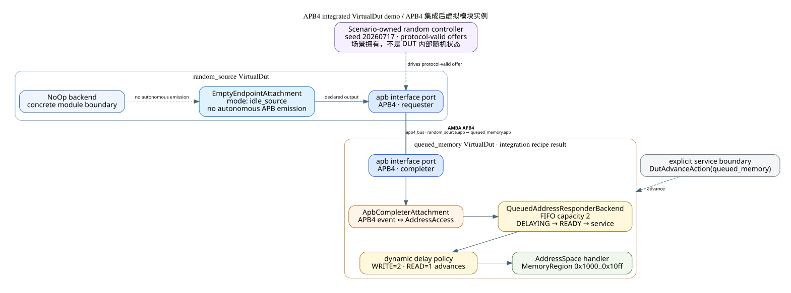
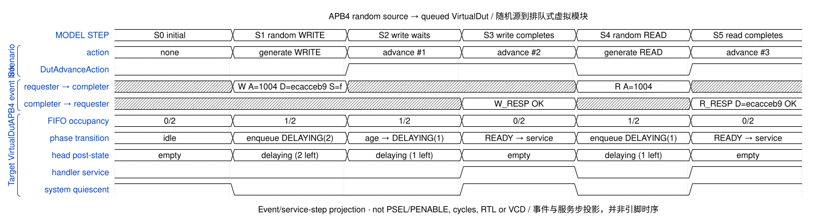
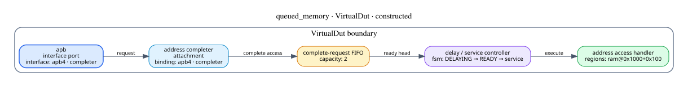
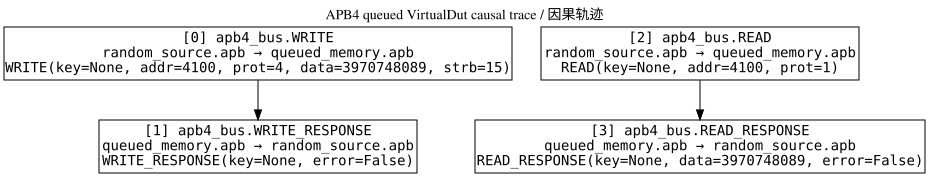

# APB4 queued-responder execution

This publication was produced by the current model, not hand-drawn from an
expected result.

The topology distinguishes two constructions that are easy to conflate:

- `queued_memory` is a concrete `VirtualDut` returned by an AMBA integration
  recipe. Its APB4 attachment, finite FIFO, delay policy and address handler
  are module-local behavior.
- `random_source` is a concrete idle source `VirtualDut`, while the seeded
  traffic controller belongs to the scenario and drives its port from outside.
  Its EmptyEndpointAttachment records that the module has no autonomous APB
  emission; the scenario controller is deliberately kept outside that boundary.

Together with `apb4_bus`, they form one executable AMBA APB4 model instance.
The APB4-labeled edge is that concrete InterfaceConnection; its smaller line names the
link instance and the two bound module ports. It is a connection, not an extra
hardware node.

The instance models normalized transaction semantics. It is not an RTL module
instance and does not claim to emit PSEL/PENABLE cycles.

## WaveDrom execution view

The controller generated a full-strobe write to `0x1004` with random
data `0xecacceb9`, followed by a read of the same address. The target
used a dynamic policy: writes wait two explicit service advances and reads
wait one. FIFO occupancy and completion therefore come from the executed
VirtualDut state.

## Target VirtualDut realization

This view comes from the reusable VirtualDut structure projector. It treats
the module boundary as the outer box and keeps the APB attachment, request
FIFO, delay/service controller and AddressSpace as separate constructed
components. An unknown external backend would remain one opaque node.

## Causal trace

Machine-readable evidence: [result.json](result.json),
[WaveJSON](sources/waveform.json), [topology DOT](sources/topology.dot),
[VirtualDut structure DOT](sources/target-structure.dot),
[causality DOT](sources/causality.dot), and
[provenance.json](provenance.json).
