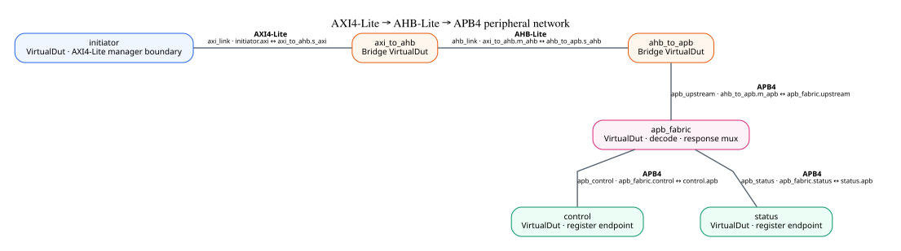
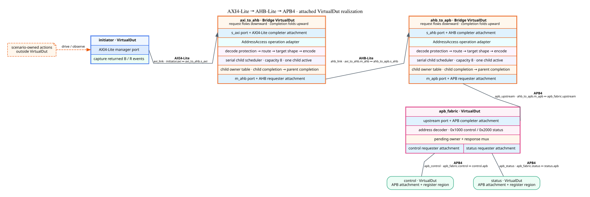
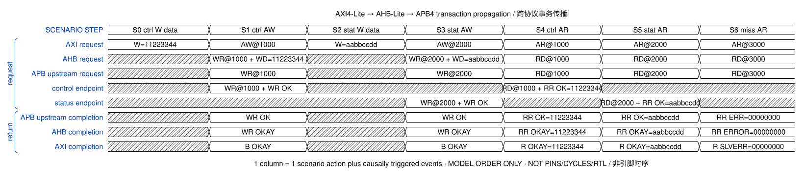
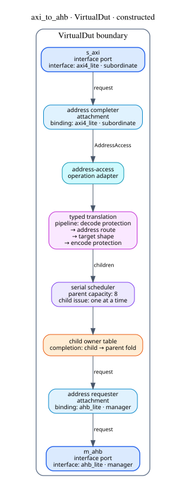
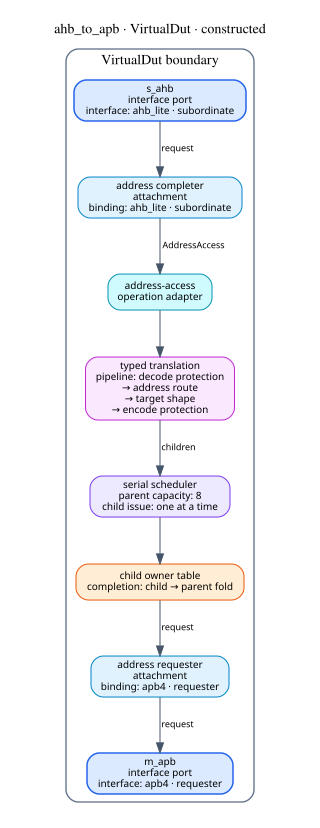
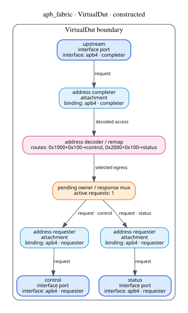
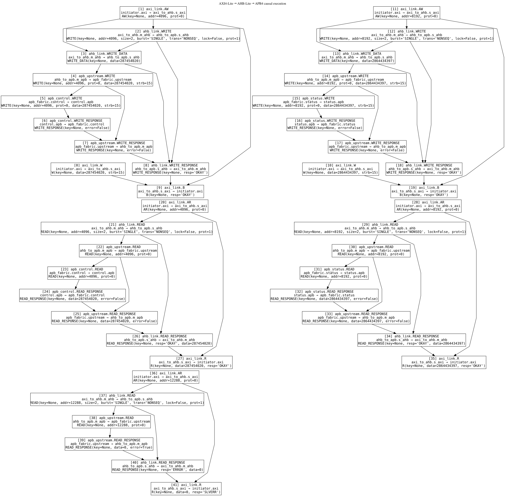

# AXI4-Lite → AHB-Lite → APB4 execution

The current architecture executed a deterministic write/read pair against two
APB endpoints through two independently constructed bridges.

The compact view is the primary network map.  It keeps one box per concrete
module and makes the three protocol families and two APB endpoint links easy
to follow.

Each connection is drawn directly between VirtualDuts. Its bold label is the
InterfaceProtocol name; the smaller label identifies the concrete InterfaceConnection and
the two bound ports. No additional diamond-shaped hardware node is implied.

## Expanded, inspectable realization

The orange dashed note is scenario-owned.  `initiator` only provides the
AXI4-Lite manager boundary and captures returned responses. The expanded view
keeps each bridge/fabric interface port and attachment at the module boundary;
the separate structure figures below use the shared VirtualDut projector for
the complete constructed internals.

## Cross-interface transaction view

Each column starts with one scenario action and includes the protocol events
causally triggered during that `SystemSession.step`.  It is a model-order
projection, not AXI/AHB/APB pins, cycles, or RTL timing.

## Bridge realizations

Each bridge has two protocol attachments around a typed translation plan, a
serial child scheduler, and completion ownership.  The second bridge receives
the AHB WRITE and WRITE_DATA events, joins them into one address operation,
and emits one APB transfer.

## APB routing realization

The APB fabric selects `control` or `status`, holds the selected egress owner,
and returns the endpoint completion through the upstream APB link.

The unmapped `0x3000` read reaches this decoder but no endpoint link.  APB's
single error bit returns through AHB `ERROR` as AXI4-Lite `SLVERR`; it cannot
retain AXI's finer `DECERR`/`SLVERR` distinction.  This is an observed protocol
projection boundary rather than a hidden bridge failure.

## Causal execution

The complete machine-readable execution is in [result.json](result.json).
The publication retains every [DOT source](sources/), its
[provenance](provenance.json), and [manifest](manifest.json).

This is a transaction-semantic network.  It demonstrates composition and
return-path ownership; it does not claim pin/cycle timing, arbitration,
multiple initiators, or coherence behavior.
