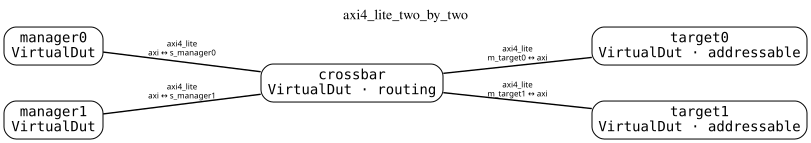
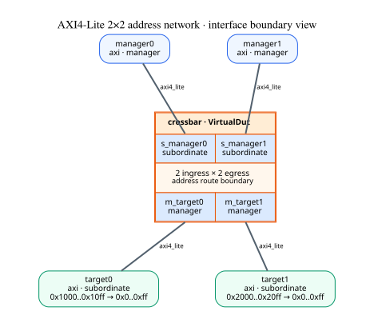
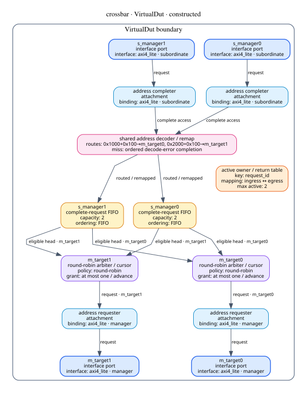
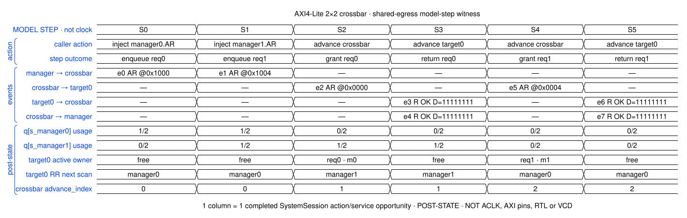
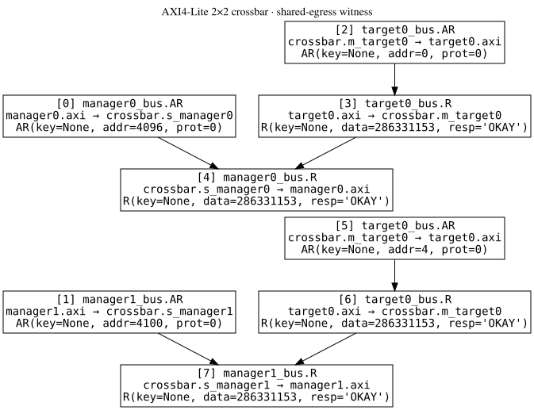
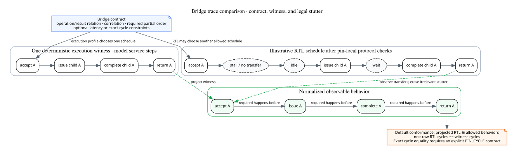

# AXI4-Lite 2×2 crossbar · executable witness

这个发布包来自具名脚本实际装配和执行的 `SystemProtocol`，不是手工绘制的假想网络。

## 1. 网络拓扑



两个 manager 各通过一条完整的 AXI4-Lite interface connection 进入 crossbar；
两个 target 分别位于另一侧。该图只表示 module 与 connection，不从星形外观推断
crossbar 内部的通道数、仲裁或路由行为。

## 2. Interconnect interface map



这张图显式选择 `crossbar` 的 address-router contract，把两侧真实 port/role 和
地址窗投影出来。System route contract 将系统窗口 `0x1000`、`0x2000` remap
到 target 的局部 `0x0..0xff`。边上显示协议身份；connection 实例名保存在 typed
view 中，并只在 diagnostic 密度显示。中央矩形表示一个多端口 `VirtualDut` 的
边界，不代表物理共享总线或固定数量的内部 crosspoint。

## 3. Crossbar VirtualDut 内部构造



实线是 request 主路径：attachment 解出完整 address access，地址先完成
decode/remap，再进入相应 ingress FIFO；每个 egress 有独立 round-robin arbiter。
点线表示 owner/cursor 控制关系，虚线表示 completion 返回。owner table 保存
`request_id → ingress/egress` 相关性，不是 request 数据必经的转换级。

## 4. 模型步骤执行视图



横向六列分别对应六次已经完成的 `SystemSession` action。S0、S1 是外部
request 注入，S2、S4 是 crossbar 的显式 service opportunity，S3、S5 是
target0 的显式 service opportunity。列宽只服务排版，不表示物理持续时间、相邻
硬件周期或共同 clock。

Canonical-event lanes 显示本步实际接受并路由的事件；状态 lanes 是本步结束后的
reference backend post-state。`RR next scan` 表示下一次仲裁扫描起点，不表示当前
owner。S3/S5 同列出现 downstream R 与 upstream R，表示一次模型调用内的
fixed-point 传播，不能据此推断 RTL 在同一周期返回。

## 5. 同出口竞争因果见证



manager0 和 manager1 都访问 target0。当前 execution profile 用显式 service
opportunity 先授予 manager0，completion 返回后再授予 manager1。这个结果证明
当前 constructed backend 的 FIFO、lease 和 return owner 可以协同执行；它不把
round-robin 的这一条线性展开提升为所有外部 RTL 必须逐周期复制的波形。

当前 `SystemTrace` 只画运行时已经声明的 causal edge。由独立
`DutAdvanceAction` 触发的 delayed grant 尚未携带最初 ingress event 的完整 lineage，
因此本图不能被解读成完整的端到端因果证明。

## 6. Reference witness 与 RTL conformance



桥或 crossbar contract 描述一组允许行为；deterministic executor 只从中选择一条
execution witness。RTL pin frame 必须先接受协议本地检查，例如 handshake、stall
期间稳定性、reset 和不可回压条件。之后，operation/effect 级比较可以折叠没有
相关 transfer/effect 的 stutter frame，并检查 identity、结果和必要偏序。

因此普通判定形式是：

```text
normalize(observe(RTL frames)) ∈ AllowedBehaviors(contract)
```

而不是：

```text
RTL frames == generated witness frames
```

如果 profile 声明最大延迟、吞吐、progress 或 `PIN_CYCLE` 等价，相关空周期就不再
是无关 stutter，必须在折叠前或由独立 property 检查。当前工程尚未实现通用 RTL
conformance/partial-order checker；本图记录目标边界，不声称该 checker 已完成。

机器可读运行见 [result.json](result.json)，图源在 [sources](sources/)，生成边界见
[provenance.json](provenance.json)，完整文件清单见 [manifest.json](manifest.json)。
