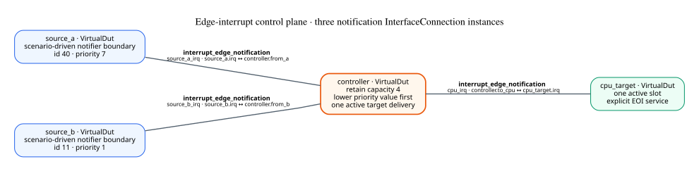
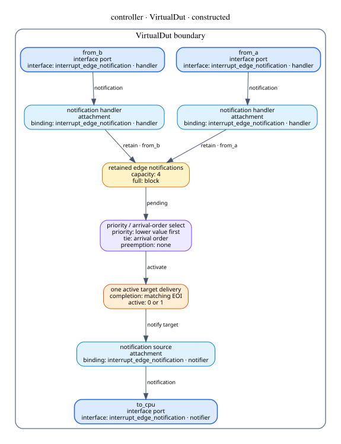
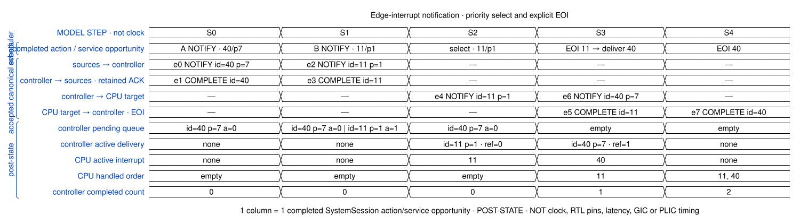
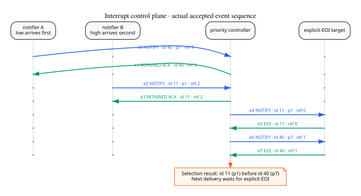
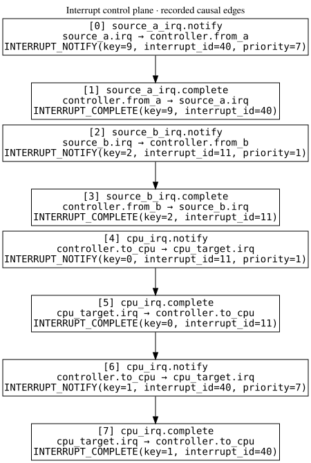

# Edge-interrupt notification control plane

这个发布包来自一次真实 `SystemSession` 执行。两路 scenario-driven notifier 通过
两个中断通知 `InterfaceConnection` 连接到 priority controller；controller 再通过第三条
link 连接 explicit-EOI target。

## 系统连接

`source_a` 和 `source_b` 是演示环境驱动的 notifier 边界。它们使用 `CaptureBackend`
接收 controller 在安全保留通知后返回的 completion，并不模拟传感器或设备内部行为。
`controller` 与 `cpu_target` 是 constructed `VirtualDut`。

这三条 link 都是同一个 `control.interrupt_notification` 协议的实例。协议只规定一次
edge notification 的字段、live reference、FIFO completion 和 correlation；priority
选择、容量、active slot 与 EOI 调度属于 controller/target 的 module 行为。

拓扑图用 VirtualDut 之间的直接边表示这些 link：粗体是协议名，较小的一行是
InterfaceConnection 实例名和两端的具体 port，因此图中没有额外的中断交换节点。

## Controller 的可检查内部构造

这张图由共享 VirtualDut projector 生成。入口 attachment 把 link event 解成
notification operation；controller 保留 edge，按“较小 priority 优先、同优先级按
到达顺序”选择，并维持一个 active target delivery，直到匹配的 EOI 返回。

## 模型步骤视图

A 先提交 `id=40, priority=7`，B 后提交 `id=11, priority=1`。S2 的显式 controller
service opportunity 选择 id 11。S3 的 CPU service opportunity 发出 id 11 的 EOI；
同一次固定点传播中 controller 激活并投递 id 40。S4 再完成 id 40。

每一列是一项已经完成的模型 action/service opportunity，状态 lane 是该列结束后的
post-state。它不是时钟波形，不表达物理延迟、RTL pin 或 cycle-exact EOI 时序。

## 实际消息顺序

MSC 中每支箭头来自本次执行的 `SystemTrace`，包括源通知、入口 completion、target
delivery 和 EOI。controller-facing delivery 使用新的 reference；它与原 ingress
reference 的关联保存在 controller state 中。

## 当前记录的因果边

因果图只显示 runtime 已保存的 causal edge。由独立 `DutAdvanceAction` 稍后触发的
delivery 尚未携带原 ingress event 的完整 delayed lineage，所以本图不能被解读成
完整的端到端因果证明。

## 范围边界

本例建模 edge-notification transport 与一个 priority controller/EOI target。它没有
CSR 地址端口，因此当前 controller 不具备可寻址配置界面；这不妨碍它作为控制平面
VirtualDut 工作。若后续需要 mask、priority register 或 status register，可以再 attach
一个地址协议端口，不能据此推断已经实现 GIC、PLIC、APIC、level-trigger、affinity、
抢占、多 target 或 MSI。

机器可读结果见 [result.json](result.json)，图源见 [sources](sources/)，发布边界见
[provenance.json](provenance.json)，完整文件表见 [manifest.json](manifest.json)。
