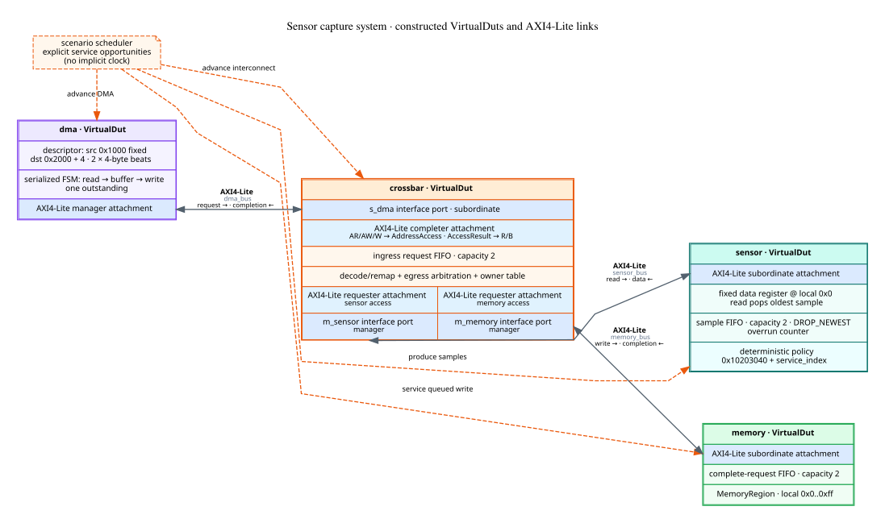
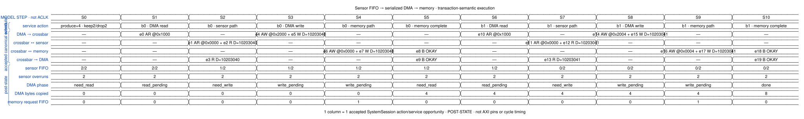
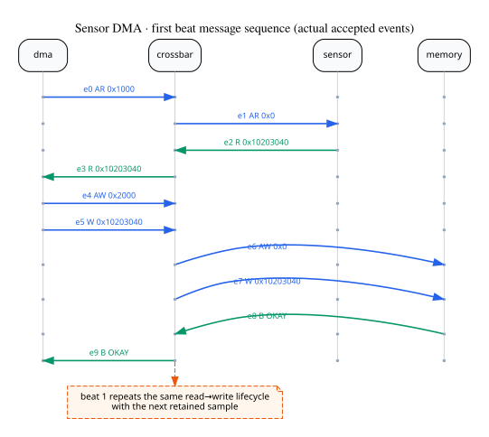
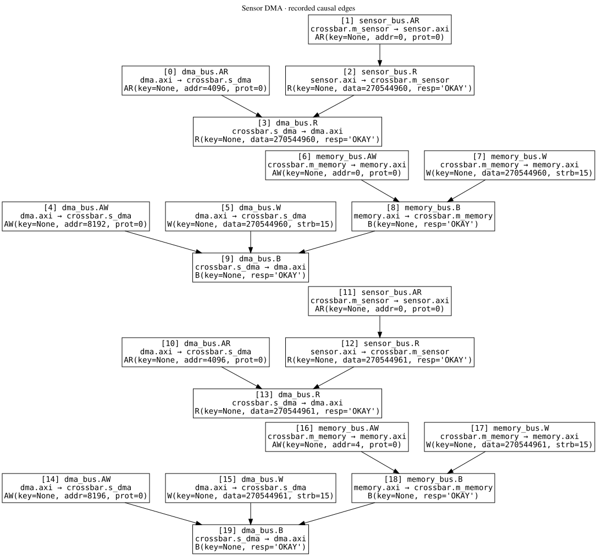

# Sensor FIFO → DMA → memory

这个发布包由具名脚本装配并执行一个最小 AXI4-Lite 系统。传感器、DMA、crossbar
和 memory 都是具体 `VirtualDut`；三条 `InterfaceConnection` 连接它们。

## 结构与数据流

三条 `InterfaceConnection` 在结构图中直接画成 module port 之间的边。粗体标签表示协议，
较小标签表示连接实例；crossbar 框内进一步列出 ingress completer attachment、
两个 egress requester attachment 及其 interface ports。

传感器不是随机信号源。本例使用确定性的递增 sample policy，使同一组 service
opportunity 可以重复生成相同证据。depth=2 的 FIFO 接受前两个样本；额外两个样本
采用 `DROP_NEWEST`，因此 `overrun_count=2`。DMA 的 source stride 为零，反复读取
传感器固定寄存器；destination 每拍增加四字节。

共享 VirtualDut projector 生成的单体展开图：

- [sensor internal structure](sensor-structure.svg)
- [DMA internal structure](dma-structure.svg)

## 模型步骤视图

每列是一次已接纳的 `SystemSession` action/service opportunity。它显示 canonical
AXI4-Lite 事件和执行后的 reference state，不表示 ACLK、VALID/READY pin 或物理周期。
一列内出现多条事件，表示一次模型调用内的固定点传播。

## 实际事务顺序

MSC 取实际 trace 的前十个事件，覆盖第一拍 `sensor read → memory write`。第二拍
重复同一生命周期，但携带下一个样本。

## 已记录的因果边

因果图只投影当前运行时已保存的 causal edge。跨显式 `DutAdvanceAction` 的 delayed
emission 尚未保留完整 lineage，因此它是可检查的现有证据，不应解读成完整的端到端
因果证明。

最终 memory 内容是 `40 30 20 10 41 30 20 10`。机器可读结果见
[result.json](result.json)，DOT/WaveJSON 源见 [sources](sources/)，生成边界见
[provenance.json](provenance.json)，完整文件清单见 [manifest.json](manifest.json)。
