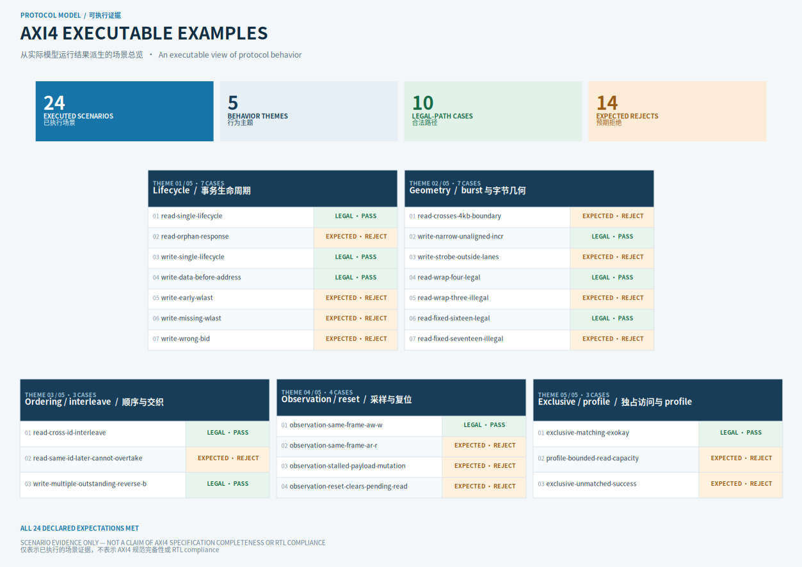

# Protocol Model

## From bus rules to explainable micro-systems

A compositional semantic modeling and verification research prototype for on-chip communication

**Technical preview in preparation**

---

# Why is the same protocol knowledge written many times?

```text
specification ─┬─→ scenario / driver
               ├─→ monitor / assertion
               ├─→ reference model
               └─→ waveform / report explanation
```

- AXI becomes difficult through relationships across channels, transactions, and modules.
- Re-encoding a relationship can make generation, checking, and reporting drift apart.
- A failure may show *where* something changed without explaining the lifecycle it violated.
- Protocol Model asks whether these uses can share one compositional semantics.

---

# The central hypothesis: construct once, project many ways

```text
events + relations + resources
             ↓ compose / refine
      communication model
        ↙        ↓        ↘
   generate    check    explain
```

The goal is not to copy an entire specification into code. It is to select verification-relevant relationships:

- which events may occur;
- how they correlate and order;
- which resources a lifecycle occupies;
- how failures retain rule, transaction, and causal provenance.

<small>Status: RESEARCH QUESTION — the reduction in duplicated knowledge must be tested through public cases.</small>

---

# Three scopes, three plain-language questions

| Object | What does it answer first? | Typical responsibility |
|---|---|---|
| **LinkProtocol** | What communication is legal on one connection? | channels, event schemas, ordering, completion |
| **VirtualDut** | What does one concrete module do with communication? | address operations, translation, routing, queues, owners |
| **SystemProtocol** | What must hold after modules are connected? | topology, link ownership, end-to-end contracts |

An attachment translates protocol events into module operations. Observation lowers sampled frames into protocol events.

The model attaches protocol ports to named virtual modules instead of building an AXI/APB device inheritance tree.

---

# Executable engineering evidence exists today

- **Semantics and observation:** typed events, constraints/resources/obligations, causal graphs, `AtomicFrame`, stalls, reset.
- **LinkProtocol:** AXI4, AXI4-Lite, AXI4-Stream, AHB-Lite/AHB5 profiles, APB3/4/5, ACE-Lite ordinary-data subset.
- **AXI4 behavior:** bursts, narrow/unaligned transfers, read interleaving, AW/W/B correlation, link-local exclusive eligibility.
- **Modules and systems:** typed ports, AMBA attachments, address endpoints, synchronous micro-systems, AXI4-to-APB witness.
- **Evidence foundation:** managed run store, manifests, DOT and WaveDrom renderers.

<small>Status: CURRENT — see migration-status for boundaries; this is not a complete compliance claim.</small>

---

# One AXI4 navigation, several reading depths



**CURRENT: 24 executed scenarios across five themes; ten legal inputs and fourteen expected violations all met their declarations.**

Every case opens into a model waveform, causal graph, and machine-readable result. Legal narrow/unaligned and early-WLAST
are the two focused entries with step-by-step source, resource, and diagnostic explanation; they are not a separate
Quick Start product.

<small>Scenario count demonstrates behavioral breadth; it does not automatically establish official requirement coverage.</small>

---

# The second story: a minimal bridge system

```text
AXI4 requester
      │ AXI4 link
      ▼
Bridge VirtualDut
      │ APB4 link
      ▼
memory / register-bank endpoint
```

- One burst produces several APB child operations.
- The current profile executes them serially; it does not imply APB concurrency.
- AW/W joining, error aggregation, and completion return belong to the bridge lifecycle.
- Three modules and two links already form a small `SystemProtocol`; a crossbar is not required yet.

<small>Status: CURRENT witness + PROPOSED public story.</small>

---

# General bridge construction: where are we now?

```text
protocol events
  → attachment / codec
  → typed operation
  → TranslationStage + executor
  → target codec
  → target protocol events
```

**Current kernel:** operation signatures, stage contracts, plan closure, fan-out ledger, capacity leases, serial executor.

**In migration:** moving the full AXI4-to-APB bridge onto an attachment-aware shared executor.

**Hypothesis to test:** can protocols share a small set of codecs and semantic stages instead of implementing every pair?

This is an evidence-backed research direction, not arbitrary protocol-pair generation today.

---

# Boundaries matter more than slogans

The project does not currently claim:

- complete compliance with the official AXI4 specification;
- arbitrary RTL, VCD, UVM-transaction, or simulator verification;
- model checking, theorem proving, or a complete formal verification system;
- automatic construction of every protocol-pair bridge;
- superiority to, or replacement of, UVM, cocotb, commercial VIP, SVA, or formal tools.

Model-generated waveforms will identify their source. Stronger claims require a requirement catalog, external-DUT path,
and public reproduction evidence.

---

# Help the community test the method

| Perspective | A bounded first contribution |
|---|---|
| Protocol engineer | Correct one AXI requirement, profile boundary, or corner case |
| Verification engineer | Add one replayable legal or violating scenario |
| RTL integrator | Supply one public small DUT and observation mapping |
| Visualization contributor | Improve one waveform, causal graph, or term explanation |

Near-term goal: **let a small group scan 24 cases through one AXI4 navigation, then independently open, understand, and challenge two focused cases.**

[Architecture map](../../docs/architecture/technical-route/README.md) ·
[Demo editorial strategy](../strategy/demo-program.md) ·
[Claims and evidence](../strategy/claims-and-evidence.md)
